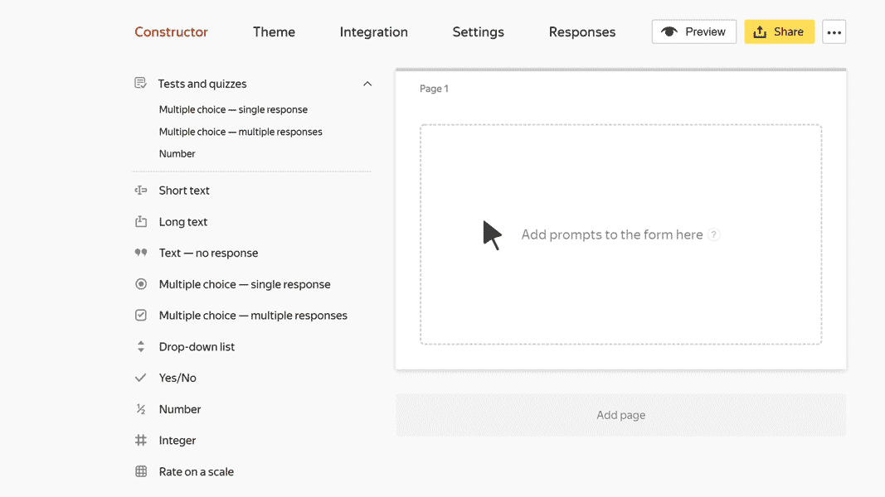

# "Number" test block

This block is for prompts that require a number to be entered in response. For example, you can ask users to solve an equation.

The response must be an integer or a fraction with no more than 2 decimal places. The format of the entered number is checked when the user completes the test.

## Block settings {#sec_settings}

### Question {#question}

Enter a prompt that requires a number in response.



### Responses {#answer}

1. Enter the correct response. It must be an integer or a fraction with no more than two decimal places.

1. Specify how many points the user gets for the correct response. It must be a positive integer or fraction with no more than two decimal places.

