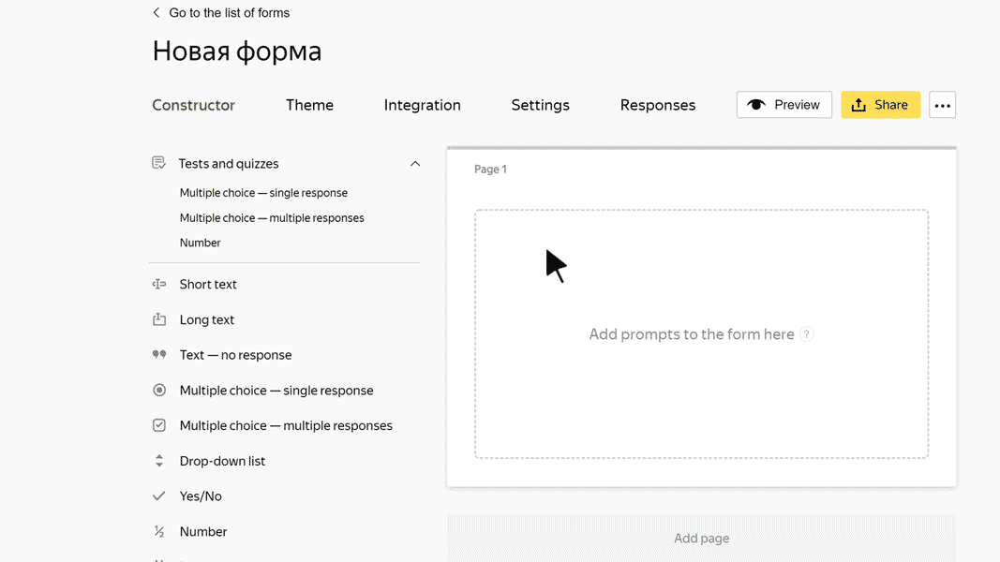

# "One answer" test block

In this block, the user can choose a response from the suggested options, even if multiple responses may be correct. If the user selects a correct response, they only get points for this response.

> **For example, a test about traveling has the prompt:** How many times did you travel abroad last year?
>
> **Answers options:**
>
> - I didn't go abroad: 0 points.
> - Once: 1 point.
> - Two or three times: 3 points.
> - More than three times: 5 points.
>
> All the suggested responses are correct. The more often the user travels abroad, the more points they get for this prompt.

## Block settings {#sec_settings}

### Question {#question}

Enter your prompt.





Under all the responses you think are correct, select **Correct**.

Under the correct responses, specify the number of points that the user gets for each response. It must be a positive integer or fraction with no more than two decimal places.
The user only gets points for the response that they select.







