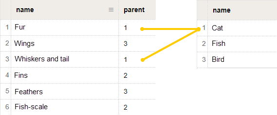

# Wiki



This block is only available to users of [{{ forms-full-name }} for business](../forms-for-org.md).



In this block, the user can enter response options that are loaded from a [dynamic {{ wiki-name }} table](../../wiki/create-grid.md). Acceptable response options are suggested to the user as they type. Responses not listed in the table are not accepted.



 Data from the [{{ wiki-name }} dynamic table](../../wiki/create-grid.md) is updated every 30 minutes. Therefore, response options may be loaded with a delay.



If multiple {{ wiki-name }} blocks are used in the form, you can [configure response filtering](#filter). In this case, a set of possible responses in one {{ wiki-name }} block will change depending on the response selected in another block.

## Block settings {#sec_settings}

### Question

Enter a field name or a prompt.





### Link to the table of responses

In the **Settings** section, insert an absolute or relative link to the [dynamic table of response options](#sec_table). For example:

`{{ link-wiki }}users/<user-name>/<table-name>`

`/users/<user-name>/<table-name>`

### Filter responses {#filter}

You can use this option to filter response options in the {{ wiki-name }} block: load different rows from the dynamic table depending on the response selected in a different {{ wiki-name }} block. To do this, add at least two {{ wiki-name }} blocks to the form:
* Parent block.

* Block with response options that are filtered depending on the response that the user selected in the parent block.

To filter response options:
1. Add a parent {{ wiki-name }} block to the form or select an existing block as the parent.

1. Create a [table of responses with an additional column for filtering](#sec_filter).

1. Add a block with filtering to the form and specify a link to the created table in the **Settings** section.

1. Turn on **Filter responses**.

1. In the **Select a question to filter** list, specify the {{ wiki-name }} block with the parent table.

## Create a table of responses {#sec_table}

The table of responses for the {{ wiki-name }} block must use a special format. To create this table:

1. In [{{ wiki-full-name }}]({{ link-wiki }}), create a [dynamic table](../../wiki/create-grid.md).

1. Add a column named `name` to the table.
   If there are other columns in the table, they will not affect the response options in the {{ wiki-name }} block.

1. Add multiple rows to the table. In the `name` column cells, enter response options that must be available in the {{ wiki-name }} block.

1. Make sure the service account `yndx-wiki-cnct-robot@` has [access to the table](../../wiki/page-management/access-setup.md). This account also has access to the table if **Available to all employees** mode is on.

1. Specify a link to the table in the {{ wiki-name }} block settings.

## Create a table with response filtering {#sec_filter}

To create a table with response filtering:

1. In [{{ wiki-full-name }}]({{ link-wiki }}), create a [dynamic table](../../wiki/create-grid.md).

1. Add columns named `name` and `parent` to the table.
   If there are other columns in the table, they will not affect the response options in the {{ wiki-name }} block and their filtering.

1. Add multiple rows to the table. In the `name` column cells, enter response options that must be available in the {{ wiki-name }} block.

1. Link each response option to a row in the parent table, i.e., the table specified in the parent {{ wiki-name }} block settings. To do so, go to the `parent` column and specify the row number in the parent table that should load the response in the {{ wiki-name }} block with filtering.
   For example, if the user selects a response from row number `1`, in the parent block, response options that have `1` specified in the `parent` column are available in the block with filtering.

   

1. Make sure the service account `yndx-wiki-cnct-robot@` has [access to the table](../../wiki/page-management/access-setup.md). This account also has access to the table if **Available to all employees** mode is on.

1. Specify a link to the table in the {{ wiki-name }} block settings and [enable response filtering](#dlentry_filter).