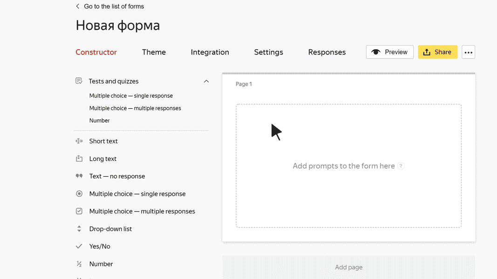

# Yes/No

In this block, the user can check a <q>checkbox</q> to agree to a statement or action. For example, they can confirm that they're over 18 years old or agree to receive emails.

## Block settings {#sec_settings}

### Question {#question}

Enter your prompt or a statement for the user to agree or disagree with. For example: <q>I agree to receive email newsletters</q>.









