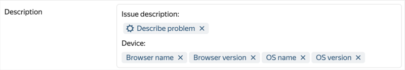
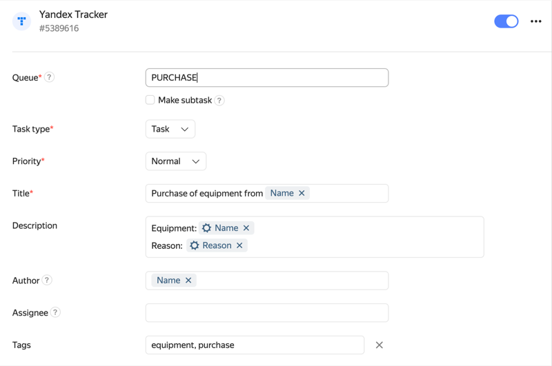

# Create a task in {{ tracker-full-name }}



Integration with {{ tracker-short-name }} can be configured by users of [{{ forms-full-name }} for business](forms-for-org.md).



You can integrate your form with [{{ tracker-short-name }}]({{link-tracker}}) to automatically create tasks when users submit responses. User responses are sent from the form to {{ tracker-short-name }}, where a task is created based on them. For example, these forms are useful for accepting service requests or collecting error messages. To learn more about tasks, go to [Help {{ tracker-full-name }}](../tracker/user/create-ticket.md).

## Set up task creation in {{ tracker-short-name }} {#setup}

1. Select a form and go to **Integration**.

1. Select a [group of actions](notifications.md#add-integration) for which you want to create a task and click  at the bottom of the group. **{{ tracker-short-name }}**.

1. Enter the key for the [queue](../tracker/queue-intro.md) where you want the task to be created.

1. To create a [subtask](../tracker/user/create-ticket.md#subtask), enable the **Make subtask** option and enter the parent task key.

   <!--

    In this case, the task from the form is created in the same queue as the parent task.

    
    -->

1. Set the task type, priority, and other parameters.

    **Data input format** When entering values in **Owner**, **Assignee**, **Tags**, **Components**, and similar fields, hints don't appear.

    - Specify user logins in the **Owner**, **Assignee**, and **Followers** fields.
      To specify multiple users in the **Followers** field, enter their logins separated by commas (for example, `smith,johnson`).

    - Enter values in other fields exactly as they are in {{ tracker-short-name }}.

    - To add multiple values to **Components** or **Tags**, separate them by commas.

    **Add a task field** If the necessary task parameters aren't on the list, add them. Click the **Add task parameter** button and start entering the parameter name. Then select an appropriate parameter from the suggestion.<!-- --> To learn more about task parameters, go to [Help {{ tracker-full-name }}](../tracker/user/create-param.md).

    **Add data from the form to the field**. You can insert a response to a prompt or other form data in task fields:

    - Select a field and click **Variables** on the right.

    - Select a [variable](vars.md) from the list that you want to add.

    

    You can add an employee specified in a response to a <q>People</q>,To do so, add a **Response ID** variable to the field. If you're using a **Response to prompt** variable, integration won't work.

    

    For example, if you use a form to collect error messages, you can add the user's message and technical information to the task description.

    

1. For the user to get a link to the created task after filling out the form, enable the **Show messages about action results** option under the action name.

1. Click **Save**.

To create multiple tasks at once, add new actions using the  **{{ tracker-short-name }}** button at the bottom of the page.

If you want a task to only be created for users who give certain responses, [set your conditions](notifications.md#section_xlw_rjc_tbb).

> Example of integration with {{ tracker-short-name }} for a request form for buying equipment. Employees can use this form to make equipment requests in the form of tasks for the purchasing department.
>
>

## Troubleshooting {#troubles}

If tasks aren't created in {{ tracker-short-name }} or if they're created incorrectly after the form is filled out, check for integration errors:

1. Open the form in which the tasks couldn't be created and click **Integration** at the top of the page.

1. Check for an error message in the {{ tracker-short-name }} integration settings.

1. Check if there is a solution to your problem provided below. After resolving the problem, try [creating a task again](notifications.md#status).

1. If you couldn't resolve the issue, [contact support](feedback.md).

### Error in the Owner, Assignee, and Followers fields

The error may be caused by invalid data being sent from the form to the **Owner**, **Assignee**, or **Followers** task fields. Fill in these fields in the following way:

- To add an employee manually, enter the user's login. For example: `smith`.

- To specify multiple users in the **Followers** field, enter their logins separated by commas (for example, `smith,johnson`).

- To add an employee specified in a response to a <q>People</q>, prompt, insert the [Response ID](vars.md) variable in the field. **Response option ID**. If you're using a **Response to prompt** variable, integration won't work.

- To add an employee specified in a response to the <q>Drop-down list</q> or <q>Multiple answers</q> prompt type, set user logins as response options (for example, ` smith`) and use the [variable](vars.md) **Prompt response**.

If there's an error in the **Owner** field but the field is filled in correctly, make sure the user who submitted the form has [access to creating tasks in the {{ tracker-short-name }}](#access) queue.

### Error: no right to add tasks to queue {#access}

This error occurs because the user who filled out the form doesn't have the right to create tasks in the {{ tracker-short-name }} queue. Ask the queue owner to [verify access rights](../tracker/manager/queue-access.md).

<!-- ### Error in the Type field This error may occur if you enabled the **Make subtask** option. When this option is on, a task from a form is always created in the same queue as the parent task. If this queue isn't the one in the **Queue** field, it may not contain the specified task type.

To resolve the issue, make sure the parent task in the **Make subtask** option is in the queue specified in the **Queue** field.-->

