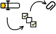
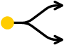
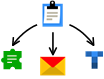

# What is {{ forms-full-name }}

With [{{ forms-full-name }}](go-to-forms.md), you can create surveys, collect reviews, accept requests and applications, and conduct tests and quizzes.

Create a form with prompts for users to respond to and publish it. When users fill out the form, you can get their responses and integrate the data with other services.

**Simple structure**
 | [Create a form](new-form.md) consisting of simple blocks and 
combine them as you wish.  [Make a test or quiz.](tests.md)
**Flexibility**
 | [Set conditions](add-questions.md#section_q2t_zqz_sbb) for displaying or hiding prompts depending on how the user responded to the previous prompts.  [Customize the appearance of your form.](appearance.md)
**Publish your form**
 | [You can publish a form](publish.md) using a direct link, post it on a website, or embed it in a wiki page. You can make any form either public or only available to your company employees.  [Publish a form](publish.md) via a direct link or post it on a website. You can make any form either public or only available to your company employees.  Set up auto [pre-filling for the fields of your form](pre-fill.md).  [Localize your form to foreign languages.](localize.md)
**Integration with other services**
 | [Set up integration](notifications.md) to send data from your form to Yandex Mail, {{ wiki-name }}, or {{ tracker-name }}.  [Set up integration](notifications.md) to send data from your form to Yandex Mail, {{ tracker-name }}, and other Yandex services.

