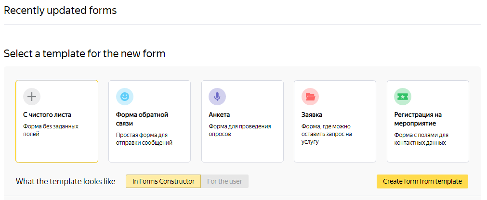

# Creating a form

## Create a form {#create-form}

To conduct a survey, collect votes, accept requests, or take orders, create a form:

1. 

1. Select a [template for your form](#section_dyd_dnx_cgb) or click **{{ ui-key.forms.common.blocks_f-slider.button-2 }}** a form on the top panel.

1. To change the name of the form, hover over **New form** and click the  icon.

1. In the **Constructor** tab, [add prompts](add-questions.md) for the user to respond to.
   To [create a test or quiz](tests.md), use prompts from the **Tests and quizzes** category.

1. Configure the [appearance of form](appearance.md).

1. To see what your form will look like when you publish it, click **Preview**.

1. To limit the timeframe for accepting responses or the number of respondents, use the [options in the **Settings** tab](restrictions.md). By default, no limits are set.

1. To use data from responses in other services, [configure integration](notifications.md).

1. [Publish the form](publish.md).



If you are using [{{ forms-full-name }} for business](forms-for-org.md), you can give your employees [access to edit the form](forms-settings.md#section_vcf_h5b_tbb).



## Copying a form {#sec_copy_form}

To create a new form based on an existing one, copy the form and edit it:

1. On the top panel, select **My forms**.

1. Select the form and hover over the trigger.

1. Click the icon  and select **Copy**.
   A success message will appear at the top of the window.

1. Click **Go to form**. A page for editing the form will open.

1. [Edit prompts](add-questions.md) and adjust the settings for the new form.

## Using a template {#section_dyd_dnx_cgb}

{{ forms-full-name }} has several templates for popular form types. To create a form based on a template:

1. Go to the [{{ forms-full-name }} home page]({{ link-forms-admin }}).

1. Select one of the templates:

   - **{{ ui-key.forms.common.blocks_survey.feedback }}**: Collect user reviews.
   - **Questionnaire**: Conduct surveys on any topic.
   - **Application**: Accept requests for services and orders.
   - **Registration for an event**: Accept applications for participating in an event.

   To create a form from scratch, select **From scratch**.

1. To see what the form with your selected template will look like after you publish it, click **For the user**.

1. Click **Create form from template**.

