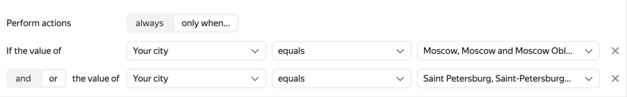
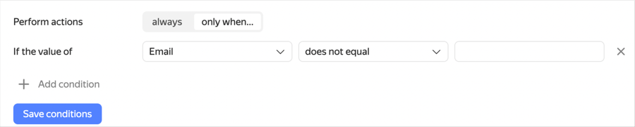

# Integration with other services

Integrate your form with other services to use their features related to processing of user responses and other form data. You can:

- [Set up actions](#add-integration) to be performed automatically when the user fills out the form:

   - [Send notifications by email.](send-mail.md)

   - [Create issues in {{ tracker-name }}](create-task.md) and add form data to them.

   - [Add user responses to {{ wiki-name }}.](send-wiki.md)

   - [Send HTTP requests to an API](send-request.md).

- [Connect a Yandex&#160;Metrica](metrica.md) tag and gather statistics on form traffic.

You can set up multiple automated actions for each form and [set conditions for performing those actions](#section_xlw_rjc_tbb) depending on user responses to the prompts.





Integration with {{ wiki-name }} and {{ tracker-name }} services is only available to users of [{{ forms-full-name }} for business](forms-for-org.md).





## Add {#add-integration} actions

To integrate your form with other services, you can configure one or more actions to be performed automatically when the user submits a completed form. To do this:

1. Select the form and open the **Integration** tab.

1. Add a new group of actions or use an existing one. You can add multiple actions to the group and set shared conditions for them.

   

   By default, a group with one action — sending an email — is set up for all forms. This group is enabled, and you can disable or delete it or add custom actions to it.

   

   - To create a new group, click **Add notification group****Add action group** at the bottom of the page.

   - To create a group of actions based on an existing one, click  in the upper-right corner and select **Copy group of actions**. Next, edit the copy.

   - To enable or disable a group of actions, use the  toggle in the upper-right corner.

   - To delete a group of actions, click  in the upper-right corner and select **Delete group of actions**.

1. If necessary, [set up action conditions for the group](#section_xlw_rjc_tbb).
   To configure multiple actions to be performed under different conditions, add multiple groups.

1. To add an action to a group, click a button at the bottom of the group:

   - To [send a notification by email](send-mail.md), click  **Mail**.

   - For [creating issues in {{ tracker-name }}](create-task.md) click  **{{ tracker-short-name }}**.

   - To [add user responses to Wiki](send-wiki.md), click  **{{ wiki-name }}**.

   - To [send an HTTP request](send-request.md), click  **API** and select the request type.

   

   

   Integration with {{ wiki-name }} and {{ tracker-name }} services is only available to users of [{{ forms-full-name }} for business](forms-for-org.md).

   

   

1. Set up the action and click **Save**.

1. To disable an action, use the  toggle in the upper-right corner.

1. To delete the action click  and select **Delete**.

To return to the prompt settings, click **Go to Forms Constructor** at the top of the page.

## Set conditions {#section_xlw_rjc_tbb}

You can set conditions for integrating your form with other services. In this case, the actions (sending notifications or creating issues) will only be performed if the user gives certain responses to the prompts. To set up conditions for actions:

1. Select the form and click **Integration** at the top of the page.

1. Select a group of actions and enable the **Performing conditional actions** option.

1. If you want an action to be performed in accordance with user responses to the form prompts:

   1. Specify a prompt that requires a certain response as a condition for the action.

   1. Choose a comparison operation: **equal** or **not equal**.

   1. Select or enter a response that the user's response needs to match.
      

      - If you want the actions to be triggered by any response (if the form field is filled in), select the **not equal** relational operator in the condition and leave the response field empty.

      - If you want the actions to be triggered when a user doesn't respond (if the form field isn't filled in), select the **equal** relational operator in the condition and leave the response field empty.

      For example, you can have an email sent to a user if they fill in the **Email** field in the form.
      



1. For the action to trigger depending on the interface language the user selected:

   1. In the **If the value of** field, select **Language**.

   1. Choose a comparison operation: **equal** or **not equal**.

   1. Select the language to check a match with.



1. To add multiple conditions, click **Add condition** and set a logical operator.

   - If you put the **AND** logical operator between two conditions, both of them must be met. If you use **OR**, at least one condition must be met.

   - If you add multiple conditions with different operators, the conditions are checked from top to bottom. The **AND** operator doesn't take priority over the **OR** operator.

   

   To make sure results are predictable when checking a group of conditions, we recommend using just one operator type: all conditions with **AND** or all conditions with **OR**.

   

1. Click **Save conditions**.

To add multiple actions with different conditions, click **Add group of actions** at the bottom of the page and set up conditions and [actions](#add-integration) for the new group.

## Completed integrations {#completed-integration}

To view completed integrations, select a form and go to **Integration** → **Completed integrations**.

To filter the integration list, use the fields above the list.





The integration data is stored for three months, after which it is deleted.





### Integration errors {#status}

If the integration failed when getting responses to the form and the [set actions](#add-integration) couldn't be performed, an error message appears in the action settings card.

1. Check settings for actions and if necessary, make the changes.

1. To view the list of responses on which the action failed, click **Show**.

1. To retry the actions, select the lines with the **Error** status and click **Restart**.

For more information, see:

- [Troubleshooting mail integration issues](send-mail.md#troubleshooting)

- [Troubleshooting {{ tracker-name }} integration issues](create-task.md#troubles)



- [Troubleshooting HTTP request sending issues](send-request.md#filters)



### Set up notifications about integration errors {#error-notification}

To have notifications about integration issues sent to an email address:

1. Select the form and open the **Settings** → **Additional** tab.

1. In the **Notify about integration errors** field, select the frequency of sending notifications.

   If you select an interval, a single notification is sent with a list of all errors that occurred during this interval.



1. If you're using [{{ forms-full-name }} for business](forms-for-org.md), list the users to send emails to in the **Add recipients** field.

To disable sending notifications select **Don't notify**.



1. List the users to send emails to in the **Add recipients** field.


