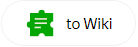

# Integration with other services

Integrate your form with other services to use their features for processing user responses and other form data. You can:



- [Publish the form on Yandex.Zen.](forms-lite.md)



- [Set up actions](#add-integration) that are performed automatically when the user fills out the form:

    - [Send notifications by email.](send-mail.md)

    - [Create tasks in {{ tracker-name }}](create-task.md) and add form data to them.

    - [Add user responses to {{ wiki-name }}.](send-wiki.md)

    - [Send HTTP requests.](send-request.md)

- [Connect a Yandex.Metrica](metrica.md) tag and gather statistics on form traffic.

You can set up multiple automated actions for each form and [set conditions for performing those actions](#section_xlw_rjc_tbb) depending on user responses to the prompts.





Integration with {{ wiki-name }} and {{ tracker-name }} is only available for [{{ forms-full-name }} for business](forms-for-org.md) users.





## Add actions {#add-integration}

To integrate the form with other services, you can configure one or more actions to be performed automatically when the user submits a completed form. To do this:

1. Select a form and go to **Integration**.

1. Add a new group of actions or use an existing one. You can add multiple actions to a group and set common conditions for performing them.

    

    By default, a group with one action — sending an email — is set up for all forms. This group is disabled. You can delete it or enable it and add your own actions.

    

    - To add a group of actions, click **Add notification group** at the bottom of the page.

    - To create a new group of actions based on an existing one, click  in the upper-right corner, select **Copy group of actions**, and then edit the copy.

    - To enable or disable a group of actions, use the  toggle in the upper-right corner.

    - To delete a group of actions, click  in the upper-right corner and select **Delete group of actions**.

1. If necessary, [set up action conditions for the group](#section_xlw_rjc_tbb).

To configure multiple actions to be performed under different conditions, add multiple groups.

1. To add an action to a group, click a button at the bottom of the group and configure action parameters:

    - To [send a notification by email](send-mail.md), click .

    - To [create a task in {{ tracker-name }}](create-task.md) click .

    - To [add the response to a Wiki page](send-wiki.md), click .

    - To [send an HTTP request](send-request.md), click the button with the necessary request type.

    

    

    Integration with {{ wiki-name }} and {{ tracker-name }} is only available for [{{ forms-full-name }} for business](forms-for-org.md) users.

    

    

1. To disable an action, use the  toggle in the upper-right corner.

1. To delete an action, click .

1. To apply changes, click **Save** at the bottom of the page.

## Set conditions {#section_xlw_rjc_tbb}

You can set conditions for integrating your form with other services. Then the actions (sending notifications or creating tasks) will only be performed if the user gives certain responses to the prompts. To set up conditions for performing actions:

1. Select a form and go to **Integration**.

1. Select a group of actions and turn on **Performing actions on condition**.

1. Set conditions for performing actions:

    1. Specify a prompt that requires a certain response as a condition for the action.

    1. Select a relational operator: **equal** or **not equal**.

    1. Select or enter a response that the user's response needs to match.

    

    - If you want the actions to be triggered by any response (if the form field is filled in), select the relational operator **not equal** in the condition and leave the response field empty.

    - If you want the actions to be triggered when a user doesn't respond (if the form field isn't filled in), select the relational operator **equal** in the condition and leave the response field empty.

    For example, you can have an email sent to a user if they fill in the **Email** field in the form.

    

1. To add multiple conditions, click **Add condition** and set a logical operator.

    - If you put the **and** logical operator between two conditions, they must both be met. If you use the **or** operator, at least one condition must be met.

    - If you add multiple conditions with different operators, the conditions are checked from top to bottom. The **and** operator doesn't take priority over the **or** operator.

   

   To make sure results are predictable when checking a group of conditions, we recommend using just one operator type: all conditions with **and** or all conditions with **or**.

   

1. To apply changes, click **Save** at the bottom of the page.

To add multiple actions with different conditions, click **Add notification group** at the bottom of the page and [set up the actions](#add-integration).

## Integration errors {#status}

If integration failed when getting responses to the form and the [set actions](#add-integration) couldn't be performed, the  icon appears in the **Integration** tab header. The action card displays a list of responses for which integration errors occurred.

If an error occurs, you can do the following:

- Check action settings and make changes if necessary. To try to perform the action again, click **Restart all** under the error description.
- To save data that couldn't be sent when performing the action, click **Download responses** and select a file format.
- To clear the information about responses with integration errors and not perform the set actions for them, click **Hide errors**.

To learn more, go to:

- [Solving problems with mail integration.](send-mail.md#troubleshooting)

- [Solving problems with {{ tracker-name }} integration.](create-task.md#troubles)



- [Solving problems with sending HTTP requests.](send-request.md#filters)



