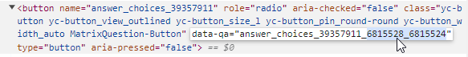

# Getting IDs for questions and responses

Question and response IDs are used to prefill the form. There are several ways to get IDs for different types of questions.

## ID of the question {#sec_question}

You can get the question ID in the **Settings** section of the [Edit a response](add-questions.md#section_jpy_2xg_qbb) window.

## IDs for a series of questions {#series}

You can add a [series of questions](blocks-ref/series.md) to a form several times. This means that questions from a series may repeat. To distinguish between multiple instances of the same question, question IDs that belong in a series get a suffix, which is the instance number after a double underscore. The numbers start with zero: `__0`, `__1`, `__2`.

For example, the form has a series of questions:

* <q>Name</q> with the `text_2643945` ID.

* <q>Phone</q> with the `phone_2752014` ID.

To prefill the fields in a series of questions, configure [GET parameters](get-params.md):

* For the first instance of the series, which is displayed in the form by default, use the `text_2643945__0` and `phone_2752014__0` question IDs.

* For the second instance of the series, which can be added by clicking **more "series of questions"**, use the `text_2643945__1` and `phone_2752014__1` question IDs.

## Response ID {#sec_answer}

To find out the response ID:

1. Select the question section.

1. In the left-hand panel, click **Advanced parameters** in the **{{ ui-key.forms.common.blocks_correct-answers.title }}** section.

1. Copy the **ID** field value.



IDs can be edited. IDs of responses to a single question must be unique.



## Response IDs for the <q>Rate on scale</q>, <q>{{ ui-key.forms.common.blocks_integration-group.title-wiki }}</q>, <q>Cities and countries</q> prompt types {#sec_rating}

You can find out the response IDs in your browser by using developer tools. This feature is available both to the author and user of the form.

Let's see how to get IDs using Yandex&#160;Browser:

1. [Open the form by following the link](publish.md#section_link).

1. Open the developer tools using the keyboard shortcut **Ctrl + Shift + I** (for Windows and Linux) or **⌘ + Option + I** (for macOS).

1. Select the  tool and click the necessary response field, list, or marker.
   

1. You will see a fragment of the page code with the question or response parameters highlighted in the **Elements** tab.

1. Find the ID values in the code:
   * Question ID: Find the `name` parameter value (except for the <q>Rate on scale</q> question type).

   * Response ID: Find the `value` parameter value.
      

   
   * For the <q>Drop-down list</q> question type, the code lists all available response options.
      

   * For the <q>Rate on scale</q> question type, the `name` parameter contains the question ID and the `data-qa` parameter, the response ID. In the example below, this is `6815528_6815524`.
   

   * In a question with a suggestion, such as <q>Cities and countries</q>, or <q>{{ ui-key.forms.common.blocks_integration-group.title-wiki }}</q>, go to the `Response` requests.
   

   The `getSuggest` section will list response options with country names and response `IDs`.
   
