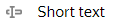
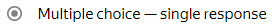
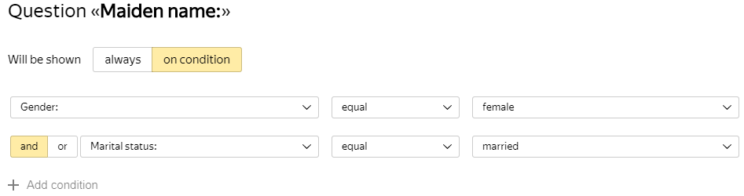
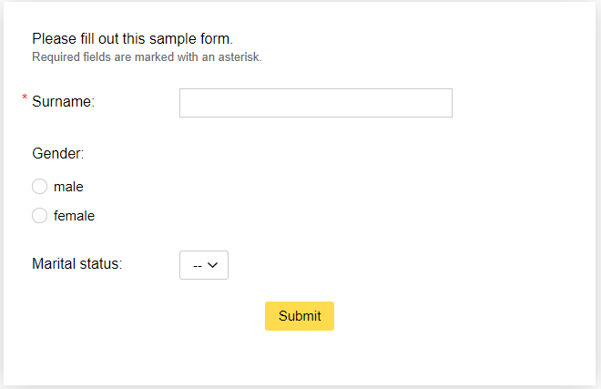

# How to create the first form

Learn your way around {{ forms-full-name }} by creating a simple form:

1. [Add form prompts for users to respond to](#create-form).

1. [Publish your form and ask users to fill it out](#publish).

1. [Get a table with user responses](#get-answers).

1. [Set up access to the form](#access).

## Step 1. Create a form {#create-form}

1. 

1. On the top panel, click **Create form**.

1. From the list on the left, select the desired blocks and put them on the form in the following order:

   | No. | Blocks | Settings |
   ----- | ----- | -----
   | 1 |  | Enter text: `Please fill out this sample form.` Add a comment: ` Required fields are marked with an asterisk.` |
   | 2 |  | Enter question:  `Last name:` Enable the **Required question** option. |
   | 3 |  | Enter a prompt: `Gender:` Add responses:<ul><li>`male`<li>`female`<ul/> |
   | 4 |  | Enter a prompt: `Marital status:` Add responses:<ul><li>`single`<li>`married`<ul/> |
   | 5 |  | Enter a prompt: `Maiden name:` |

1. Set the conditions for showing the <q>Maiden name</q> prompt:

   1. Hover over the <q>Maiden name</q> block and click the  icon that appears.

   1. Add two conditions and fill in the fields as shown in the example:

      

   Now this prompt is only visible in the form if the user previously selected the female gender and <q>married</q> status.

## Step 2. Publish the form {#publish}

To allow users to fill out the form, you need to publish it:

1. Click **Share**.

1. To copy link to form in the **Link** field click .

1. Paste the link in your browser address bar and open it. If you did everything right, the new form opens:

   

1. Send users a link to the form.

## Step 3. Get the answers to questions {#get-answers}

To get a table with user responses to form prompts:

1. Go to the **Responses** tab.

1. In the **Download responses** list, select **All**.

1. In the **Format** list, select **XLSX**.

1. In the **Filter by response date** list, select **For all time**.

1. Click **Download**.

## Step 4. Set up access to the form {#access}

By default, only the creator of the form can edit it. If you are using [{{ forms-full-name }} for business](forms-for-org.md), you can give your employees [access](access.md) to edit the form or groups of forms.
