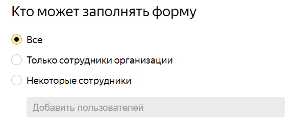

# {{ forms-full-name }} release notes: August 2023

* [Integration with {{ sf-full-name }}](#integration-with-functions)
* [New type of displaying a <q>One answer</q> prompt](#radiobutton-choice)
* [Opening files attached to a form](#open-file)
* [Configuring permissions to fill out a form](#access-to-filling)
* [Saving attached files to {{ objstorage-name }}](#saving-files-s3)

## Integration with {{ sf-full-name }} {#integration-with-functions}

[Business forms](../forms-for-org.md) can now be integrated with {{ sf-name }}. To enable integration, you need to specify the keys to invoke cloud functions. You can do this in the form settings: go to **Settings** → **Advanced** and fill in the fields under **Cloud function key**. Integration will fail without any keys. To proceed to integration setup, open the form settings, go to the **Integration** tab, and click  **{{ sf-name }}** below the selected group of actions.

## New type of displaying a <q>One answer</q> prompt {#radiobutton-choice}

In the [new interface](2306.md), you can now select how to display a [<q>One answer</q>](../blocks-ref/radiobutton.md) prompt. Two types of display are available:

* <q>Tile</q> (default)
* <q>Single row</q>: Response options are placed in a single row. The maximum number of response options per row is four.

## Opening files attached to a form {#open-file}

Now, when you click a [file](../blocks-ref/file.md) attached to a form, it opens in a new tab. The option is only available in the [new interface](2306.md).

## Configuring permissions to fill out a form {#access-to-filling}

[Business form](../forms-for-org.md) permission settings now enable you to choose who is allowed to fill out the form.

## Saving attached files to {{ objstorage-name }} {#saving-files-s3}

[Business forms](../forms-for-org.md) now enable you to save attached files from user responses to {{ objstorage-name }} buckets. To enable this setting, open the page for editing forms, go to **Settings** → **Advanced**, and fill in the fields under **Save attached files from responses to specified S3**.

If the bucket is available, files from new user responses will be saved to it. Files received before you specified the bucket, will continue to be stored in {{ forms-name }} for a [limited time](../answers.md#files).

For more information, see [{#T}](../storage-for-attached-files.md#s3-ext).

