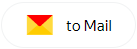
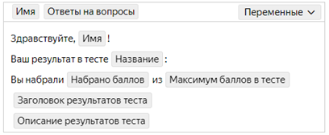
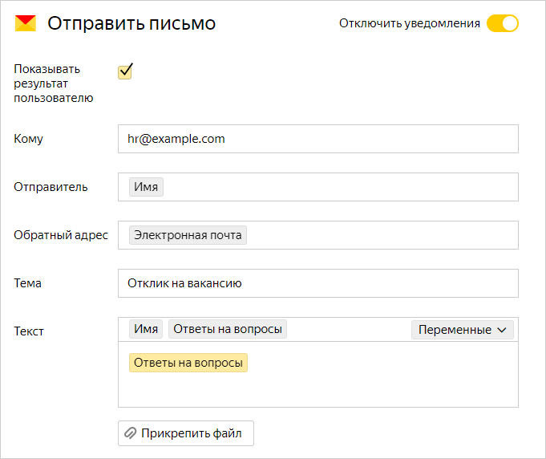
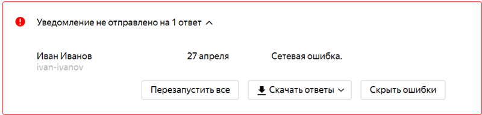

# Send message

You can set up integration of your form with Yandex.Mail so that a notification is sent automatically when the user fills out the form.

## Configure notifications {#setup}

1. Select a form and go to **Integration**.

1. Select a [group of actions](notifications.md#add-integration) for which you want emails sent and click  at the bottom of the group.

1. In the **Send mail** block, fill out the fields:

    - **To**: The email address the notification is sent to. You can list multiple addresses separated by commas or specify a variable.

        - To send a notification to the form owner's email, select the **Form owner email** variable.

        - To send a notification to the Yandex account email the user was logged under when filling out the form, select the **Email** variable.

        - To send a notification to the address the user gave in response to a prompt, add a **Response to prompt** variable and select the <q>Email</q> prompt type.

    

    - **From**: The email address the notification is sent from. Only use emails on allowed domains:

        - `market.yandex.ru`

        - `contest.yandex.ru`

        - `o.yandex.ru`

        - `support.yandex.ru`

        - `yandex-team.ru`

        - `forms.yandex.ru`

        If the field uses the [variable](vars.md), its content must also be an email address with a permitted domain. If the field is not filled in, the email will be sent from the default address. If you used an address with a domain not included in the permitted list, the notification won't be sent.

    

    - **Sender**: The sender name you want the recipient to see.

    - **Send response to**: The email the recipient can send responses to. If you don't specify the return email address, your respondents won't be able to reach you by email.

    - **Subject**: The subject of your email.

    - **Text**: The text of your email.

    
    - If necessary, add headers to the message. Specify a name and value for each header.

    

    You can insert a response to a prompt or other form data in any field:

    - Select a field and click **Variables** on the right.

    - Select a [variable](vars.md) from the list that you want to add. For example, you can add a variable to address the user by their name or to include their [test results](tests.md) in the email.

    <!--  -->

1. If necessary, attach a file to the email.

1. To display a message informing users that an email was sent after they fill out the form, turn on the **Show result to user** option under the name of the action.

1. Click **Save**.

To send multiple email notifications at the same time, add them using the  button at the bottom of the group of actions.

If you want notifications to only be sent to users who gave certain responses, [set your conditions](notifications.md#section_xlw_rjc_tbb).

<!-- > Example of a notification for a job application form. After the form is filled out, responses to the prompts are sent to the email of the HR department.

  > -->

## Troubleshooting {#troubleshooting}

If you set up email notifications but aren't getting emails when your form is filled out, check your spam folder and see if there are errors when sending emails.

### Check your spam folder

If you aren't receiving email notifications, check your <q>Spam</q> folder. If emails from {{ forms-full-name }} were sent to the spam folder, mark them as <q>Not spam</q>.

If you use your own mail server, <q>whitelist</q> the `form_id@forms-mailer.yaconnect.com` sender address.

### Check the text of the email

The mail server can block an email if its text is missing or looks like spam. Add or edit the text of the email.

### Check for errors when sending emails

1. Open the form with notification issues and go to the **Integration** tab.

1. Check for an error message in your notification settings.

   <!--  -->

1. If there's an error message:

    1. [Take a screenshot]({{ support-troubleshooting-screen }}).

    1. [Contact {{ forms-full-name }}](feedback.md) support and attach a screenshot of the error to your message.

### If there are no spam notifications or error messages

If you have no notifications in the <q>Spam</q> folder or errors in the **Integration** tab, the email may be blocked by the recipient's mail server. To find out why the email is blocked:

1. Open the form with notification issues and go to the **Integration** tab.

1. In the notification settings, go to the **Send response to** field and enter your personal or work email.

1. The next time the mail server blocks a notification from the form, an error message will be sent to the email that you specified. Copy the text of the message.

1. [Contact {{ forms-full-name }}](feedback.md) support and add the error message that you received to your request.
