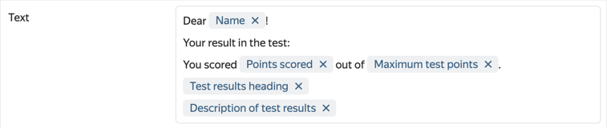
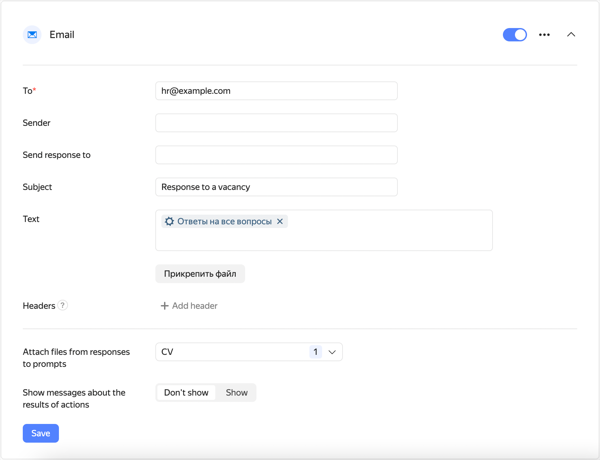

# Send an email

You can integrate your form with Yandex Mail so that a notification is sent automatically when the user fills out the form.

## Configuring notifications {#setup}

1. Select the form and open the **Integration** tab.

1. Select a [group of actions](notifications.md#add-integration) for which you want to set up sending emails and click  **Email** at the bottom of the group.

1. Under action settings, fill in the following fields:

   - **To**: The email address the notification is sent to. You can list multiple addresses separated by commas, or set a variable.

      - To send a notification to the form creator's email,  select the **Form creator's email** variable.

      - To send a notification to the Yandex email account the user was logged in to when filling out the form, select the **Email** variable.  Is only available to [{{ forms-full-name }} for business](forms-for-org.md) users.

      - To send a notification to the address the user gave in response to a prompt, add the **Response to prompt** variable and select the <q>Email</q> prompt type.

   - **Sender**: The sender name you want the recipient to see.

   - **Send response to**: The email address the recipient can send responses to. If not specified, your respondents won't be able to reach you by email.

   - **Subject**: Email subject.

   - **Text**: Email text.

   - If necessary, add headers to the message. Specify a name and value for each header.

   You can insert a response to a prompt or other form data in any field:

   - Select the field and click  to the right.

   - Select a [variable](vars.md) from the list to add to the field. For example, you can add a variable to address the user by their name or to include their [test results](tests.md) in the email.

   

1. To attach a file from your computer to the email, click **Attach file**.

   To attach the files that the user sent in response to the form to your email, select prompts like <q>File</q> from the **Attach files from responses to prompts** list.

1. To display a message informing the user that an email was sent after they filled out the form, enable the **Show messages about the results of actions** option under the action name.

1. Click **Save**.

To send multiple email notifications at once, add new actions using the  **Email** button at the bottom of the action group.

If you want notifications to only be sent to users who gave certain responses, [set your conditions](notifications.md#section_xlw_rjc_tbb).

> Sample notification for a form with a questionnaire for job applicants Once the form is filled out, responses to the questionnaire are sent to the HR department's email address.
>
> 

## Troubleshooting {#troubleshooting}

If you set up email notifications but aren't getting emails when your form is filled out, check your spam folder and see if there are errors when sending emails.

### Check your spam folder
If you aren't receiving email notifications, check your <q>Spam</q> folder. If emails from {{ forms-full-name }} were sent to the Spam folder, mark them as <q>Not spam</q>.

 If you use your own mail server, <q>whitelist</q> the sender addresses: `form_id@forms-mailer.yaconnect.com` and `sndr.bnc@yandex.ru`.

### Check the email text

The mail server can block an email if its text is missing or looks like spam. Fill out or edit the email text.

### Check for errors when sending emails

1. Open the form with notification issues and click **Integration** at the top of the page.

1. Check for an error message in your notification settings.

1. If there's an error message, try to [restart sending notifications](notifications.md#status).

1. If the problem persists, [contact {{ forms-full-name }} support](feedback.md).

### If there are no spam notifications or error messages

If you have no notifications in the <q>Spam</q> folder or errors in the **Integration** tab, the email may be blocked by the recipient's mail server. To find out why the email is blocked:

1. Open the form with notification issues and click **Integration** at the top of the page.

1. In the email notification settings, go to the **Send response to** field and enter your personal or corporate email.

1. The next time the mail server blocks a notification from the form, an error message will be sent to the email that you specified. Copy the message text.

1. [Contact {{ forms-full-name }} support](feedback.md) and add the error message that you received to your request.