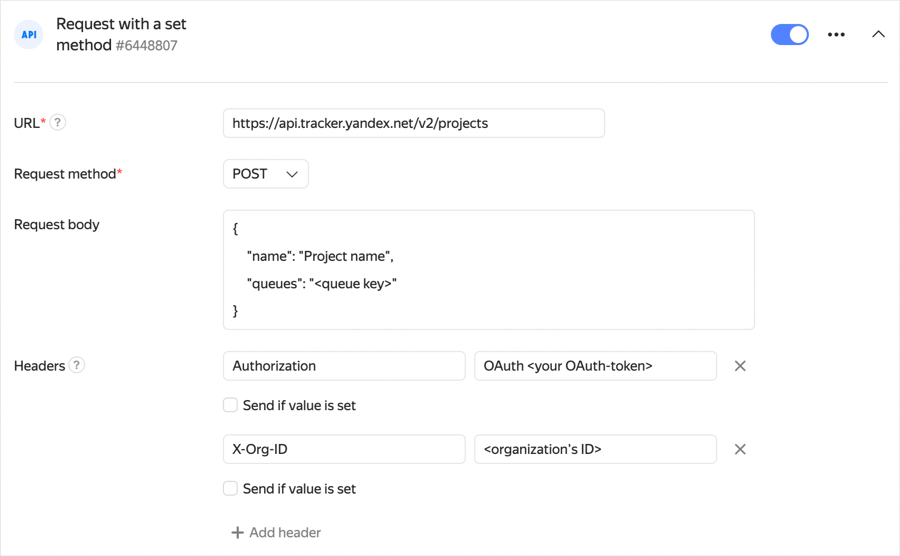

# Sending an HTTP request




For HTTP requests to work correctly, you need to allow your service to accept packets from the {{ forms-full-name }} `2a02:6b8:c00::/40` network over the `ipv6` protocol. Otherwise, your service firewall may block data sent by the form.




To send data from your form to a web service via the API, use HTTP requests:


1. Select the form and open the **Integration** tab.

1. Select the [group of actions](notifications.md#add-integration) to add an HTTP request to and click the button with the desired **API** request type:

   - **JSON-RPC POST request**: Send a request using the JSON-RPC protocol.


   - **Request with a set method**: Send any available form data with the option to set the request format and select the HTTP method.

   

   All requests are executed asynchronously.

   

1. Enter the URL of the service: Address of the node that provides the API.


1. Set parameters that depend on your selected request type:

   - Request JSON-RPC POST

      - Specify the service method that the request is sent to.

      - Specify the request parameters. Specify a name and value for each parameter.

      - You can use [variables](vars.md) as parameter values. If you choose to do so, enable **Send if value is set**.


   - Request with a set method

      - Select the HTTP method.

      - Set the request body: specify the parameters to be sent in JSON format. To add the data from the form to the request body, use [variables](vars.md).

      - Add headers to the request. Specify a name and value for each header.

      - You can use [variables](vars.md) as header values. If you choose to do so, enable **Send if value is set**.

1. Click **{{ ui-key.yacloud.common.save }}**.

> Example: create a project in {{ tracker-full-name }} with a name and queue key you specify.
>
> Create a request to the [{{ tracker-name }} API](../tracker/about-api.md) by filling out the form as follows:
>
> * **URL**: `https://api.tracker.yandex.net/v2/projects`.
> * **Request method**: `POST`.
> * **Request body**: Project parameters in JSON format:
>
>    ```json
>    
>        {
>           "name": "Project name",
>           "queues": "<queue_key>"
>        }
>    ```
>
> * **Headers**:
>    `Authorization` — `OAuth <OAuth_token>`;
>    >    `X-Org-ID: <organization_ID>` or `X-Cloud-Org-ID: <organization_ID>`
>    If you only have a {{ org-full-name }} organization, use the `X-Cloud-Org-ID` header; if only {{ ya-360 }} or both organization types, use `X-Org-ID`.
>    
>
> 

## Processing responses to  HTTP requests with a set method {#http-response}

**Successful request**

A request is considered successful if you get a response with code `200`, `201` or `202`.

**Handling errors**

If the following errors occur, the request is sent again (up to seven attempts in 30 minutes):

- Request expires in 5 seconds.

- Network error.

- Response with `5XX` code.

- Response with `404` code.

Any other errors cause the integration to fail.

**Redirect**

If the received response has the `307` code, the request is redirected to the URL that's specified in the `Location` header.

## Processing responses to a JSON-RPC POST request {#json-response}

**Successful request**

The request is considered successful if there are no errors from the list below.

**Redirect**

If the received response has the `307` code, the request is redirected to the URL that's specified in the `Location` header.

**Handling errors**

Errors are processed as follows:

1. If there's no response due to a network error or because the request expired, the request is sent again.

1. The response body is checked. If there's an error in the response body, the request is sent again after any error code, except:

   - `-32700` Parse error

   - `-32600` Invalid Request

   - `-32602` Invalid params

1. If the response body has no errors, the HTTP status code is checked. The request is sent again after responses with `5XX` and `404` status codes.

Any other errors cause the integration to fail.

## Troubleshooting {#filters}

### Two HTTP requests are sent per response in the form {#duplicated-requests}

In some cases, the HTTP request module doesn't wait for the external service to respond that the request is accepted. If so, the request is sent again and the service receives a duplicate request with the same data. If you want to track the uniqueness of HTTP requests, use the `x-delivery-id` header value.


### 400 Client Error: Bad request {#error-400}

If the integration failed with <q>400 Client Error: Bad request</q>, check the URL and the request body for typos, such as odd line breaks, non-breaking spaces, and escaped characters. The request body must be in JSON format.
