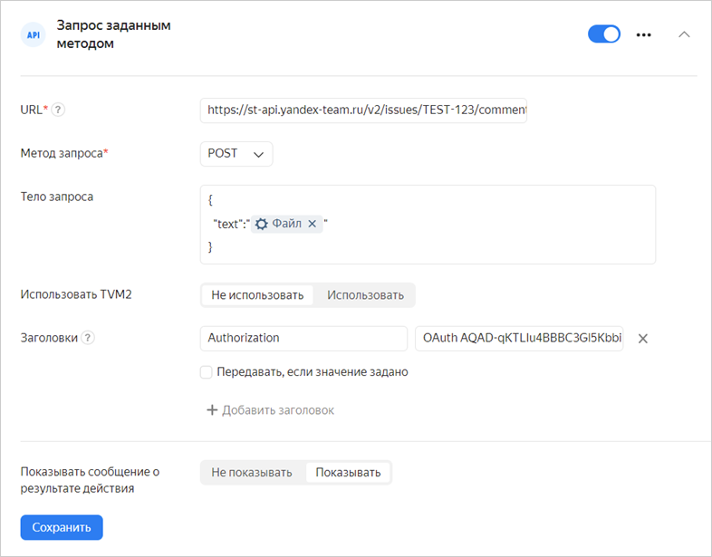
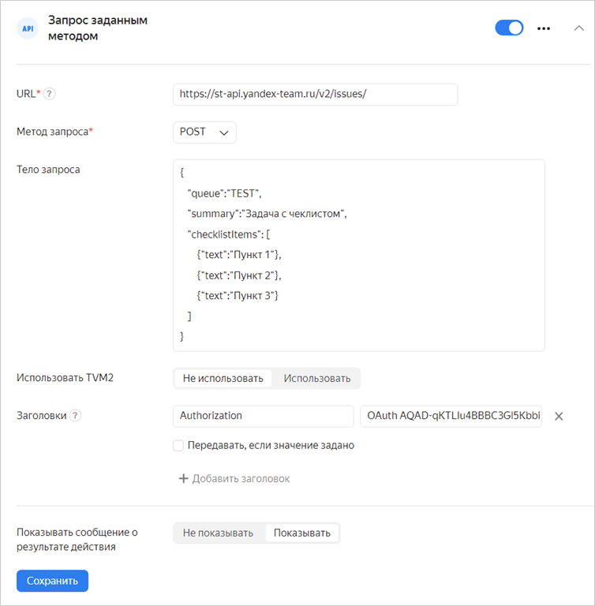

# Send the HTTP request





For HTTP requests to work correctly, you need to allow your service to accept packets from the {{ forms-full-name }} `2a02:6b8:c00::/40` network over the `ipv6` protocol. Otherwise, your service firewall may block data that's sent by the form.





To send data from your form to a web service via the API, use HTTP requests:



1. Before you set up HTTP requests, [request access](https://puncher.yandex-team.ru/) from the {{ forms-name }} subnet to your service: `_FORMS_BACK_PROD_NETS_` for production and `_FORMS_BACK_TEST_NETS_` for testing.



1. Select the form and open the **Integration** tab.

1. Select the [group of actions](notifications.md#add-integration) to add an HTTP request to and click the button with the desired **API** request type, then choose the type of request:

   - **JSON-RPC POST request**: Send a request using the JSON-RPC protocol.

   

   - **Request with the POST method**: Send the user's responses in JSON or XML format using an HTTP request with the POST method.

   - **Request with the PUT method**: Send the user's responses in JSON or XML format using an HTTP request with the PUT method.

   

   - **Request with a set method**: Send any available form data with the option to set the request format and select the HTTP method.

   

   All requests are executed asynchronously.

   

1. Enter the URL of the service: Address of the node that provides the API.



1. If necessary, configure authentication using [TVM2](https://wiki.yandex-team.ru/passport/tvm2/):

   

   TVM authentication can be configured by users with the `tvm_manager` or `form_manager` role in the ABC service that the specified application Client ID is linked to.

   

   1. Enable the **Use TVM2** option.

   1. In the **Client ID** field, specify ID of the your TVM application.

   1. Allow receiving TVM tickets from {{ forms-name }} in your service. You can view information about TVM applications {{ forms-name }} in [ABC service](https://abc.yandex-team.ru/services/forms/resources/?supplier=14&type=47&state=requested&state=approved&state=granted&view=consuming): forms is for production, forms-testing is for testing.



1. Set parameters that depend on your selected request type:

   - Request JSON-RPC POST

      - Specify the service method that the request is sent to.

      - Specify the request parameters. Specify a name and value for each parameter.

      - You can use [variables](vars.md) as parameter values. If you choose to do so, enable **Send if value is set**.

   

   - Requesting using the POST/PUT method

      - Select the prompts responses to which should be sent in the request.

      - Select the request format: JSON or XML.

      - If necessary, add headers to the request. Specify a name and value for each header.

      - You can use [variables](vars.md) as header values. If you choose to do so, enable **Send if value is set**.

   

   - Request with a set method

      - Select the HTTP method.

      - Set the request body: specify the parameters to be sent in JSON format. To add the data from the form to the request body, use [variables](vars.md).

      - Add headers to the request. Specify a name and value for each header.

      - You can use [variables](vars.md) as header values. If you choose to do so, enable **Send if value is set**.

1. Click **Save**.

> Example: create a project in {{ tracker-full-name }} with a name and queue key you specify.
>
> Create a request to the [{{ tracker-name }} API](../tracker/about-api.md) by filling out the form as follows:
>
> * **URL**: `https://st-api.yandex-team.ru/v2/projects``https://api.tracker.yandex.net/v2/projects`.
> * **Request method**: `POST`.
> * **Request body** is project parameters in JSON format:
>
>    ```json
>    
>        {
>           "name": "Project name",
>           "queues": "<queue key>"
>        }
>    ```
>
> * **Headers**:
>    `Authorization` — `OAuth <your OAuth token>`;
>    
>    `X-Org-ID` — `<organization ID>`.
>    
>
> 

## Processing responses to POST/PUT/ HTTP requests with a set method {#http-response}

**Successful request**

A request is considered successful if you get a response with code `200`, `201` or `202`.

**Handling errors**

If the following errors occur, the request is sent again (up to seven attempts in 30 minutes):

- Request expires in 5 seconds.

- Network error.

- Response with `5XX` code.

- Response with `404` code.

Any other errors cause the integration to fail.

**Redirect**

If the received response has the `307` code, the request is redirected to the URL that's specified in the `Location` header.

## Processing responses to a JSON-RPC POST request {#json-response}

**Successful request**

The request is considered successful if there are no errors from the list below.

**Redirect**

If the received response has the `307` code, the request is redirected to the URL that's specified in the `Location` header.

**Handling errors**

Errors are processed as follows:

1. If there's no response due to a network error or because the request expired, the request is sent again.

1. The response body is checked. If there's an error in the response body, the request is sent again after any error code, except:

   - `-32700` Parse error

   - `-32600` Invalid Request

   - `-32602` Invalid params

1. If the response body has no errors, the HTTP status code is checked. The request is sent again after responses with `5XX` and `404` status codes.

Any other errors cause the integration to fail.

## Troubleshooting {#filters}

### Two HTTP requests are sent per response in the form

In some cases, the HTTP request module doesn't wait for the external service to respond that the request is accepted. If so, the request is sent again and the service receives a duplicate request with the same data. If you want to track the uniqueness of HTTP requests, use the `x-delivery-id` header value.



### Variable data is inserted in an incorrect format

If you use [variables](vars.md) to add data from your form to a request, invalid characters may get into the request body and cause an integration error. To remove invalid characters from a response or convert it into a different format, set up [filters for variables](vars.md#var-filters).

Let's say a variable with a response to a prompt of the <q>Long text</q> type needs to be added to the body of the request. If the response text contains newline characters, integration will fail. To avoid this, convert the value of a variable to JSON format.

To do so, select the **JSON** filter when adding a variable.


### Unable to attach a file to an issue in {{ tracker-full-name }}

If you need to attach a file from a response to your form's prompt to an issue in {{ tracker-short-name }} via the API, the easiest way is to add a file to comments. To do this, create a **Request with a set method** with the following parameters:

- URL: `https://st-api.yandex-team.ru/v2/issues/<issue_key>/comments`

- Request method: **POST**

- Request body: add the <q>Response to prompt</q> variable to the request body and select <q>File</q> as the prompt type.

   ```
   {
       "text":"<variable with a response to a prompt>"
   }
   ```

- Headers: `Authorization: OAuth <token>`

   

### Unable to create an issue with a checklist in {{ tracker-full-name }} {#resolve-problems-checklist}

To create an issue with a checklist in {{ tracker-short-name }}, use the **Request with a set method** integration and specify the following parameters:

- URL: `https://st-api.yandex-team.ru/v2/issues`

- Request method: **POST**

- Request body: Enter the issue parameters in JSON format. For example:

   ```
   {"queue":"<Queue_key>",
   "summary":"Issue summary",     
   "checklistItems":[                     
       {"text":"Item 1"},
       {"text":"Item 2"},
       {"text":"Item 3"}]
   }
   ```

   To add the data from the form to the request body, use [variables](vars.md). For example, if you want an issue to be created by the user who filled out the form, set the `createdBy` parameter to a variable

   

   The `queue` and `summary` issue parameters are required. For more information about the request structure, see the [{{ tracker-name }} documentation](https://docs.yandex-team.ru/cloud/tracker/concepts/issues/create-issue).

   

   

   