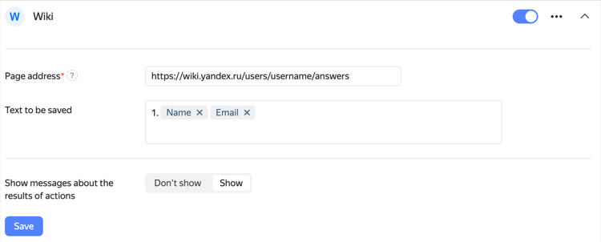

# Add a response to {{ wiki-name }}



Integration with {{ wiki-name }} can be configured by users of [{{ forms-full-name }} for business](forms-for-org.md).



You can integrate your form with [{{ wiki-name }}]({{ link-wiki }}) to save user responses on a wiki page. For example, if you're using a form to register participants for an event, you can automatically create a list of participants in {{ wiki-name }}. For more information about wiki pages, see the [{{ wiki-name }} documentation](../wiki/edit-page.md).



Integration won't work if user access to a {{ wiki-name }} page is restricted. In this case, [grant access](../wiki/page-management/access-setup.md) to your page for the service account `@yndx-wiki-cnt-robot`.



Settings for sending responses to {{ wiki-name }} differ depending on the response destination: a [{{ wiki-name }} page](#editor) or a [dynamic table](#grid).

## Adding responses to a page {#editor}

To set up adding responses from forms to a {{ wiki-name }} page:

1. Select the form and open the **Integration** tab.

1. Select a [group of actions](notifications.md#add-integration) for which you want to set up sending responses to {{ wiki-name }} and click  **{{ wiki-name }}** at the bottom of the group.

1. Specify the address of the Wiki page where you want to send data from the form. For example: `users/login/my-page`. By default, responses are added to the bottom of the page. To add responses to a specific place on the page:

   1. Insert an [anchor](../wiki/actions/anchor.md) in the place where you want to add responses from the form. For example, `{{a name="form"}}`.

   1. In the {{ wiki-name }} integration settings, append the `#` character and the name of the anchor to the page address like this: `users/login/my-page#form`. Responses from the form will be added to the page after the anchor.

1. In the **Text** field, specify what data to add to the page. You can format the text using [wiki markup](../wiki/static-markup.md).
   You can add to the text a response to a prompt or other data from the form:

   1. Select the field and click  to the right.

   1. Select a [variable](vars.md) from the list to add to the field. For instance, you can add a user's name and email to the text.

   

1. For the user to get a link to the Wiki page after filling out the form, enable the **Show messages about the results of actions** option under the action name.

1. Click **{{ ui-key.yacloud.common.save }}**.

## Dynamic table {#grid}

To set up adding responses from forms to a {{ wiki-name }} dynamic table:

1. Select the form and open the **Integration** tab.

1. Select a [group of actions](notifications.md#add-integration) for which you want to set up sending responses to {{ wiki-name }} and click  **{{ wiki-name }}** at the bottom of the group.

1. Specify the address of the dynamic table to send data from the form to. For example: `users/login/my-page`.

1. In {{ wiki-full-name }}, find out the ID of the column where you want to add records.

   1. On the dynamic table page, click  → **Settings** to the right of the column name.

   1. Copy the **Unique ID** field value.

1. In {{ forms-full-name }}, on the integration page, under **Column and value**, click **Add column** and paste the column ID you copied. In the field next to it, specify what data to add to the table. You can format the text using [wiki markup](../wiki/static-markup.md). To add to the text a response to a prompt or other data from the form:

   1. Click  to the right of the field.

   1. Select a [variable](vars.md) from the list to add to the field. For example, you can add a user's name and email address to the text.

1. For the user to get a link to the Wiki page after filling out the form, enable the **Show messages about the results of actions** option under the action name.

1. Click **{{ ui-key.yacloud.common.save }}**.

To send responses to multiple Wiki pages at once, add multiple actions using the  **{{ wiki-name }}** button at the bottom of the page. 

If you want data to be sent to {{ wiki-name }} only if the user gave certain responses, [set the conditions](notifications.md#section_xlw_rjc_tbb).