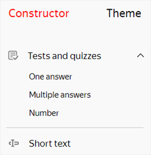

# Conducting a test

You can use {{ forms-full-name }} to make a test or quiz. You can test people's knowledge on some topic or make a humorous quiz that can be shared on social media. Users get points for correct responses, and after completing the test, they can see their results.

## Adding prompts for a test {#test-questions}

To create a test, add prompt blocks from the **Tests and quizzes** category to your form:

1. Open a form or [create a new one](new-form.md).

1. Select the desired form and open the **Constructor** tab.

1. To add a prompt for the test, select a block in the left panel under **Tests and quizzes** and drag it to the workspace.

   

1. In the **Edit a response** window that opens, set the block parameters:

   1. In the **Prompt** field, enter your prompt.

   1. For the **One answer** and **Multiple answers** prompt types, set the response options.

   1. Specify the correct responses and the number of points that the user gets for them. The **One answer** and **Multiple answers** prompt types can have multiple correct responses.

   1. Under **Settings**, you can make a prompt require a response or set up response sorting if needed. To learn more about prompt parameters for tests, see [{#T}](blocks-ref/tests-ref.md).

1. Add the rest of the prompts to the form and configure the responses in the same way.

1. To change the order of prompts, hover over the block and drag the  icon to where you want it.

   

1. If you want to show or hide a block depending on how the user responded to other prompts, [set the block display conditions](add-questions.md#conditions).

1. Set up [rules for scoring the test](#test-result).

1. [Publish your test](publish.md).

## Setting up scoring {#test-result}

After the user completes the test, you can show them their scored points and results. You can choose one of two ways to calculate the score:

- Two-level: Pass or fail.

- Multi-level: Results labeled in segments. For example: <q>professional</q>, <q>amateur</q>, and <q>beginner</q>.

To set up rules for scoring:

1. Select a form and go to **Settings** → **Tests and quizzes**.

1. Turn on **Show test results**.

   

   If you show test results, you can't [redirect users to a website](success-page.md#sec_redirect) or display a [message](success-page.md#message) when they submit the form. You can set up these parameters in **Settings** → **Text and submit logic**.

   

1. Select the scoring method:

   - **By segment**: For multi-level scoring. If you select this option, set the number of segments (scoring levels). The number of points that corresponds to each segment is determined automatically.

   - **Pass/Fail**: For two-level scoring. If you select this option, specify the minimum number of points that constitutes a passing score.

1. For each segment (or for pass and fail), enter the text that the user sees if their result fits this segment:

   - Enter a header like <q>You're an avid traveler!</q>

   - Write a comment. For example, suggest materials that the user can read to improve their result. To format the text of a comment, use [Markdown markup](appearance.md#section_pzm_m1j_j3b).

   - To attach an image, click .

1. Click **{{ ui-key.yacloud.common.save }}**.



If you merge prompts from the **Tests and quizzes** category into a [series of prompts](blocks-ref/series.md), scoring won't work.



## Show correct and incorrect responses {#show-right-answ}

After the user completes the test, you can let them know which of their responses were correct or incorrect:

1. Select a form and go to **Settings** → **Tests and quizzes**.

1. Turn on **Show test results**.

1. Turn on **Show correct and incorrect answers in test results**.

1. Click **{{ ui-key.yacloud.common.save }}**.

After completing the test, users can click **{{ ui-key.forms.common.blocks_quiz-result.correct-answers }}**. A page opens where the user can see their score, with correct and incorrect responses highlighted.

## View user responses {#right-answ-separately}

When the test is submitted, you can see which responses are correct or incorrect by viewing [individual responses](answers.md#answer-in-detail). Correct and incorrect responses are highlighted in different colors.
