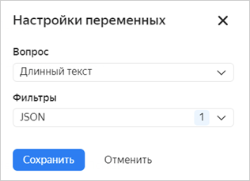

# Variables in integration settings

When you set up integration of your form with other services, you can send responses or other data from the form to the service. For example, you can insert the user's responses into the text of an email or insert data into issue fields in {{ tracker-short-name }}.

Use variables to do this:

1. In the **Integration** tab of your form, [add an action](notifications.md#add-integration).

1. Select the field and click  to the right.

1. Select a variable from the list to add to the field.

1. If using variables like **Prompt response**, **Response ID** or similar, you can choose a [filter](#var-filters) for the variable values if needed.

1. Click **{{ ui-key.yacloud.common.save }}**.

When data is sent to the service, the variable is automatically converted to a value: a response to a prompt, test result, or technical data.



When [integrating your form with {{ tracker-short-name }}](create-task.md), you can add the employee who's specified in a response to the <q>People</q>, to the **Reporter**, **Assignee**, and **Followers** fields in Tracker. To do so, add a **Response ID** variable to the field. If you use a **Response to prompt** variable, integration won't work.



> See below sample text of an email containing all the user's responses to the form prompts.
>
> 

## Filters {#var-filters}

If integration settings contain prompt responses added using variables, errors may occur if responses do not match the format required for integration. For example, if you add a response to the <q>Long text</q> prompt to the HTTP request body and this response contains line breaks, integration won't work.

To avoid data format errors, use the following filters for variables:

* **Sanitize string** to remove special characters from the text of a response.

* **JSON** to convert the response text to a JSON-compatible format.

* **base64** to convert the response text to ASCII encoding.

## Formatting of responses {#formatting-responses}

If the integration settings contain question responses added using variables, you can select the format of responses submitted from the form.

* **Plain text** shows the data in the "question - response" format.

* **Formatted** wraps questions and responses in a code block.

* **JSON** shows responses in the `"key": "value"` format.

## Variable reference {#section_wqx_1j2_p2b}

You can use the following variables in action settings:

| Variable | Description |
----- | -----
| **User data** | Personal data of the user filling the form.   Variables of this group are only converted to the user's personal data if the form was created in [{{ forms-full-name }} for business](forms-for-org.md) and filled by an employee of the organization. You can only get data from external users if they provide their data in response to the form prompts. |
| Name | User's name. |
| Login | User's login. |
| Email | User's email. |
| Gender | User's gender. |
| Department | Employee's department (for [{{ forms-full-name }} for business](forms-for-org.md) users). |
| Phone | Employee's work phone number (for [{{ forms-full-name }} for business](forms-for-org.md) users). |
| Supervisor | Employee's direct supervisor (for [{{ forms-full-name }} for business](forms-for-org.md) users). |
| Team | Employee's teams (for [{{ forms-full-name }} for business](forms-for-org.md) users). |
| **Data from the organization** | Information from the organization's address book in [{{ org-full-name }}]({{ link-org-main }}).|
| User info | One of the fields from the card of the employee filling the form. |
| Information from a response to a prompt | For prompts of the **People**, **Departments**, and **Teams** type, it is one of the fields from the card of an employee or department specified in the response.  |
| **Test results** | User's [test or quiz](tests.md) result. |
| Maximum test points | Maximum number of points one can score in the test. |
| Total prompts with points | Number of prompts one can score points for. |
| Points scored | Number of points scored by the user. |
| Test results heading | [Heading of the segment](tests.md#test-result) the user's result fits into. |
| Description of test results | [Description of the segment](tests.md#test-result) the user's result fits into. |
| Points scored for a prompt | Number of points scored for a selected prompt. |
| **Form** | Form's parameters and responses to its prompts. |
| Form ID | Unique form ID. |
| Name | Form name. |
| Prompt response | User's response to a specific prompt in the form (select a prompt and set up the response format). Only the response to the prompt you selected will be sent to this variable. |
| Questions and answers | User's responses to multiple prompts: select the prompts and set up the formatting for responses. Prompts with responses in "Prompt : response" format will be sent to this variable. |
| Response ID | Unique ID of the completed form. |
| Prompt response option ID | Unique ID of a response option for multiple-choice prompts (such as <q>People</q> or <q>Drop-down list</q>). |
| Response date | The date of filling out the form. |
| Form author's email | Email of the user who created the form. |
| **Browser** | Information about the user's browser and operating system |
| OS family | Operating system type |
| OS name | Operating system name |
| OS version | Operating system version |
| Browser name | Name |
| Browser version | Version |
| **Request** | The technical parameters of an HTTP session |
| Host | Domain name of the server the request is received from |
| URL | Form address |
| All GET parameters | Values of all request parameters.  Learn more about how to [use GET parameters to pre-fill a form](get-params.md). |
| GET parameter | Value of a specific request parameter (enter parameter name).  Learn more about how to [use GET parameters to pre-fill a form](get-params.md). |
