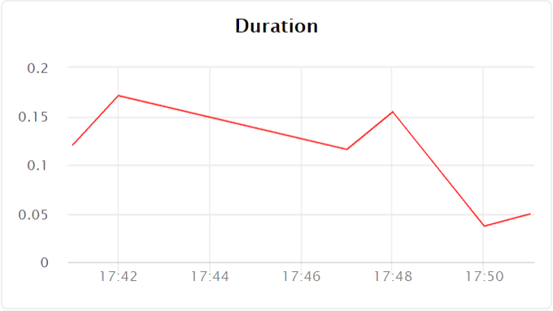

# Monitoring

{{ sf-name }} monitors functions by three indicators:

- Number of function calls per minute — the **Invocations** chart:

    

- Average function execution time — the **Durations** chart:

    

- Number of errors that occurred on running a function — the **Errors** chart:

    

#### See also {#see-also}

- [{#T}](../operations/function/function-monitoring.md)

