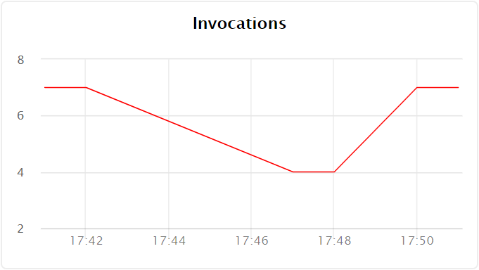
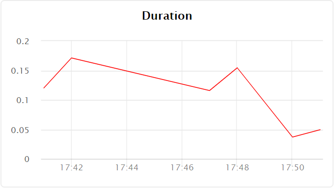
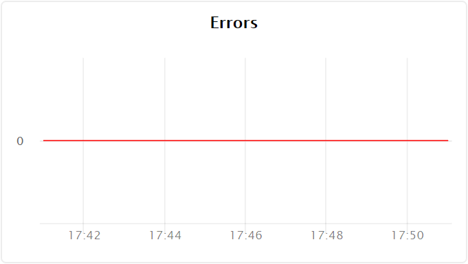

# View monitoring charts

You can view charts for the following metrics:

- [Number of function invocations](#invocations)
- [Average function execution time](#durations)
- [Number of errors that occurred when running the function](#errors)

## Number of function invocations {#invocations}

To view the chart:

1. Open the **{{ sf-name }}** section in the folder containing the function you want to get information about.

1. Select the function whose monitoring charts you want to view from the list of functions.

1. On the **Overview** page, go to the **Monitoring** tab.

1. Select the period for the chart. You can choose a predefined interval (hour, day, week, month) or enter a custom period in the date fields.

1. The number of function calls is displayed on the **Invocations** chart:

    

## Average function execution time {#durations}

To view the chart:

1. Open the **{{ sf-name }}** section in the folder containing the function you want to get information about.

1. Select the function whose monitoring charts you want to view from the list of functions.

1. On the **Overview** page, go to the **Monitoring** tab.

1. Select the period for the chart. You can choose a predefined interval (hour, day, week, month) or enter a custom period in the date fields.

1. The average call time is displayed in the **Durations** chart:

    

## Number of errors that occurred when executing a function {#errors}

To view the chart:

1. Open the **{{ sf-name }}** section in the folder containing the function you want to get information about.

1. Select the function whose monitoring charts you want to view from the list of functions.

1. On the **Overview** page, go to the **Monitoring** tab.

1. Select the period for the chart. You can choose a predefined interval (hour, day, week, month) or enter a custom period in the date fields.

1. The number of errors that occurred when running the function is shown in the **Errors** chart:

    

