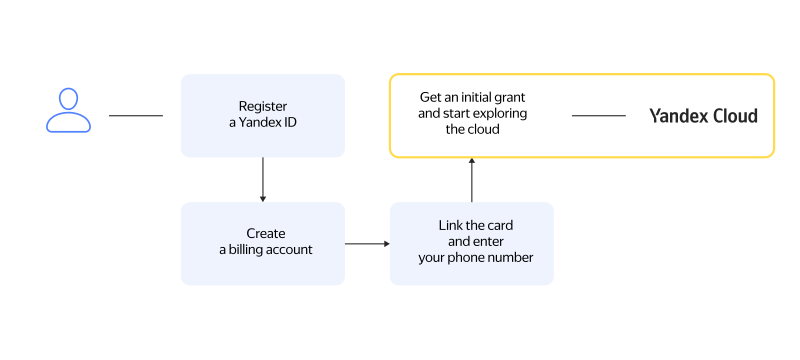

# Getting started

The {{ yandex-cloud }} platform has several user interfaces, such as the [management console]({{ link-console-main }}) and the [command line interface](../../cli/). To access any user interface, you will need a _user account_. This can be a personal Yandex account (Yandex ID) or a Yandex.Connect account. For detailed instructions, see Help for [Yandex ID](https://yandex.ru/support/passport/authorization/registration.html)(https://yandex.com/support/passport/authorization/registration.html) and [Yandex.Connect](https://yandex.ru/support/connect/personal.html#personal__section_aq5_hcq_23b)(https://yandex.com/support/connect/personal.html#personal__section_aq5_hcq_23b).

## Creating a billing account {#new-account}

A billing account is required even if you plan to use only free services. After you create the first billing account linked to your user account, you are awarded the initial grant. For more information about the initial grant, see [{#T}](../../billing/concepts/bonus-account.md).

