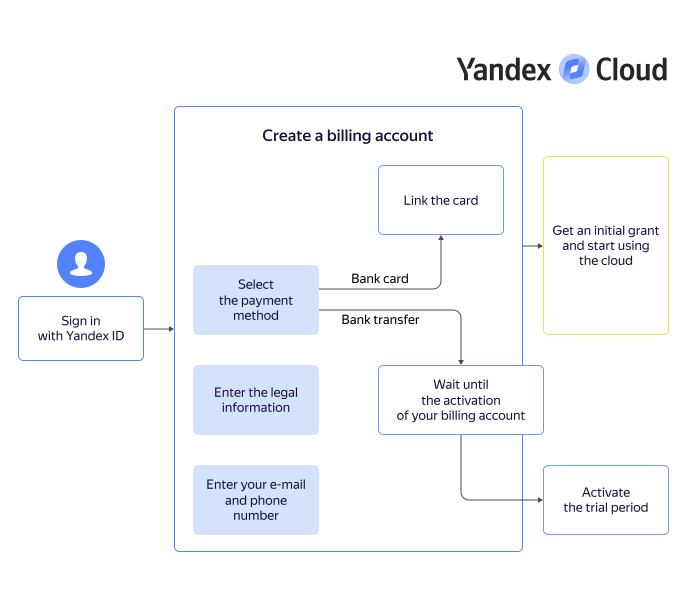

# Getting started for businesses



## Creating a billing account {#new-account}

A billing account is required even if you plan to use only free services. When you create the first billing account linked to your user account, you are awarded the [initial grant](../usage-grant.md).



- Trial period

   

- Paid version

   





Provide details to create a billing account:

1. Select a payment method: **Bank card** or **Bank transfer**. You can [change your payment method](../../billing/operations/change-payment-method.md) any time after creating a billing account.



- Bank card

   1. Enter the legal information of your organization.

      

   1. Link your corporate bank card:

      

      * Confirm the card is a corporate one and you are authorized to use it.

      

      

   1. Enter your current email address and phone number. Contact details are required not only to reach you, but also to issue payment invoices and send financial documents.

   1. If this is your first billing account in {{ yandex-cloud }}, a [trial period](../free-trial/concepts/quickstart.md) is available to you.

      

      In some cases, additional verification may be required when you create a billing account with a trial period. On the page of this billing account in the management console, you'll find a message with detailed instructions.

      

      * When enabling the trial period, remember that after its expiration, your resources will be suspended. To resume operation, you will need to switch to the [paid version](../free-trial/concepts/upgrade-to-paid.md).
      * If you do not activate the trial period at this stage, your account will be created with paid consumption. In this case, [after using up the initial grant](../usage-grant.md), you will not have to upgrade to the paid version.

   1. Click **Create**.

- Bank transfer

   1. Enter the legal information of your organization and your contact details.

      

   1. Click **Create**.

   You will receive an email with further instructions at the email address specified in your user account. It may take up to three business days to activate your billing account.

   If this is your first billing account in {{ yandex-cloud }}, it's created with the trial period enabled. To continue using the resources after your trial period ends, make sure to switch to the [paid version](../../billing/operations/activate-commercial.md).



