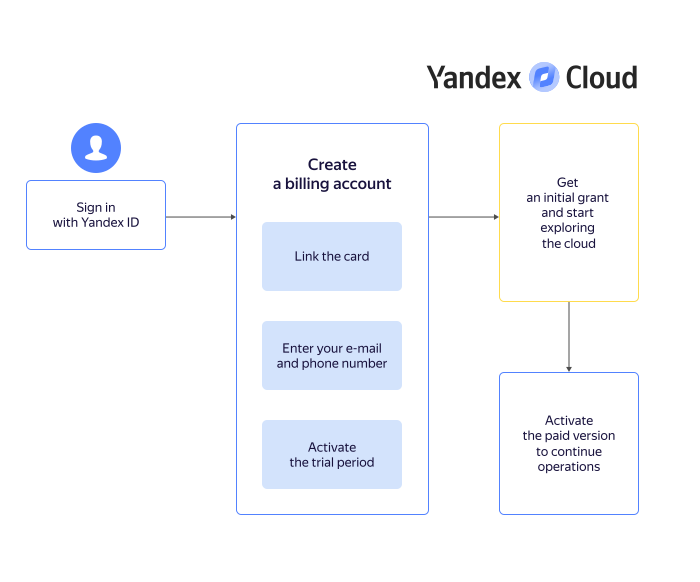
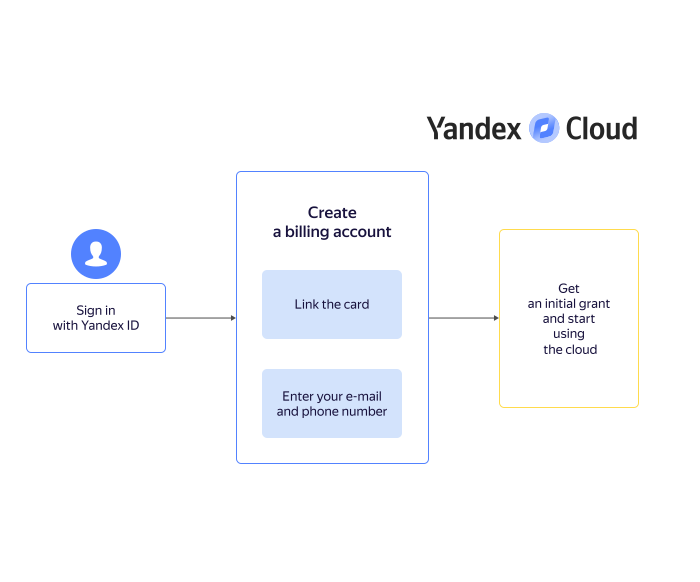

# Getting started for individuals



## Creating a billing account {#new-account}

A billing account is required even if you plan to use only free services. When you create the first billing account linked to your user account, you are awarded the [initial grant](usage-grant.md).



- Trial period

   

- Paid version

   





Provide details to create a billing account:

1. Enter your first, last, and middle name.

1. Link the card:

   

   

   

1. Enter your current email address and phone number. Contact details are required not only to reach you, but also to issue payment invoices and send financial documents.

1. If this is your first billing account in {{ yandex-cloud }}, a [trial period](free-trial/concepts/quickstart.md) is available to you.

   

   In some cases, additional verification may be required when you create a billing account with a trial period. On the page of this billing account in the management console, you'll find a message with detailed instructions.

   

   * When enabling the trial period, remember that after its expiration, your resources will be suspended. To resume operation, you will need to switch to the [paid version](free-trial/concepts/upgrade-to-paid.md).
   * If you don't activate the trial period at this stage, your account will be created with paid consumption. In this case, after [using up the initial grant](usage-grant.md), you don't have to upgrade to the paid version.

1. Click **Create**.

