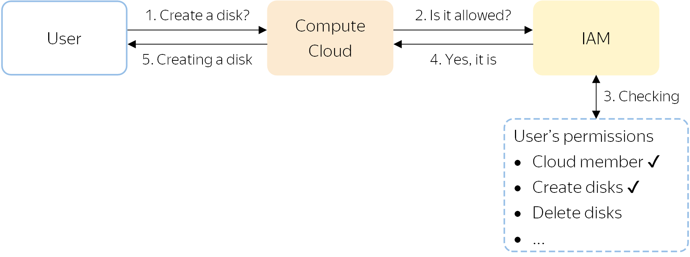
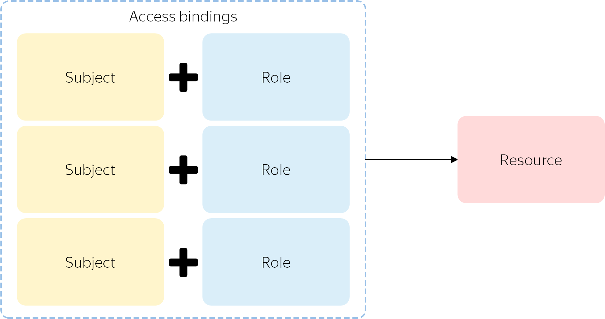

# How access management works in {{ yandex-cloud }}

Here you can learn how to manage access to your resources and how {{ iam-short-name }} checks access rights for the resources.

## How are access rights verified? {#access-verifying}

All operations in {{ yandex-cloud }} are first sent for verification to {{ iam-short-name }}. For example:

1. A user requests {{ compute-name }} to create a new disk in the <q>default</q> folder.
1. The service sends a request to {{ iam-short-name }} to check whether this user is allowed to create disks in this folder.
1. {{ iam-short-name }} checks if the user is a member of the cloud with the <q>default</q> folder and has the necessary permissions to create a disk in this folder.
1. If any of the permissions are missing, the operation is not allowed and {{ yandex-cloud }} returns an error.
   If all the required permissions were granted, {{ iam-short-name }} reports this to the service.
1. The service creates a new disk.

## How do I perform access management? {#how-do-i-perform-access-management}

Access management in {{ yandex-cloud }} leverages the [Role Based Access Control](https://en.wikipedia.org/wiki/Role-based_access_control) (RBAC) policy. To grant users access to a resource, you specify which [roles](roles.md) are assigned to them for that resource.

To assign a role, [select a resource](#resource), [choose a role](#role), and [describe the subject](#subject) assigned the role. This allows you to [bind access rights](#access-bindings) to the resource.

You can also assign a role to a parent resource that [access rights are inherited](#inheritance) from, such as a folder or cloud.



It usually takes 5 seconds or less to update access rights. If the role was assigned to you, but you do not have access yet, repeat the operation.

For example, you were given the right to create folders in the cloud and you were able to create one folder, but couldn't create another one. This is because the access rights have not yet been updated on the server where the second create folder operation was performed. Try creating the folder again.



### Resources that roles can be assigned for {#resource}

You can assign roles for a [cloud](../../../resource-manager/operations/cloud/set-access-bindings.md), [folder](../../../resource-manager/operations/folder/set-access-bindings.md), and other resources from the [list](resources-with-access-control.md). If you need to grant access to a resource that is not on the list, assign the role for the parent resource it [inherits](#inheritance) permissions from. For example, [{{ mpg-full-name }} clusters](../../../managed-postgresql/concepts/index.md) inherit access permissions from their folder.

### Role {#role}



Thus, roles for a resource can be assigned by users with the [administrator](../../roles-reference.md#admin) role for the cloud or organization, as well as by the owners of the cloud or organization to which the resource belongs.

Each role consists of a set of permissions that describe operations that can be performed with the resource. A user can assign a role with only those permissions which are available to themselves. For example, only the user with the [cloud owner](../../../resource-manager/security/index.md#resource-manager-clouds-owner) role can assign this same role. The administrator role is not enough for this.

To find out what roles exist and what permissions they include, see [{#T}](roles.md).

### Subjects that roles are assigned to {#subject}

Roles are assigned to subjects. The following subject types are available:

* `userAccount`: [Yandex account](../users/accounts.md#passport) added to {{ yandex-cloud }}.
* `serviceAccount`: [Service account](../users/service-accounts.md) created in {{ yandex-cloud }}.

   
* `federatedUser`: User account in an [identity federation](../../../organization/concepts/add-federation.md), e.g., Active Directory.

* `group`: User group created in [{{ org-full-name }}](../../../organization/).

* `system`: [System group](system-group.md).

### Access binding {#access-bindings}

Roles to a resource are assigned as a list of _role-subject_ bindings. They are called _access bindings_. You can add or remove these bindings to control access rights to a resource.

Each binding is a single assignment of a role to a subject. To assign a user multiple roles to a resource, set a separate binding for each role.

### Inheritance of access rights {#inheritance}

If a resource has child resources, all permissions from the parent resource will be inherited by the child resources. For example, if you assign a user a role for a folder where a VM instance resides, all permissions of this role will also apply to the instance.

If a child resource is also assigned some roles, a list of permissions for this resource will be combined with a list of permissions for its parent resource. You cannot limit the list of permissions inherited from the parent resource.

### Impersonation {#impersonation}

_Impersonation_ occurs when a user performs certain actions with cloud resources on behalf of a service account with the appropriate permissions. Impersonation is mostly used to temporarily expand user permissions without generating static credentials for the user.

For example, the user needs temporary permissions for viewing a folder they do not have view access for. The administrator can [assign](../../operations/sa/set-access-bindings.md#impersonation) a role for viewing the folder to the service account, and assign the special `iam.serviceAccounts.tokenCreator` role to the user. As a result, the user can view the folder's resources on behalf of the service account or obtain an IAM token for the service account. The user cannot edit permissions or delete the service account.

The administrator can revoke the role whenever needed.

### Access control restrictions in the management console {#console-restrictions}

Some restrictions apply to [assigning roles](../../operations/roles/grant.md) in the management console:

* You cannot assign roles to multiple subjects at once, unlike in the API or CLI. In the management console, you should first select the subject (user or service account) and then assign roles to it.

#### See also {#see-also}

For more information about managing access to a specific {{ yandex-cloud }} service, see the <q>Access management</q> section in the documentation for that service.

Step-by-step guides and examples:

* [{#T}](../../operations/roles/grant.md)
* [{#T}](../../operations/roles/revoke.md)
* [{#T}](../../operations/sa/assign-role-for-sa.md)
* [{#T}](../../operations/sa/set-access-bindings.md)
* [{#T}](../../../resource-manager/operations/cloud/set-access-bindings.md)
* [{#T}](../../../resource-manager/operations/folder/set-access-bindings.md)
