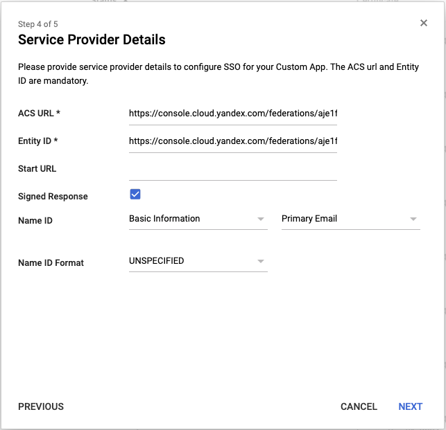
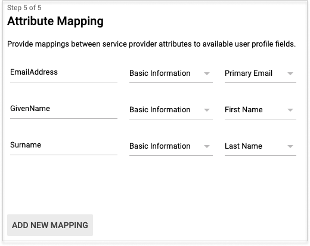

# Authentication using G Suite

If you have an [identity federation](../../concepts/users/identity-federations.md), you can use Google's [G Suite](https://gsuite.google.com/) to authenticate in the cloud.

To set up authentication:

1. [Start to create an SAML app](#configure-sso-gsuite-start).
1. [Create an identity federation in the cloud](#create-federation).
1. [Add certificates to the federation](#add-certificate).
1. [Get a console login link](#get-link).
1. [Finish creating your SAML app](#configure-sso-gsuite-finish).
1. [Add users to the cloud](#add-users).
1. [Test the authentication process](#test-auth).

## Before you start {#before-you-begin}

To use the instructions in this section, you need:​

1. The [`admin`](../../concepts/access-control/roles.md#admin) or [`resource-manager.clouds.owner`](../../concepts/access-control/roles.md#owner) role in the cloud.
1. An activated domain that you're going to configure the SAML app in G Suite for.

## Start creating an SAML app {#configure-sso-gsuite-start}

Before you can create an identity federation in the cloud, you need to get information about the IdP (your SAML app in G Suite):

1. Log in to the [G Suite admin console](https://admin.google.com/).
1. Click the **Apps** icon.
1. Click on the **SAML apps** card.
1. Click the add app button (the **+** icon in the lower-right corner of the page).
1. At the bottom of the window that opens, click **Set up my own custom app**.
1. The **Google IdP Information** page shows the IdP server data. Don't close this window: you need this data to [create an identity federation](#create-federation) and [add a certificate](#add-certificate).

## Create a federation in the cloud {#create-federation}



- Management console

    1. Open the folder page in the [management console]({{ link-console-main }}).

    1. Select the **Federations** tab in the left menu.

    1. Click **Create federation**.

    1. Enter a name for the federation. The name must be unique within the folder.

    1. Add a description if necessary.

    1. In the **Cookie lifetime** field, specify the time before the browser asks the user to re-authenticate.

    1. Copy the link from the **Entity ID** field of the G Suite **Google IdP Information** page to the **IdP Issuer** field. This is a link in the format:

        ```
        https://accounts.google.com/o/saml2?idpid=<SAML app ID>
        ```

    1. Copy the link from the **SSO URL** field of the G Suite **Google IdP Information** page to the **Link to the IdP login page** field. This is a link in the format:

        ```
        https://accounts.google.com/o/saml2/idp?idpid=<SAML app ID>
        ```

    1. Enable **Automatically create users** to automatically add a new user to the cloud on successful authentication. This option simplifies the user setup process, but the user only has the `resource-manager.clouds.member` role and they can't do anything with the resources in the cloud. Exceptions are the resources that the `allUsers` or `allAuthenticatedUsers` system group roles are assigned to.

        If this option is disabled, users who aren't added to the cloud can't log in, even if they have authenticated on your server. This way you can create a <q>white list</q> of users that are allowed to use {{ yandex-cloud }}.

- CLI

    

    

    1. See the description of the create federation command:

        ```
        yc iam federation create --help
        ```

    1. Create a federation:

        ```
        yc iam federation create --name my-federation \
            --auto-create-account-on-login \
            --cookie-max-age 12h \
            --issuer "https://accounts.google.com/o/saml2?idpid=C03xolm0y" \
            --sso-binding POST \
            --sso-url "https://accounts.google.com/o/saml2/idp?idpid=C03xolm0y"
        ```

        Where:

        * `name`: Federation name. The name must be unique within the folder.

        * `auto-create-account-on-login`: Flag for automatically creating new users in the cloud after authenticating on the IdP server. This option simplifies the user setup, but users created this way are only assigned the `resource-manager.clouds.member` role by default: they can't do anything with cloud resources. Exceptions are the resources that the `allUsers` or `allAuthenticatedUsers` system group roles are assigned to.

            If this option is disabled, users who aren't added to the cloud can't log in to the management console, even if they authenticate with your server. In this case, you can manage the white list of users who are allowed to use {{ yandex-cloud }}.

        * `cookie-max-age`: Time before the browser asks the user to re-authenticate.

        * `issuer`: IdP server ID to be used for authentication.

            Copy here the link from the **Entity ID** field of the G Suite **Google IdP Information** page. This is a link in the format:

            ```
            https://accounts.google.com/o/saml2?idpid=<SAML app ID>
            ```

        * `sso-url`: URL of the page that the browser redirects the user to for authentication.

            Copy here the link from the **SSO URL** field of the G Suite **Google IdP Information** page. This is a link in the format:

            ```
            https://accounts.google.com/o/saml2/idp?idpid=<SAML app ID>
            ```

        * `sso-binding`: Specify the Single Sign-on binding type. Most Identity Providers support the `POST` binding type.

- API

    1. [Get the ID of the folder](../../../resource-manager/operations/folder/get-id.md) to create your federation in.

    1. Create a file with the request body (for example, `body.json`):

        ```json
        {
          "folderId": "<folder ID>",
          "name": "my-federation",
          "autocreateUsers": true,
          "cookieMaxAge":"43200s",
          "issuer": "https://accounts.google.com/o/saml2?idpid=C03xolm0y",
          "ssoUrl": "https://accounts.google.com/o/saml2/idp?idpid=C03xolm0y",
          "ssoBinding": "POST"
        }
        ```

        Where:

        * `folderId`: ID of the folder.

        * `name`: Federation name. The name must be unique within the folder.

        * `autocreateUsers`: Flag for automatically creating new users in the cloud after authenticating on the IdP server. This option simplifies the user setup, but users created this way are only assigned the `resource-manager.clouds.member` role by default: they can't do anything with cloud resources. Exceptions are the resources that the `allUsers` or `allAuthenticatedUsers` system group roles are assigned to.

            If this option is disabled, users who aren't added to the cloud can't log in to the management console, even if they authenticate with your server. In this case, you can manage the white list of users who are allowed to use {{ yandex-cloud }}.

        * `cookieMaxAge`: Time before the browser asks the user to re-authenticate.

        * `issuer`: IdP server ID to be used for authentication.

            Copy here the link from the **Entity ID** field of the G Suite **Google IdP Information** page. This is a link in the format:

            ```
            https://accounts.google.com/o/saml2?idpid=<SAML app ID>
            ```

        * `ssoUrl`: URL of the page that the browser redirects the user to for authentication.

            Copy here the link from the **SSO URL** field of the G Suite **Google IdP Information** page. This is a link in the format:

            ```
            https://accounts.google.com/o/saml2/idp?idpid=<SAML app ID>
            ```

        * `ssoBinding`: Specify the Single Sign-on binding type. Most Identity Providers support the `POST` binding type.

    1. 



## Specify certificates for the identity federation {#add-certificate}



Download the certificate from the **Google IdP Information** page open in G Suite. Add this certificate to the federation created.



## Get a console login link {#get-link}



## Finish creating your SAML app {#configure-sso-gsuite-finish}

Having created a federation and obtained a console login link, finish creating the SAML app in G Suite:

1. Re-open the SAML app creation window and click **Next**.

1. Enter a name for your SAML app, like <q>yandex-cloud-federation</q>. Add a description and upload a logo if necessary. Click **Next**.

1. Enter information about {{ yandex-cloud }} that acts as a Service Provider (SP):

    * In the **ACS URL** and **Entity ID** fields, enter the previously obtained [console login link](#get-link).

    * Enable **Signed Response**.

    * In the **Name ID** field, specify what the server will return as Name ID (the unique ID of the identity federation user).

        Select **Basic Information** and **Primary Email** next to it.

    * The other fields are optional, so you can skip them and click **Next**.

    

1. For the user to contact {{ yandex-cloud }} technical support from the [management console](https://console.cloud.yandex.com/support), click **Add new mappings** and configure the server to pass the user's email address. We also recommend that it passes the user's first and last name. Then click **Finish**.

    

1. On the next page, you can check the data entered for your SAML app.

1. Enable your SAML app by clicking **Edit service**.

1. In the page that opens, select who can authenticate with this identity federation:
    * To enable access for all federation users, select **ON for everyone**.
    * To enable access for an individual organizational unit, select the unit from the list on the left and configure the service status for this unit. The child units inherit access settings from the parent units by default.

## Add users to the cloud {#add-users}



## Test the authentication process {#test-auth}

When you finish configuring the server, you can test that everything is up and running:

1. Open the browser in guest or incognito mode to protect your work done in the console from your Yandex account.
1. Follow the [console login link](#get-link) obtained earlier. The browser forwards you to the Google authentication page.
1. Enter your authentication data. By default, enter your UPN and password. After that, click **Sign in**.
1. If the authentication is successful, the server redirects you back to the console login link and then to the management console home page. In the upper-right corner, you can see that you are logged in to the console as a federated user.

#### What's next {#what-is-next}

* [Assign roles to the added users](../roles/grant.md#access-to-federated-user).

