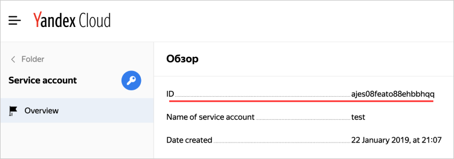

# Getting the service account ID

If you don't have a service account yet, [create one](create.md).



- Management console

  1. Go to the folder that the service account belongs to.

  1. Go to the **Service accounts** tab.

  1. Choose a service account and click the line with its name.

  1. For the service account ID, see **Overview**:

      

- CLI

  

  If you know the service account name, use the `get` command to get the account ID:

  ```
  $ yc iam service-account get my-robot
  
  id: aje6o61dvog2h6g9a33s
  ...
  ```

  If you don't know the name, get a list of service accounts in the default folder:

  ```
  $ yc iam service-account list
  +----------------------+------------------+-------------------------------+
  |          ID          |       NAME       |          DESCRIPTION          |
  +----------------------+------------------+-------------------------------+
  | aje6o61dvog2h6g9a33s | my-robot         |                               |
  | aje9sda1ufvqcmfksd3f | blabla           | bla bla bla is my description |
  +----------------------+------------------+-------------------------------+
  ```

- API

  1. [Get the ID of the folder](../../../resource-manager/operations/folder/get-id.md) that the service account was created in.

  1. Get information about the service accounts in the folder using the [list](../../api-ref/ServiceAccount/list.md) method:

      ```bash
      $ export FOLDER_ID=b1gvmob95yysaplct532
      $ export IAM_TOKEN=CggaATEVAgA...
      $ curl -H "Authorization: Bearer ${IAM_TOKEN}" \
          "https://iam.api.cloud.yandex.net/iam/v1/serviceAccounts?folderId=${FOLDER_ID}"
      
      {
       "serviceAccounts": [
        {
         "id": "ajebqtreob2dpblin8pe",
         "folderId": "b1gvmob95yysaplct532",
         "createdAt": "2018-10-18T13:42:40Z",
         "name": "my-robot",
         "description": "my description"
        }
       ]
      }
      ```



