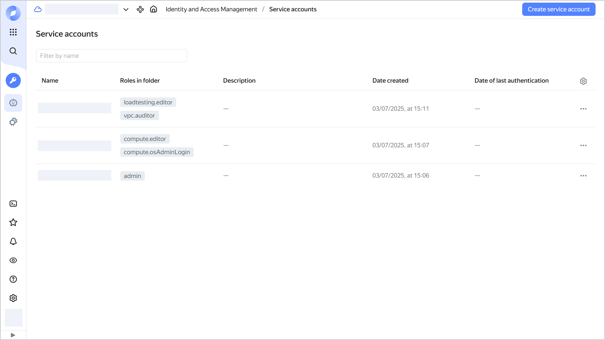

# Getting a list of the folder's service accounts

You can get a list of all [service accounts](../../concepts/users/service-accounts.md) available in the [folder](../../../resource-manager/concepts/resources-hierarchy.md#folder).



- Management console {#console}

  1. In the [management console]({{ link-console-main }}), navigate to the folder whose list of service accounts you want to get.
  1. In the list of services, select **{{ ui-key.yacloud.iam.folder.dashboard.label_iam }}**.
  1. In the left-hand panel, select  **{{ ui-key.yacloud.iam.label_service-accounts }}**.
  1. The **{{ ui-key.yacloud.iam.folder.service-accounts.label_title }}** page will display a list of all the folder's service accounts.

   

- CLI {#cli}

  

  

  Get a list of service accounts in the default folder:

  ```bash
  yc iam service-account list
  ```

  Result:

  ```
  +----------------------+--------------+--------+---------------------+-----------------------+
  |          ID          |     NAME     | LABELS |     CREATED AT      | LAST AUTHENTICATED AT |
  +----------------------+--------------+--------+---------------------+-----------------------+
  | ajeg2b2et02f******** | my-robot     |        | 2024-09-08 18:59:45 | 2025-02-18 10:10:00   |
  | ajegtlf2q28a******** | account-name |        | 2023-06-27 16:18:18 | 2025-02-18 10:20:00   |
  +----------------------+--------------+--------+---------------------+-----------------------+
  ```

  Where:

  * `ID`: Service account ID.
  * `NAME`: Service account name.
  * `LABELS`: Service account description.
  * `CREATED AT`: Service account creation date and time.
  * `LAST AUTHENTICATED AT`: Last authentication date and time.

- API {#api}

  1. [Find out the ID of the folder](../../../resource-manager/operations/folder/get-id.md) whose list of service accounts you want to view.
  1. Get a list of service accounts in the folder using the [list](../../api-ref/ServiceAccount/list.md) REST API method for the [ServiceAccount](../../api-ref/ServiceAccount/index.md) resource:

      ```bash
      export FOLDER_ID=b1gvmob95yys********
      export IAM_TOKEN=CggaATEVAgA...
      curl \
        --header "Authorization: Bearer ${IAM_TOKEN}" \
        "https://iam.{{ api-host }}/iam/v1/serviceAccounts?folderId=${FOLDER_ID}"
      ```

      Result:

      ```text
      {
       "serviceAccounts": [
        {
         "id": "ajeg2b2et02f********",
         "folderId": "b1gvmob95yys********",
         "createdAt": "2024-09-08T18:59:45Z",
         "name": "my-robot",
         "lastAuthenticatedAt": "2025-02-18T10:10:00Z"
        },
        {
         "id": "ajegtlf2q28a********",
         "folderId": "b1gvmob95yys********",
         "createdAt": "2023-06-27T16:18:18Z",
         "name": "account-name",
         "lastAuthenticatedAt": "2025-02-18T10:20:00Z"
        }
       ]
      }
      ```

     You can also get a list of service accounts in a folder using the [ServiceAccountService/List](../../api-ref/grpc/ServiceAccount/list.md) gRPC API call.

