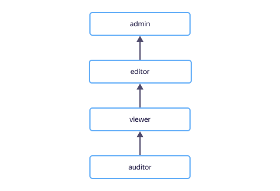

# {{ yandex-cloud }} role reference

## Primitive roles {#primitive-roles}

The chart below shows which primitive roles are available in {{ yandex-cloud }} and how they inherit each other's permissions. For example, the `{{ roles-editor }}` role includes all the permissions of the `{{ roles-viewer }}` role. You can find the description of each role under the chart.

#### {{ roles-auditor }} {#auditor}



#### {{ roles-viewer }} {#viewer}



#### {{ roles-editor }} {#editor}



#### {{ roles-admin }} {#admin}



## Service roles {#auxiliary-roles}

#### quota-manager.requestOperator {#quota-manager-requestoperator}



## AI services {#ai-services}

#### ai.auditor {#ai-auditor}



#### ai.viewer {#ai-viewer}



#### ai.editor {#ai-editor}



#### ai.admin {#ai-admin}



## {{ api-gw-full-name }} {#api-gateway-roles}

#### api-gateway.viewer {#api-gateway-viewer}



#### api-gateway.editor {#api-gateway-editor}



#### api-gateway.websocketWriter {#api-gateway-websocketwriter}



#### api-gateway.admin {#api-gateway-admin}



For more information, see [{#T}](../api-gateway/security/index.md).

## {{ alb-full-name }} {#alb-roles}

#### alb.auditor {#alb-auditor}



#### alb.viewer {#alb-viewer}



#### alb.user {#alb-user}



#### alb.editor {#alb-editor}



#### alb.admin {#alb-admin}



For more information, see [{#T}](../application-load-balancer/security/index.md).

## {{ at-full-name }} {#at-roles}

#### audit-trails.auditor {#at-auditor}



#### audit-trails.viewer {#at-viewer}



#### audit-trails.editor {#at-editor}



#### audit-trails.admin {#at-admin}



#### audit-trails.configViewer {#at-configviewer}



For more information, see [{#T}](../audit-trails/security/index.md).

## {{ certificate-manager-full-name }} {#certificate-manager-roles}

#### certificate-manager.auditor {#certificate-manager-auditor}



#### certificate-manager.viewer {#certificate-manager-viewer}



#### certificate-manager.editor {#certificate-manager.editor}



#### certificate-manager.admin {#certificate-manager-admin}



#### certificate-manager.certificates.downloader {#certificate-manager-certificates-downloader}



For more information, see [{#T}](../certificate-manager/security/index.md).

## {{ backup-full-name }} {#backup-roles}

#### backup.viewer {#backup-viewer}



#### backup.editor {#backup-editor}



#### backup.admin {#backup-admin}



For more information, see [{#T}](../backup/security/index.md).

## {{ billing-name }} {#billing-roles}

#### billing.accounts.member {#billing-accounts-member}



#### billing.accounts.owner {#billing-accounts-owner}



#### billing.accounts.viewer {#billing-accounts-viewer}



#### billing.accounts.accountant {#billing-accounts-accountant}



#### billing.accounts.editor {#billing-accounts-editor}



#### billing.accounts.admin {#billing-accounts-admin}



#### billing.accounts.varWithoutDiscounts {#billing-accounts-var-without-discounts}



#### billing.partners.editor {#billing-partners-editor}



For more information, see [{#T}](../billing/security/index.md).

## {{ cdn-full-name }} {#cdn-roles}

#### cdn.viewer {#cdn-viewer}



#### cdn.editor {#cdn-editor}



#### cdn.admin {#cdn-admin}



For more information, see [{#T}](../cdn/security/index.md).

## {{ dns-full-name }} {#dns-roles}

#### dns.auditor {#dns-auditor}



#### dns.viewer {#dns-viewer}



#### dns.editor {#dns-editor}



#### dns.admin {#dns-admin}



For more information, see [{#T}](../dns/security/index.md).

## {{ sf-full-name }} {#functions-roles}

#### functions.auditor {#functions-auditor}



#### functions.viewer {#functions-viewer}



#### functions.functionInvoker {#functions-functionInvoker}



#### functions.editor {#functions-editor}



#### functions.mdbProxiesUser {#functions-mdbProxiesUser}



#### functions.admin {#functions-admin}



For more information, see [{#T}](../functions/security/index.md).

## {{ cloud-logging-full-name }} {#logging-roles}

#### logging.viewer {#logging-viewer}



#### logging.editor {#logging-editor}



#### logging.reader {#logging-reader}



#### logging.writer {#logging-writer}



#### logging.admin {#logging-admin}



For more information, see [{#T}](../logging/security/index.md).

## {{ marketplace-full-name }} {#marketplace-roles}

#### marketplace.meteringAgent {#marketplace-meteringagent}



#### license-manager.auditor {#license-manager-auditor}



#### license-manager.viewer {#license-manager-viewer}



#### license-manager.user {#license-manager-user}



For more information, see [{#T}](../marketplace/security/index.md).

## {{ org-full-name }} {#organization-roles}

#### organization-manager.viewer {#organization-manager-viewer}



#### organization-manager.admin {#organization-manager-admin}



#### organization-manager.organizations.owner {#organization-manager-organizations-owner}



#### organization-manager.federations.viewer {#organization-manager-federations-viewer}



#### organization-manager.federations.admin {#organization-manager-federations-admin}



#### organization-manager.osLogins.viewer {#organization-manager-osLogins-viewer}



#### organization-manager.osLogins.admin {#organization-manager-osLogins-admin}



#### organization-manager.groups.memberAdmin {#organization-manager-groups-memberAdmin}



For more information, see [{#T}](../organization/security/index.md).

## {{ postbox-full-name }} {#postbox-roles}

#### postbox.sender {#postbox-sender}



#### postbox.auditor {#postbox-auditor}



#### postbox.viewer {#postbox-viewer}



#### postbox.editor {#postbox-editor}



#### postbox.admin {#postbox-admin}



For more information, see [{#T}](../postbox/security/index.md).

## {{ compute-full-name }} {#compute-roles}

#### compute.auditor {#compute-auditor}



#### compute.viewer {#compute-viewer}



#### compute.editor {#compute-editor}



#### compute.admin {#compute-admin}



#### compute.osLogin {#compute-oslogin}



#### compute.osAdminLogin {#compute-osadminlogin}



#### compute.disks.user {#compute-disks-user}



#### compute.images.user {#compute-images-user}



#### compute.operator {#compute-operator}



#### compute.snapshotSchedules.viewer {#compute-snapshotSchedules-viewer}



#### compute.snapshotSchedules.editor {#compute-snapshotSchedules-editor}



For more information, see [{#T}](../compute/security/index.md).

## {{ container-registry-full-name }} {#cr-roles}

#### container-registry.viewer {#container-registry.viewer}



#### container-registry.editor {#container-registry.editor}



#### container-registry.admin {#container-registry.admin}



#### container-registry.images.pusher {#container-registry-images-pusher}



#### container-registry.images.puller {#container-registry-images-puller}



#### container-registry.images.scanner {#container-registry-images-scanner}



For more information, see [{#T}](../container-registry/security/index.md).

## {{ datalens-full-name }} {#datalens-roles}

#### datalens.visitor {#datalens-visitor}



#### datalens.creator {#datalens-creator}



#### datalens.admin {#datalens-admin}



#### datalens.instances.user {#datalens-instances-user}



#### datalens.instances.admin {#datalens-instances-admin}



For more information, see [{#T}](../datalens/security/roles.md).

## {{ dataproc-full-name }} {#dataproc-roles}

#### dataproc.agent {#dataproc-agent}



#### mdb.dataproc.agent {#mdb-dataproc-agent}



#### dataproc.auditor {#dataproc-auditor}



#### dataproc.viewer {#dataproc-viewer}



#### dataproc.user {#dataproc-user}



#### dataproc.provisioner {#dataproc-provisioner}



#### dataproc.editor {#dataproc-editor}



#### dataproc.admin {#dataproc-admin}



#### managed-metastore.auditor {#managed-metastore-auditor}



#### managed-metastore.viewer {#managed-metastore-viewer}



#### managed-metastore.editor {#managed-metastore-editor}



#### managed-metastore.admin {#managed-metastore-admin}



For more information, see [{#T}](../data-proc/security/index.md).

## {{ ml-platform-full-name }} {#datasphere-roles}

#### datasphere.community-projects.viewer {#datasphere-communityprojects-viewer}



#### datasphere.community-projects.developer {#datasphere-communityprojects-developer}



#### datasphere.community-projects.editor {#datasphere-communityprojects-editor}



#### datasphere.community-projects.admin {#datasphere-communityprojects-admin}



#### datasphere.communities.viewer {#datasphere-communities-viewer}



#### datasphere.communities.developer {#datasphere-communities-developer}



#### datasphere.communities.editor {#datasphere-communities-editor}



#### datasphere.communities.admin {#datasphere-communities-admin}



#### datasphere.user {#datasphere-user}



#### datasphere.admin {#datasphere-admin}



For more information, see [{#T}](../datasphere/security/index.md).

## {{ yds-full-name }} {#yds-roles}

#### yds.viewer {#yds-viewer}



#### yds.writer {#yds-writer}



#### yds.editor {#yds-editor}



#### yds.admin {#yds-admin}



For more information, see [{#T}](../data-streams/security/index.md).

## {{ data-transfer-full-name }} {#data-transfer-roles}

#### data-transfer.auditor {#data-transfer-auditor}



#### data-transfer.viewer {#data-transfer-viewer}



#### data-transfer.privateAdmin {#data-transfer-privateadmin}



#### data-transfer.admin {#data-transfer-admin}



For more information, see [{#T}](../data-transfer/security/index.md).

## {{ yagpt-full-name }} {#yagpt-roles}

#### ai.languageModels.user {#languageModels-user}



For more information, see [{#T}](../yandexgpt/security/index.md).

## {{ iam-full-name }} {#iam-roles}

#### iam.serviceAccounts.user {#iam-serviceAccounts-user}



#### iam.serviceAccounts.admin {#iam-serviceAccounts-admin}



#### iam.serviceAccounts.accessKeyAdmin {#iam-serviceAccounts-accessKeyAdmin}



#### iam.serviceAccounts.apiKeyAdmin {#iam-serviceAccounts-apiKeyAdmin}



#### iam.serviceAccounts.authorizedKeyAdmin {#iam-serviceAccounts-authorizedKeyAdmin}



#### iam.serviceAccounts.keyAdmin {#iam-serviceAccounts-keyAdmin}



#### iam.serviceAccounts.tokenCreator {#iam-serviceAccounts-tokenCreator}



#### iam.auditor {#iam-auditor}



#### iam.viewer {#iam-viewer}



#### iam.editor {#iam-editor}



#### iam.admin {#iam-admin}



For more information, see [{#T}](../iam/security/index.md).

## {{ iot-full-name }} {#iot-core-roles}

#### iot.devices.writer {#iot-devices-writer}



#### iot.registries.writer {#iot-registries-writer}



#### iot.auditor {#iot-auditor}



#### iot.viewer {#iot-viewer}



#### iot.editor {#iot-editor}



For more information, see [{#T}](../iot-core/security/index.md).

## {{ kms-full-name }} {#kms-roles}

#### kms.keys.encrypter {#kms-keys-encrypter}



#### kms.keys.decrypter {#kms-keys-decrypter}



#### kms.keys.encrypterDecrypter {#kms-keys-encrypterDecrypter}



#### kms.asymmetricEncryptionKeys.publicKeyViewer {#kms-asymmetricEncryptionKeys-publicKeyViewer}



#### kms.asymmetricSignatureKeys.publicKeyViewer {#kms-asymmetricSignatureKeys-publicKeyViewer}



#### kms.asymmetricSignatureKeys.signer {#kms-asymmetricSignatureKeys-signer}



#### kms.asymmetricEncryptionKeys.decrypter {#kms-asymmetricEncryptionKeys-decrypter}



#### kms.auditor {#kms-auditor}



#### kms.viewer {#kms-viewer}



#### kms.editor {#kms-editor}



#### kms.admin {#kms-admin}



For more information, see [{#T}](../kms/security/index.md).

## {{ load-testing-full-name }} {#load-testing-roles}

#### loadtesting.viewer {#loadtesting-viewer}



#### loadtesting.editor {#loadtesting-editor}



#### loadtesting.admin {#loadtesting-admin}



#### loadtesting.loadTester {#loadtesting-loadtester}



#### loadtesting.generatorClient {#loadtesting-generatorclient}



#### loadtesting.externalAgent {#loadtesting-externalagent}



For more information, see [{#T}](../load-testing/security/index.md).

## {{ lockbox-full-name }} {#lockbox-roles}

#### lockbox.auditor {#lockbox-auditor}



#### lockbox.viewer {#lockbox-viewer}



#### lockbox.editor {#lockbox-editor}



#### lockbox.admin {#lockbox-admin}



#### lockbox.payloadViewer {#lockbox-payloadViewer}



For more information, see [{#T}](../lockbox/security/index.md).

## Managed databases {#mdb}

#### mdb.auditor {#mdb-auditor}



#### mdb.viewer {#mdb-viewer}



#### mdb.admin {#mdb-admin}



## {{ maf-full-name }} {#managed-airflow-roles}

#### managed-airflow.viewer {#managed-airflow-viewer}



#### managed-airflow.editor {#managed-airflow-editor}



#### managed-airflow.admin {#managed-airflow-admin}



For more information, see [{#T}](../managed-airflow/security/index.md).

## {{ mkf-full-name }} {#managed-kafka-roles}

#### managed-kafka.auditor {#managed-kafka-auditor}



#### managed-kafka.viewer {#managed-kafka-viewer}



#### managed-kafka.editor {#managed-kafka-editor}



#### managed-kafka.admin {#managed-kafka-admin}



For more information, see [{#T}](../managed-kafka/security/index.md).

## {{ mch-full-name }} {#managed-clickhouse-roles}

#### managed-clickhouse.auditor {#managed-clickhouse-auditor}



#### managed-clickhouse.viewer {#managed-clickhouse-viewer}



#### managed-clickhouse.editor {#managed-clickhouse-editor}



#### managed-clickhouse.admin {#managed-clickhouse-admin}



For more information, see [{#T}](../managed-clickhouse/security/index.md).

## {{ mes-full-name }} {#managed-elasticsearch-roles}

#### managed-elasticsearch.viewer {#managed-elasticsearch-viewer}



#### managed-elasticsearch.editor {#managed-elasticsearch-editor}



#### managed-elasticsearch.admin {#managed-elasticsearch-admin}



For more information, see [{#T}](../managed-elasticsearch/security/index.md).

## {{ mgl-full-name }} {#managed-gitlab-roles}

#### gitlab.auditor {#gitlab-auditor}



#### gitlab.viewer {#gitlab-viewer}



#### gitlab.editor {#gitlab-editor}



#### gitlab.admin {#gitlab-admin}



For more information, see [{#T}](../managed-gitlab/security/index.md).

## {{ mgp-full-name }} {#managed-greenplum-roles}

#### managed-greenplum.auditor {#managed-greenplum-auditor}



#### managed-greenplum.viewer {#managed-greenplum-viewer}



#### managed-greenplum.editor {#managed-greenplum-editor}



#### managed-greenplum.admin {#managed-greenplum-admin}



For more information, see [{#T}](../managed-greenplum/security/index.md).

## {{ managed-k8s-full-name }} {#managed-kubernetes-roles}

#### k8s.viewer {#k8s-viewer}



#### k8s.editor {#k8s-editor}



#### k8s.admin {#k8s-admin}



#### k8s.cluster-api.viewer {#k8s-cluster-api-viewer}



#### k8s.cluster-api.editor {#k8s-cluster-api-editor}



#### k8s.cluster-api.cluster-admin {#k8s-cluster-api-cluster-admin}



#### k8s.tunnelClusters.agent {#k8s-tunnelclusters-agent}



#### k8s.clusters.agent {#k8s-clusters-agent}



For more information, see [{#T}](../managed-kubernetes/security/index.md).

## {{ mmg-full-name }} {#managed-mongodb-roles}

#### managed-mongodb.auditor {#managed-mongodb-auditor}



#### managed-mongodb.viewer {#managed-mongodb-viewer}



#### managed-mongodb.editor {#managed-mongodb-editor}



#### managed-mongodb.admin {#managed-mongodb-admin}



For more information, see [{#T}](../managed-mongodb/security/index.md).

## {{ mmy-full-name }} {#managed-mysql-roles}

#### managed-mysql.auditor {#managed-mysql-auditor}



#### managed-mysql.viewer {#managed-mysql-viewer}



#### managed-mysql.editor {#managed-mysql-editor}



#### managed-mysql.admin {#managed-mysql-admin}



For more information, see [{#T}](../managed-mysql/security/index.md).

## {{ mos-full-name }} {#opensearch-roles}

#### managed-opensearch.auditor {#managed-opensearch-auditor}



#### managed-opensearch.viewer {#managed-opensearch-viewer}



#### managed-opensearch.editor {#managed-opensearch-editor}



#### managed-opensearch.admin {#managed-opensearch-admin}



For more information, see [{#T}](../managed-opensearch/security/index.md).

## {{ mpg-full-name }} {#mpg-roles}

#### managed-postgresql.auditor {#managed-postgresql-auditor}



#### managed-postgresql.viewer {#managed-postgresql-viewer}



#### managed-postgresql.editor {#managed-postgresql-editor}



#### managed-postgresql.admin {#managed-postgresql-admin}



For more information, see [{#T}](../managed-postgresql/security/index.md).

## {{ mrd-full-name }} {#mrd-roles}

#### managed-redis.auditor {#managed-redis-auditor}



#### managed-redis.viewer {#managed-redis-viewer}



#### managed-redis.editor {#managed-redis-editor}



#### managed-redis.admin {#managed-redis-admin}



For more information, see [{#T}](../managed-redis/security/index.md).

## {{ ydb-full-name }} {#ydb-roles}

#### ydb.viewer {#ydb-viewer}



#### ydb.editor {#ydb-editor}



#### ydb.admin {#ydb-admin}



#### ydb.kafkaApi.client {#ydb-kafkaapi-client}



For more information, see [{#T}](../ydb/security/index.md).

## {{ message-queue-full-name }} {#message-queue-roles}

#### ymq.reader {#ymq-reader}



#### ymq.writer {#ymq-writer}



#### ymq.admin {#ymq-admin}



For more information, see [{#T}](../message-queue/security/index.md).

## {{ monitoring-full-name }} {#monitoring-roles}

#### monitoring.viewer {#monitoring-viewer}



#### monitoring.editor {#monitoring-editor}



#### monitoring.admin {#monitoring-admin}



For more information, see [{#T}](../monitoring/security/index.md).

## {{ network-load-balancer-full-name }} {#network-load-balancer-roles}

#### load-balancer.auditor {#load-balancer-auditor}



#### load-balancer.viewer {#load-balancer-viewer}



#### load-balancer.privateAdmin {#load-balancer-private-admin}



#### load-balancer.admin {#load-balancer-admin}



For more information, see [{#T}](../network-load-balancer/security/index.md).

## {{ objstorage-full-name }} {#storage-roles}

#### storage.viewer {#storage-viewer}



#### storage.configViewer {#storage-config-viewer}



#### storage.configurer {#storage-configurer}



#### storage.uploader {#storage-uploader}



#### storage.editor {#storage-editor}



#### storage.admin {#storage-admin}



For more information, see [{#T}](../storage/security/index.md).

## {{ yq-full-name }} {#query-roles}

#### yq.viewer {#query-viewer}



#### yq.editor {#query-editor}



#### yq.admin {#query-admin}



#### yq.invoker {#query-invoker}



For more information, see [{#T}](../query/security/index.md).

## {{ resmgr-full-name }} {#resource-manager-roles}

#### resource-manager.auditor {#resource-manager-auditor}



#### resource-manager.viewer {#resource-manager-viewer}



#### resource-manager.editor {#resource-manager-editor}



#### resource-manager.admin {#resource-manager-admin}



#### resource-manager.clouds.member {#resource-manager-clouds-member}



#### resource-manager.clouds.owner {#resource-manager-clouds-owner}



For more information, see [{#T}](../resource-manager/security/index.md).

## {{ search-api-full-name }} {#search-api-roles}

#### search-api.executor {#search-api-executor}



For more information, see [{#T}](../search-api/security/index.md).

## {{ serverless-containers-full-name }} {#serverless-containers-roles}

#### serverless-containers.auditor {#serverless-containers-auditor}



#### serverless-containers.viewer {#serverless-containers-viewer}



#### serverless-containers.editor {#serverless-containers-editor}



#### serverless-containers.admin {#serverless-containers-admin}



#### serverless-containers.containerInvoker {#serverless-containers-containerinvoker}



For more information, see [{#T}](../serverless-containers/security/index.md).

## {{ captcha-full-name }} {#captcha-roles}

#### smart-captcha.auditor {#smart-captcha-auditor}



#### smart-captcha.viewer {#smart-captcha-viewer}



#### smart-captcha.editor {#smart-captcha-editor}



#### smart-captcha.admin {#smart-captcha-admin}



For more information, see [{#T}](../smartcaptcha/security/index.md).

## {{ sws-full-name }} {#sws-roles}

#### smart-web-security.auditor {#smart-web-security-auditor}



#### smart-web-security.viewer {#smart-web-security-viewer}



#### smart-web-security.user {#smart-web-security-user}



#### smart-web-security.editor {#smart-web-security-editor}



#### smart-web-security.admin {#smart-web-security-admin}



For more information, see [{#T}](../smartwebsecurity/security/index.md).

## {{ speechkit-full-name }} {#speechkit-roles}

#### ai.speechkit-stt.user {#ai-speechkit-stt-user}



#### ai.speechkit-tts.user {#ai-speechkit-tts-user}



For more information, see [{#T}](../speechkit/security/index.md).

## {{ speechsense-full-name }} {#speechsense-roles}

#### speech-sense.auditor {#speechsense-auditor}



#### speech-sense.viewer {#speechsense-viewer}



#### speech-sense.editor {#speechsense-editor}



#### speech-sense.admin {#speechsense-admin}



#### speech-sense.spaces.creator {#speechsense-spaces-creator}



#### speech-sense.data.viewer {#speechsense-data-viewer}



#### speech-sense.data.editor {#speechsense-data-editor}



For more information, see [{#T}](../speechsense/security/index.md).

## {{ translate-full-name }} {#translate-roles}

#### ai.translate.user {#translate-user}



For more information, see [{#T}](../translate/security/index.md).

## {{ vpc-full-name }} {#vpc-roles}

#### vpc.auditor {#vpc-auditor}



#### vpc.viewer {#vpc-viewer}



#### vpc.user {#vpc-user}



#### vpc.admin {#vpc-admin}



#### vpc.bridgeAdmin {#vpc-bridge-admin}



#### vpc.privateAdmin {#vpc-private-admin}



#### vpc.publicAdmin {#vpc-public-admin}



#### vpc.gateways.viewer {#vpc-gw-viewer}



#### vpc.gateways.user {#vpc-gw-user}



#### vpc.gateways.editor {#vpc-gw-editor}



#### vpc.securityGroups.user {#vpc-sg-user}



#### vpc.securityGroups.admin {#vpc-sg-admin}



For more information, see [{#T}](../vpc/security/index.md).

## {{ vision-full-name }} {#vision-roles}

#### ai.vision.user {#vision-user}



For more information, see [{#T}](../vision/security/index.md).

## {{ wiki-full-name }} {#wiki-roles}

#### wiki.viewer {#wiki-viewer}



#### wiki.admin {#wiki-admin}



