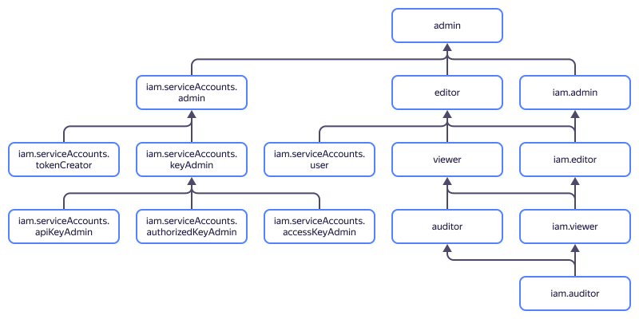

# Access management in {{ iam-name }}

In this section, you will learn:
* [Which resources you can assign a role for](#resources).
* [Which roles exist in the service](#roles-list).
* [Which roles are required](#choosing-roles) for particular actions.



Roles for a resource can be assigned by users who have the `iam.admin` role or one of the following roles for that resource:



## Which resources you can assign a role for {#resources}



You can assign a role for a [service account](../concepts/users/service-accounts.md) in the [management console]({{ link-console-main }}) or using the {{ yandex-cloud }} [CLI](../../cli/cli-ref/iam/cli-ref/service-account/add-access-binding.md), [API](../api-ref/authentication.md), or [{{ TF }}]({{ tf-provider-resources-link }}/iam_service_account_iam_binding).

## Which roles exist in the service {#roles-list}



### Service roles {#service-roles}

#### iam.serviceAccounts.user {#iam-serviceAccounts-user}



#### iam.serviceAccounts.admin {#iam-serviceAccounts-admin}



For some services, e.g., [{{ ig-name }}](../../compute/concepts/instance-groups/index.md) or [{{ managed-k8s-name }}]({{ link-cloud-services }}/managed-kubernetes), you need a service account to perform operations. If you specified a service account in the request, {{ iam-short-name }} will check whether you have permissions to use this account.

#### iam.serviceAccounts.accessKeyAdmin {#iam-serviceAccounts-accessKeyAdmin}



#### iam.serviceAccounts.apiKeyAdmin {#iam-serviceAccounts-apiKeyAdmin}



#### iam.serviceAccounts.authorizedKeyAdmin {#iam-serviceAccounts-authorizedKeyAdmin}



#### iam.serviceAccounts.keyAdmin {#iam-serviceAccounts-keyAdmin}



#### iam.serviceAccounts.tokenCreator {#iam-serviceAccounts-tokenCreator}



#### iam.serviceAccounts.federatedCredentialViewer {#iam-serviceAccounts-federatedCredentialViewer}



#### iam.serviceAccounts.federatedCredentialEditor {#iam-serviceAccounts-federatedCredentialEditor}



#### iam.workloadIdentityFederations.auditor {#iam-workloadIdentityFederations-auditor}



#### iam.workloadIdentityFederations.viewer {#iam-workloadIdentityFederations-viewer}



#### iam.workloadIdentityFederations.user {#iam-workloadIdentityFederations-user}



#### iam.workloadIdentityFederations.editor {#iam-workloadIdentityFederations-editor}



#### iam.workloadIdentityFederations.admin {#iam-workloadIdentityFederations-admin}



#### iam.auditor {#iam-auditor}



#### iam.viewer {#iam-viewer}



#### iam.editor {#iam-editor}



#### iam.admin {#iam-admin}



### Primitive roles {#primitive-roles}





## What roles do I need {#choosing-roles}

The table below lists the roles required to perform a particular action. You can always assign a role offering more permissions than the one specified. For example, you can assign the `editor` role instead of `viewer`.

Action | Methods | Required roles
----- | ----- | -----
**Viewing data** | |
[Getting an IAM token](../operations/iam-token/create.md) | `create` | None, authentication only
[Viewing user data](../operations/users/get.md) | `get`, `getByLogin` | None, authentication only
[Viewing service account data](../operations/sa/get-id.md) | `get`, `list`, `listOperations` | `iam.serviceAccounts.user` or `viewer` for the service account
Viewing information about a folder or cloud | `get`, `list` | `iam.auditor` for the folder or cloud
Viewing information about any resource | `get`, `list` | `viewer` for the resource
**Managing resources** | |
[Creating](../operations/sa/create.md) service accounts in the folder | `create` | `iam.serviceAccounts.admin` for the folder
[Updating](../operations/sa/update.md) and [deleting](../operations/sa/delete.md) service accounts | `update`, `delete` | `editor` for the service account
Creating and deleting keys for a service account | `create`, `delete` | `iam.serviceAccounts.accessKeyAdmin`, `iam.serviceAccounts.apiKeyAdmin`, `iam.serviceAccounts.authorizedKeyAdmin`, `iam.serviceAccounts.keyAdmin`  for the service account
**Resource access management** | |
[Adding a new user to the cloud](../operations/users/create.md) | `setAccessBindings` | `admin` for the cloud
[Making a new user the owner of the cloud](../operations/roles/grant.md) | `setAccessBindings`, `updateAccessBindings` | `resource-manager.clouds.owner` role for the cloud
[Granting a role](../operations/roles/grant.md), [revoking a role](../operations/roles/revoke.md), and viewing roles granted for the resource | `setAccessBindings`, `updateAccessBindings`, `listAccessBindings` | `admin` for the resource
Getting an IAM token for a service account | `create` | `iam.serviceAccounts.tokenCreator` for the service account

#### What's next {#what-is-next}

* [How to assign a role](../../iam/operations/roles/grant.md).
* [How to revoke a role](../../iam/operations/roles/revoke.md).
* [Learn more about access management in {{ yandex-cloud }}](../../iam/concepts/access-control/index.md).
* [Learn more about inheriting roles](../../resource-manager/concepts/resources-hierarchy.md#access-rights-inheritance).
