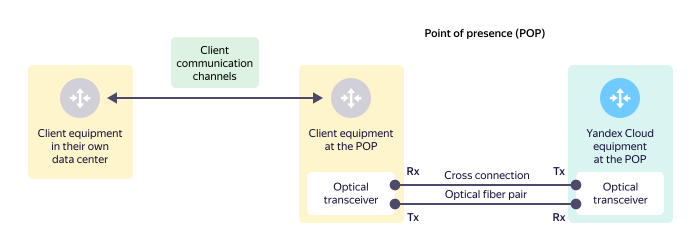
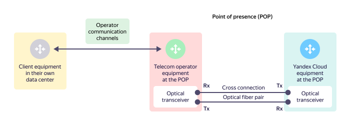

# Physical interface with {{ yandex-cloud }} (L1)

## {{ yandex-cloud }} direct physical interface {#direct-link}

A direct physical interface is a communication channel between client equipment and {{ yandex-cloud }} equipment at a [point of presence](points-of-presence.md). The direct interface includes physical ports and optical transceivers on the client and {{ yandex-cloud }} equipment. The direct interface is at Layer 1 of the [OSI model ](https://ru.wikipedia.org/wiki/Сетевая_модель_OSI)(https://en.wikipedia.org/wiki/OSI_model).

The client equipment is located at the point of presence and connected to the {{ yandex-cloud }} equipment directly through a cross-connect in the point of presence. An optical cross-connect connects to the optical transceivers from the client equipment and the {{ yandex-cloud }} equipment. For physical connections, only duplex (dual-fiber) optical transceivers. The transceiver's transmitting side (Tx) is connected to the transceiver's receiving side (Rx) with optical fiber. A pair of these optical fibers makes up an optical cross-connect.



Single-fiber transceivers aren't used for physical connections.



## Interface via a telecom operator {#operator-link}

If a client doesn't have their own equipment at the point of presence, to connect to {{ yandex-cloud }}, the client uses a telecom operator that has equipment at the appropriate point of presence.

An optical cross-connect connects to the optical transceivers from the telecom operator's equipment and the {{ yandex-cloud }} equipment.

The telecom operator agrees the connection scheme with the client and connects the client's equipment in the data center to their own equipment at the point of presence. To connect it, the telecom operator uses their own communication channels.
