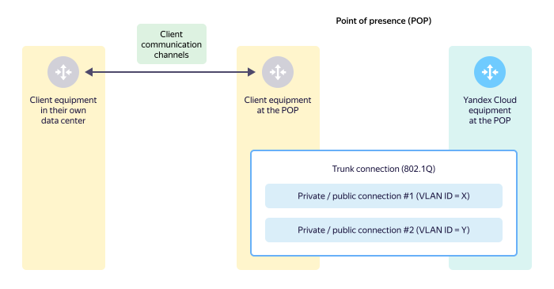
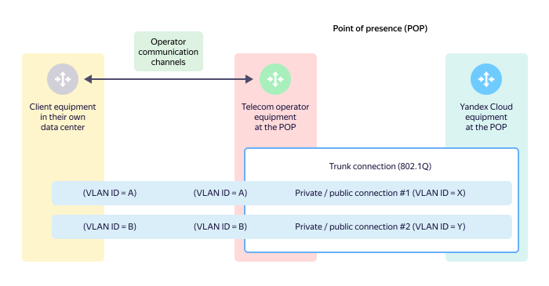
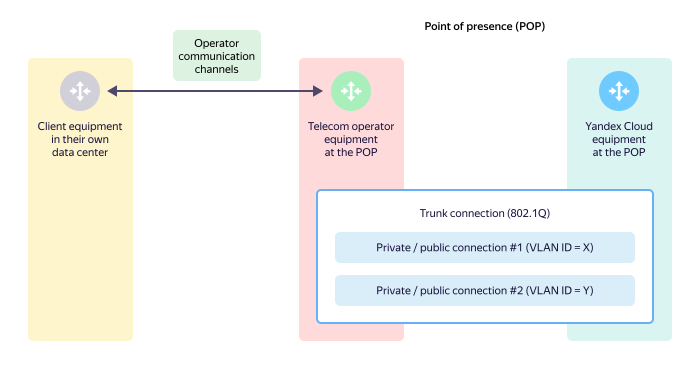

# Trunk connection (L2)

A trunk connection is a type of traffic multiplexing at the second layer of the [OSI model](https://en.wikipedia.org/wiki/OSI_model). A trunk connection uses IEEE 802.1Q Ethernet frame tagging technology. Multiplexing allows passing traffic in several logical data streams in a single [direct physical interface](l1-physical.md). The 802.1Q tag (VLAN ID) separates logical streams. The VLAN ID is 12 bits long, meaning its value can be from `0` to `4095`.



In {{ yandex-cloud }}, the possible values of the VLAN ID are `2`–`4000` inclusive.



At the trunk connection level, {{ yandex-cloud }} uses a rate limit for sending and receiving data to/from the cloud and your equipment in bits per second and in packets per second according to the selected [traffic package](../manual.md#bandwidth). For this purpose, the RateLimit (policing) mechanism is used. When the data transfer speed in bits per second or packets per second is exceeded, data may be rejected. As a result, uniform traffic may be transmitted at faster speeds than traffic transmitted in sudden bursts.

## Trunk over direct physical interface (client equipment) {#trunk-over-direct-link}

A trunk connection is set up over a direct physical interface between the client equipment at the [point of presence](points-of-presence.md) and the {{ yandex-cloud }} equipment.

## Connection over operator's link with L2 transit to client equipment {#trunk-over-operator}

This method is used when the client doesn't have its own equipment at the point of presence. In this case:
* A trunk connection is set up at the point of presence with the help of a telecom operator, which provides L2 transit.
* The trunk connection is set up between the client equipment in a data center and the {{ yandex-cloud }} equipment.
* When connecting the client equipment, the operator uses their own communication channels. If VLAN ID numbers of connections (translation of VLAN ID numbers) at L2 transit need to be changed, the telecom operator discusses the translation scheme with the client for correct configuration of the client equipment in their data center.

## Connection over direct physical interface (telecom operator's equipment) {#trunk-over-operator-2}

This method is used when the client doesn't have its own equipment at the point of presence. In this case:
* A trunk connection is set up at the point of presence with the help of a telecom operator.
* The trunk connection is set up between the telecom operator's equipment at the point of presence and the {{ yandex-cloud }} equipment.
* Connectivity between the telecom operator's equipment at the point of presence and the client equipment in their data center is ensured at [Layer 3 of the interaction](l3-ip-bgp.md). This approach can be useful if the client doesn't wish to handle BGP connectivity with the {{ yandex-cloud }} equipment on their equipment and delegates this task to a telecom operator.
