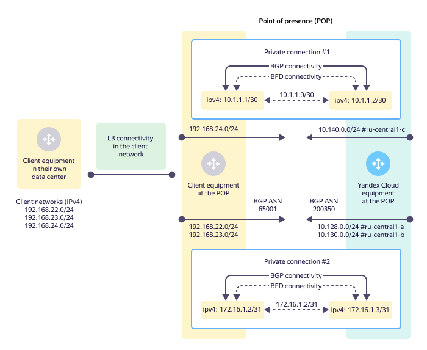
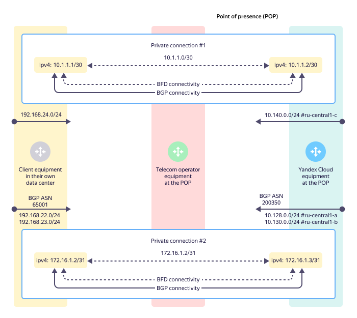
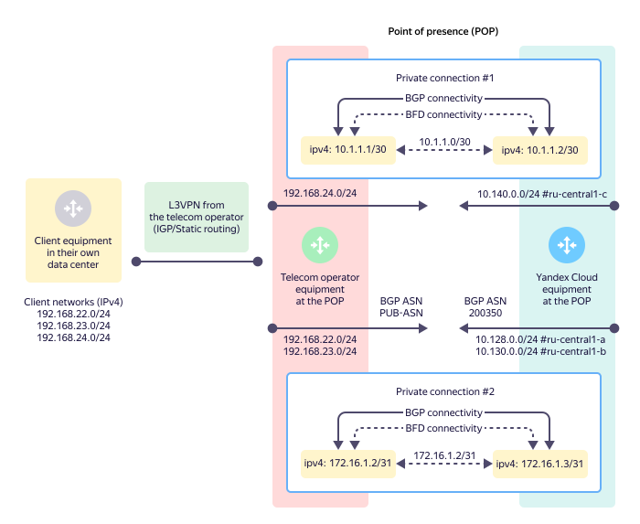

# IP and BGP connectivity (L3)

At Layer 3 of the OSI model, IP connections are made inside the VLAN. Depending on the type of IP addresses used (private or public), the connections made are either private or public.



When you set up a [private](#private-connection) or [public](#public-connection) connection, only IPv4 addresses are used. IPv6 addresses currently aren't supported.



## Private connection {#private-connection}

A private connection is a stream of data sent over a trunk connection and tagged with a specific VLAN-ID value. To pass traffic at Layer 3 of the OSI model over IPv4, private IPv4 addresses that are not routed to the internet are used. For more information about the set of subnets that private addresses are allocated from, see [RFC-1918](https://datatracker.ietf.org/doc/html/rfc1918). For private connections, /30 or /31 subnets are used.

## Public connection {#public-connection}

A public connection is a stream of data sent over a trunk connection and tagged with a specific VLAN-ID value. To pass traffic at Layer 3 of the OSI model over IPv4, public IPv4 addresses from the [pool of addresses](../../vpc/concepts/ips.md) that are routed to the internet are used. For public connections, a /31 subnet is used. A public connection is normally used for direct interaction with the services listed below.

Public IPv4 addresses are used that can be routed to {{ yandex-cloud }} services, such as:

* [{{ api-gw-full-name }}](../../api-gateway)
* [{{ sf-full-name }}](../../functions)
* [{{ container-registry-full-name }}](../../container-registry)
* [{{ objstorage-full-name }}](../../storage)

You must also use network address translation (NAT) on the client side. There are two options for implementing NAT:

* NAT on the client equipment side from the IPv4 address in a /31 point-to-point subnet for public connections.
* NAT on the client equipment (such as a server or a firewall) that is not used for a point-to-point configuration of public connections. In this case, the client is allocated an additional public /30 IPv4 subnet. The client equipment needs to announce this subnet over BGP towards {{ yandex-cloud }} via the point-to-point subnet for public connections.

## BGP connectivity {#bgp-connectivity}

BGP connectivity takes place within each private or public connection between the client equipment and {{ yandex-cloud }} equipment at the point of presence for exchanging network (prefix) data. After exchanging this routing data, the sides can pass IPv4 traffic between the networks they've communicated to each other. This is the {{ interconnect-name }} target state.

To set up BGP connectivity, each side must specify the BGP autonomous system number (ASN). The BGP ASN for {{ yandex-cloud }} is fixed at 200350. On the client side, a public BGP ASN (if any) can be set up or any number from private BGP ASNs in the range of 64512–65534 can be used.



The BGP ASN on the {{ yandex-cloud }} side is fixed at 200350. It's a 4-byte BGP ASN value. By default, network equipment uses 2-byte BGP ASN values. When setting up BGP connectivity on the client equipment, you should explicitly permit 4-byte BGP ASNs.



Sometimes a client cannot connect their router directly to the {{ yandex-cloud }} equipment. In this case, they can use other intermediate devices (switches). To quickly detect failures in such composite communication channels, the BFD protocol can be be used, but must be applied with BGP to ensure better convergence (network response time to changes).

### L3 and BGP connectivity over direct physical link {#l3-bgp-connectivity-over-direct-link}

L3 and BGP connectivity is set up between the client equipment at the point of presence and the {{ yandex-cloud }} equipment. When setting up IPv4 connectivity, /30 or /31 IPv4 subnets can be used. In this case, the client ensures L3 connectivity from their equipment in the data center to their own equipment at the point of presence. All route announcements over BGP from the client side enter all {{ yandex-cloud }} availability zones.

### L3 and BGP connectivity over operator's link {#l3-bgp-connectivity-over-operator-link}

The client with no equipment of their own at the point of presence uses a telecom operator (or a partner) to provide L1 and L2 connectivity from the {{ yandex-cloud }} equipment to the equipment in their data center (see PHY2, PHY3, and TRN2). L3 and BGP connectivity is set up between the client equipment in their data center and the {{ yandex-cloud }} equipment at the point of presence.

### L3 and BGP + L3VPN over operator's link {#l3-bgp-l3vpn-connectivity-over-operator-link}

When the client prefers not to or technically cannot provide BGP interaction themselves, they can delegate this to a telecom operator (partner).
In this case, a telecom operator (partner) connects the client equipment in the client data center to their equipment at the point of presence using an L3VPN service, which ensures L3 connectivity using a dynamic or static routing IGP.

All L3 and BGP connectivity with {{ yandex-cloud }} is set up between the telecom operator's (partner's) equipment and the {{ yandex-cloud }} equipment at the point of presence. This connection becomes a part of the client L3VPN, which ensures direct connectivity between the client equipment in their data center and {{ yandex-cloud }}.

Using L3VPN, a telecom operator (partner) can potentially provide L3 connectivity over one physical connection from the client data center to {{ yandex-cloud }} via two or more points of presence. This option should be considered when the client migrates from other locations to {{ yandex-cloud }}.
