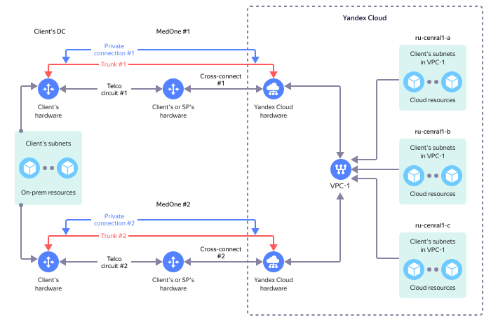

# {{ interconnect-name }} overview

The {{ interconnect-name }} service is designed to set up IP network connectivity between resources in the client infrastructure and cloud resources in {{ yandex-cloud }}.

Example of connectivity setup:

In this example, the client has the following resources:

* On-premise infrastructure where the client resources, such as dedicated servers, are deployed.
* Cloud infrastructure in {{ yandex-cloud }} where cloud resources, such as VMs, are deployed.

Let's assume the goal is to ensure IP network connectivity between resources in the client's own infrastructure and cloud resources in {{ yandex-cloud }}.

To achieve this goal, {{ interconnect-name }} can be deployed as follows:

* Set up communication channels between your own infrastructure and the {{ yandex-cloud }} equipment either on your own or through telecom provider assistance. Third-party equipment is connected to the {{ yandex-cloud }} equipment using [cross connections](terms.md) at [points of presence](pops.md). To ensure fault tolerance when providing the service, set up communication channels at two [points of presence](pops.md).
* Set up a [trunk](trunk.md) (tunk connection) in a communication channel.
* In the trunk, set up one or more [private connections](priv-con.md). The number and configuration of private connections depends on the specific task.
* In each [private connection](priv-con.md), configure a [point-to-point subnet](priv-con.md#priv-address) and set up [BGP connectivity](priv-con.md#bgp-peering). The {{ interconnect-name }} service is not provided if BGP connectivity is not set up.
* [Cloud subnet prefixes are announced](priv-con.md#prc-announce) on the {{ yandex-cloud }} virtual network side using BGP.
* The prefixes of subnets with client resources are announced on the client infrastructure side using BGP.

After the above steps are complete, IP connectivity should be available between your infrastructure resources and cloud resources in {{ yandex-cloud }} so that they can exchange IP traffic between each other.

For more information, see [Instructions](../operations/).

