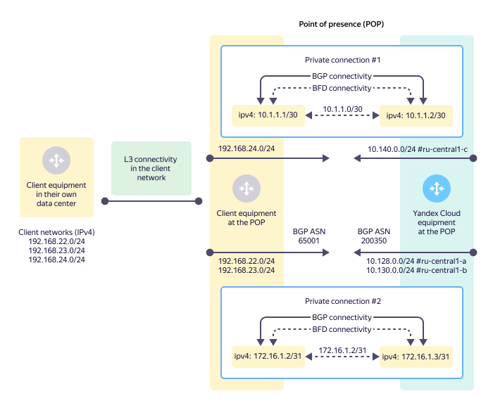
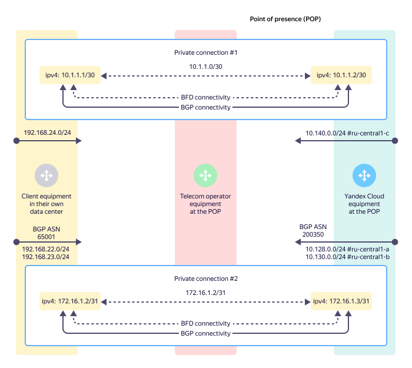
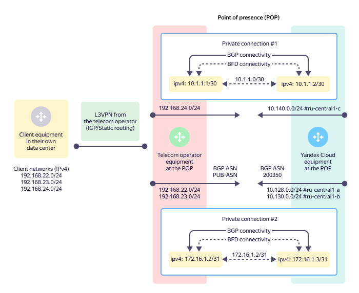

# Private connection

A private connection is a logical connection to your cloud [network](../../vpc/concepts/network.md#network), which is set up within a [trunk](./trunk.md). There can be multiple private connections to different cloud networks in a single trunk.



You cannot set up multiple private connections to a single cloud network in one [point of presence](./pops.md). For redundancy purposes, you can set up multiple private connections in a cloud network at different [points of presence](./pops.md), but no more than one such private connection in a given point of presence.



A private connection is set up inside a [trunk](./trunk.md) and has its own unique **VLAN-ID**.

Maximum IP MTU for a private connection is **8,910 bytes**. Changing IP MTU on the {{ yandex-cloud }} equipment is not allowed.

## Point-to-point subnet {#priv-address}

To set up a private connection, you need a **point-to-point subnet**. It is used to configure IP connectivity between the {{ yandex-cloud }} equipment and the client or telecom provider equipment.

The point-to-point subnet size may be either `/30` or `/31`. Other subnet sizes are not allowed.

You can use the following IP address ranges in point-to-point subnets:

* `10.0.0.0/8`
* `172.16.0.0/12`
* `192.168.0.0/16`
* `169.254.0.0/16`

IP addressing in other ranges is not allowed.



When you set up a private connection, only IPv4 addresses are used.
Currently, you cannot use IPv6 addresses.







## Private connection topologies {#priv-top}

The following private connection setup options are supported:

* [A private connection via a direct client connection](#prc-direct-link).
* [A private connection via a telecom provider connection (L2 transit)](#prc-sp-l2).
* [A private connection via a telecom provider connection (L3VPN)](#prc-sp-l3vpn).

### A private connection via a direct client connection {#prc-direct-link}





L3 and BGP connectivity is set up between the client equipment at the point of presence and the {{ yandex-cloud }} equipment. In which case:

* You should ensure L3 connectivity from the equipment in your data center to your own equipment at the point of presence yourself.
* BGP connectivity is set up between your equipment at the point of presence and the {{ yandex-cloud }} equipment.
* All route announcements over BGP from your equipment at the point of presence enter all {{ yandex-cloud }} [availability zones](../../overview/concepts/geo-scope.md).

### A private connection via a telecom provider connection (L2 transit) {#prc-sp-l2}





You do not have your own equipment at the point of presence and you use services of a telecom provider that ensures connectivity between {{ yandex-cloud }} and your own equipment. In which case:
* L2 connectivity is set up by the telecom provider between its equipment at the point of presence and the {{ yandex-cloud }} equipment.
* L3 and BGP connectivity is set up between your equipment in your data center and the {{ yandex-cloud }} equipment at the point of presence.
* All route announcements over BGP from your equipment in your data center reach all {{ yandex-cloud }} [availability zones](../../overview/concepts/geo-scope.md).

### A private connection via a telecom provider connection (L3VPN) {#prc-sp-l3vpn}





You do not have your own equipment at the point of presence and you use services of a telecom provider that ensures connectivity between {{ yandex-cloud }} and your own equipment. You cannot set up BGP connectivity to the {{ yandex-cloud }} equipment on your own, technically. In which case:

* L2 connectivity is set up by the telecom provider between its equipment at the point of presence and the {{ yandex-cloud }} equipment.
* L3 and BGP connectivity to {{ yandex-cloud }} is set up between the telecom provider's equipment and the {{ yandex-cloud }} equipment at the point of presence. This connection becomes a part of the client L3VPN, which ensures direct connectivity between your equipment in their data center and {{ yandex-cloud }}.
* All route announcements over BGP from the telecom provider's equipment at the point of presence enter all {{ yandex-cloud }} [availability zones](../../overview/concepts/geo-scope.md).
* While providing the L3VPN service, the telecom provider can use both static and dynamic routing protocols.


## Cloud subnet announcements and communication with {{ vpc-short-name }} {#prc-announce}

To connect one or more cloud subnets to a private connection, you need to have the following:
* The ID of the virtual network (`vpc_net_id`) to connect to a trunk connection.
* List of announced IPv4 prefixes of virtual network [subnets](../../vpc/concepts/network.md#subnet) distributed across [availability zones](../../overview/concepts/geo-scope.md). Typically, prefixes correspond to the subnets configured in your cloud. In this case, the announced prefixes and the actual subnet address ranges match.

New subnets that will be created in the virtual network later will not be announced to a {{ interconnect-name }} private connection automatically.

To add a new subnet to an existing private connection, contact [support]({{ link-console-support }}) with a request to add a new announcement to the respective {{ interconnect-name }} private connection.



When using {{ yandex-cloud }} load balancers:
* [{{ network-load-balancer-short-name }}](../../network-load-balancer/) (NLB)
* [{{ alb-name }}](../../application-load-balancer/) (ALB)

their listeners' addresses are announced as IPv4 prefixes with the length of `/32`.

This enables you to use load balancers to distribute traffic coming from your infrastructure via {{ interconnect-name }} between cloud resources in different {{ yandex-cloud }} [availability zones](../../overview/concepts/geo-scope.md).



Your equipment announces IPv4 prefixes from your infrastructure over BGP to the {{ yandex-cloud }} equipment. You can use the following types of prefixes in announcements:
* Private IP subnets from [RFC-1918](https://www.ietf.org/rfc/rfc1918.txt)
* Default route: `0.0.0.0/0`
* Public IP subnets

These prefixes get to {{ vpc-short-name }} subnets through redistribution of routing information on the {{ yandex-cloud }} equipment.

After the {{ yandex-cloud }} equipment receives the client prefixes, they become available to all VMs and internal load balancers within the {{ vpc-short-name }} subnets.

No changes to the VM route tables are required to ensure IP connectivity between cloud resources and your infrastructure resources.

### Aggregated prefixes (aggregates) {#agg-subnets}

To automatically announce new subnets in {{ interconnect-name }}, you can use **aggregated prefixes** (aggregates) of subnets. This allows you to set up prefix announcements once and then just add new subnets to an existing {{ vpc-short-name }} without contacting support.

> For example, when setting up a private connection, you can specify an announcement of the following aggregated IPv4 prefixes:
>
> ```
> {{ region-id }}-a [10.128.0.0/16]
> {{ region-id }}-b [10.130.0.0/16]
> {{ region-id }}-d [10.140.0.0/16]
> ```
>
> If you then create a subnet with the `10.128.15.0/24` prefix in this network in the `{{ region-id }}-a` availability zone, it will automatically be available via {{ interconnect-name }} because the `10.128.15.0/24` subnet belongs to the already announced address space, `10.128.0.0/16`.

