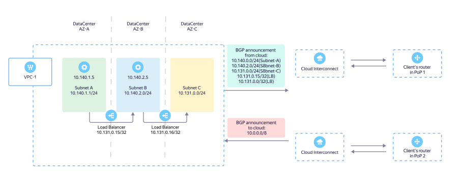

# Routing

When connecting your infrastructure via {{ interconnect-full-name }}, you will need to configure traffic routing to cloud resources or to the internet.

Example of setting up a connection using {{ interconnect-name }}:



{{ interconnect-full-name }} routing specifics:
* [Interaction {{ interconnect-name }} with {{ vpc-name }}](#interconnect-to-vpc).
* [Interaction {{ interconnect-name }} with static routes](#interconnect-and-static-routes).
* [Reserving {{ interconnect-name }} connections using a VPN](#interconnect-vpn-failover). 
* [Enabling private access to the internet without using {{ yandex-cloud }}](#private-access-to-the-internet).
* [{{ interconnect-name }} interaction with a NAT gateway](#interconnect-and-egress-nat).
* [Managing IPv4 routes{{ interconnect-name }}](#interconnect-routes).
* [Utilizing {{ interconnect-name }} channels in a fault-tolerant scheme](#interconnect-fault-tolerance).
* [Interaction {{ interconnect-name }} with security groups](#interconnect-and-security-groups). 

## Interaction {{ interconnect-name }} with {{ vpc-name }} {#interconnect-to-vpc}

In your request for connecting {{ interconnect-name }}, you should specify prefixes of {{ vpc-short-name }} [subnets](../../vpc/concepts/network.md#subnet). These prefixes are announced by the {{ yandex-cloud }} infrastructure over BGP to your equipment receiving BGP sessions. In the diagram, this equipment is labeled <q>"Client router"</q>.

When using [{{ network-load-balancer-full-name }}](../../network-load-balancer/) and [{{ alb-full-name }}](../../application-load-balancer/) load balancers, their handlers' addresses are announced as IPv4 prefixes with the length of `/32`. This enables you to use load balancers to distribute traffic coming from your networks via {{ interconnect-name }} between {{ yandex-cloud }} [availability zones](../../overview/concepts/geo-scope.md).

IPv4 prefixes passed by your equipment over BGP to {{ yandex-cloud }} enter {{ vpc-short-name }} subnets using the route information redistribution mechanism. They then become available to all virtual machines and internal load balancers within the {{ vpc-short-name }}. For cloud resources to access your corporate infrastructure, no changes to VM routing tables are required.

## {{ interconnect-name }} interaction with static routes {#interconnect-and-static-routes}

The route to external resources (IPv4 prefixes) from {{ yandex-cloud }} is chosen only by the length of its prefix. A prefix with a length of `/8` indicates the lowest priority of the route, and `/32` the highest.



In the same {{ vpc-short-name }} virtual network, do not use static routes with prefixes duplicating the prefixes announced by your equipment to {{ interconnect-name }}. This will result in asymmetric traffic routing.



If you need to route some {{ vpc-short-name }} traffic via a static route and some to {{ interconnect-name }}, use unique, non-overlapping IPv4 prefixes and plan the address space of your projects more granularly.

The scheme above shows an example of implementing this approach, where:
* The IPv4 prefix `10.0.0.0/8` is a short summary prefix of all the networks of your infrastructure. Announced over BGP to {{ yandex-cloud }} {{ vpc-short-name }} via {{ yandex-cloud }}.
* A route with the IPv4 prefix `10.20.0.0/24` and next-hop `10.128.0.5` (where `10.128.0.5` is the IP address of a virtual machine with a VPN gateway in {{ yandex-cloud }}) is represented by a static route to the VPN gateway.

With this routing setup, all traffic is routed via {{ interconnect-name }}, except for traffic from the `10.20.0.0/24` subnet, which is sent to the VPN tunnel through the VPN gateway on the {{ yandex-cloud }} side.

## Reserving {{ interconnect-name }} connections using a VPN {#interconnect-vpn-failover}. 

To safeguard a {{ interconnect-name }} connection from failure, you can set up your infrastructure so that it announces a short summary IPv4 prefix to a {{ yandex-cloud }} VM with a VPN gateway. This prefix automatically receives a higher priority in the {{ vpc-short-name }} and traffic will be routed through {{ interconnect-name }}. When a BGP session fails, a longer prefix through the VPN gateway will be used. Failure will cause the summary IPv4 prefix `10.0.0.0/8` to be deleted from routing tables both from the {{ yandex-cloud }} {{ vpc-short-name }} side and the client router.

The scheme above shows an example of implementing this approach, where:
* The prefixes `10.0.0.0/25` and `10.0.128.0/25` are long subnet prefixes from your data center, announced over BGP to {{ yandex-cloud }}.
* A route with the prefix `10.20.0.0/24` and next-hop `10.128.0.5` (where `10.128.0.5` is the IP address of a virtual machine with a VPN gateway) uses a static route through an IPSec gateway.

With this routing setup, all traffic is routed through a working {{ interconnect-name }} connection. If the connection via {{ interconnect-name }} fails, the BGP session will be interrupted and the `10.0.0.0/25` and `10.0.128.0/25` routes will be removed from the routing tables. This will redirect all traffic to the VPN gateway through the remaining working route `10.20.0.0/24`.

## Enabling private access to the internet without using {{ yandex-cloud }} {#private-access-to-the-internet}

To connect your cloud resources to the internet via {{ interconnect-name }}, you need to set up route announcement of `0.0.0.0/0` over BGP to {{ yandex-cloud }}. Then traffic from a virtual network connected to {{ interconnect-name }} is unconditionally routed to your equipment. On your side, you can configure traffic filtering rules before sending it to the internet via your own NAT without the {{ yandex-cloud }} infrastructure.

## {{ interconnect-name }} interaction with a NAT gateway {#interconnect-and-egress-nat}

{{ interconnect-name }} allows for a [NAT gateway](../../vpc/concepts/gateways.md#nat-gateway) if the default route `0.0.0.0/0` is not announced over BGP towards {{ yandex-cloud }}. If such a route is announced:

* The VM's internal IPv4 address is passed to a public IPv4 address on the {{ yandex-cloud }} side.
* The traffic is directed to your equipment (a client router in the diagram), which announced the `0.0.0.0/0` route over BGP. Your equipment starts receiving traffic from VMs' public addresses.



Do not use a NAT gateway on the {{ yandex-cloud }} side when announcing the `0.0.0.0/0` route from your own equipment.



## Managing {{ interconnect-name }} IPv4 routes {#interconnect-routes}

You can use the prefix length to manage IPv4 routes. For example, you can announce long prefixes `10.0.0.0/25` and `10.0.128.0/25` over BGP to one of the points of presence (POP-1), and a short summary prefix `10.0.0.0/24` to POP-2.

The connection through POP-1 will have higher priority than POP-2. Traffic from {{ yandex-cloud }} to the client's infrastructure will be routed through POP-1.

To direct traffic to {{ yandex-cloud }} via POP-2, configure a BGP policy on your router to raise the priority of the necessary IPv4 prefixes using the `BGP Local Preference` attribute.

At the moment, you can manage traffic sent from {{ yandex-cloud }} to the client's infrastructure only using the prefix length. The current implementation of {{ yandex-cloud }} management protocols doesn't support all BGP attributes for traffic management and does not take into account the value of the `BGP AS-PATH` attribute (path length) when choosing the shortest route. For that same reason, it's impossible to use the `BGP AS-PATH` prepend mechanism to manage traffic.

## Utilizing {{ interconnect-name }} channels in a fault-tolerant scheme {#interconnect-fault-tolerance}

To distribute the load over multiple channels {{ interconnect-name }}, you can announce the same IPv4 prefix, for example, `10.0.0.0/8`, in each of the {{ interconnect-name }} connections in each point of presence. {{ yandex-cloud }} supports ECMP balancing and will distribute traffic between connections within each point of presence.

Note that this balancing mode can lead to asymmetric traffic. As a result, traffic may enter {{ yandex-cloud }} via POP-1 and the response will be received via POP-2. The asymmetry is handled correctly and is acceptable in {{ yandex-cloud }}, but may not be permitted for certain types of equipment on the client side, such as firewalls.

To allow asymmetric traffic from {{ yandex-cloud }}, disable the [RPF](https://en.wikipedia.org/wiki/Reverse-path_forwarding). This will enable you to use all active {{ interconnect-name }} connections with a redundant connection via two or more points of presence.

## {{ interconnect-name }} interaction with security groups {#interconnect-and-security-groups} 

[Security groups](../../vpc/concepts/security-groups.md) cannot be assigned to resources outside {{ yandex-cloud }}, therefore the correct way to filter traffic is to use IPv4 prefixes rather than links to other security groups.

For example, announce the IPv4 prefix `10.0.0.0/8`, a short summary prefix of all the networks of your data center, over BGP to {{ yandex-cloud }}. Then assign a security group to your cloud resources, with rules allowing access from your data center to the web application via port `443`.

```
ingress {
      protocol       = "TCP"
      port           = 443
      description    = "Allow ingress from Interconnect to web server"
      v4_cidr_blocks = ["10.0.0.0/8"]
    }
egress {
      protocol       = "ANY"
      description    = "We allow any egress traffic for stage, since we block prod on ingress"
      v4_cidr_blocks = ["10.0.0.0/8"]
    }
```

The group rules also allow your cloud resources to access resources in your data center on any port.

You can use more specific rules to allow access to concrete addresses or subnets and ports:

```
ingress {
      protocol       = "TCP"
      port           = 443
      description    = "Allow ingress from Interconnect to web server"
      v4_cidr_blocks = ["10.20.0.5/32"]
    }
egress {
      protocol       = "TCP"
      port           = 3389
      description    = "Allow RDP to Interconnect server"
      v4_cidr_blocks = ["10.20.0.20/32"]
    }
```


