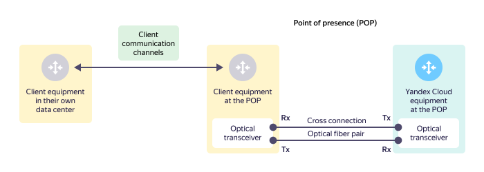
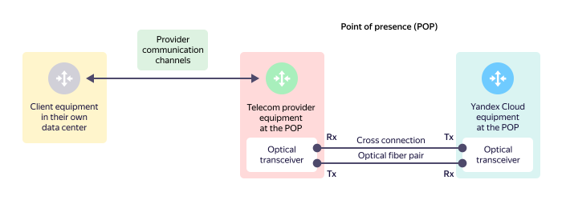
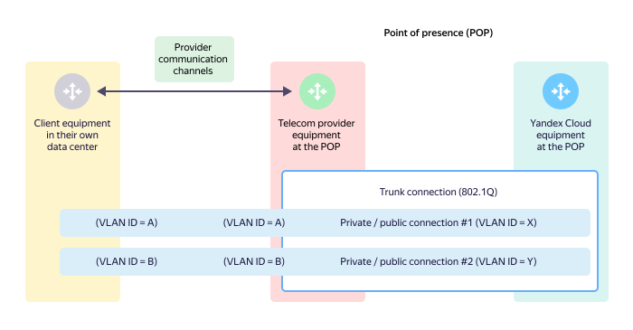
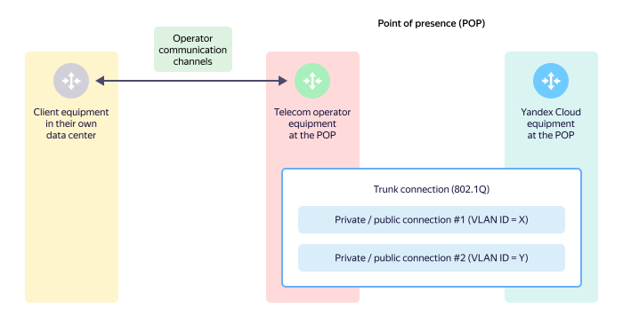

# Trunk

Trunks are mainly used for:

* Providing a [physical connection](#links) from external equipment to the {{ yandex-cloud }} equipment at a [point of presence](./pops.md).
* Enabling [traffic multiplexing](#mux) for private and public connections using **Ethernet 802.1Q**.



You can only set up a single trunk per [point of presence](./pops.md), per client. To ensure fault tolerance, you can set up multiple trunks, one per [point of presence](./pops.md).



## Parameters of physical ports on the {{ yandex-cloud }} equipment {#phy-port}

All physical ports on the {{ yandex-cloud }} equipment have the following default settings:

* No auto negotiation of the transmission rate is supported on physical ports. Be sure to explicitly set the transmission rate and disable auto negotiation on your equipment.
* On the {{ yandex-cloud }} equipment, a physical port always works in trunk mode with 802.1Q tagging. No connection in access port mode (without tagging) is supported.
* The default MTU size supports transfer of jumbo frames.



If required, you can group multiple physical ports into a single aggregate channel (bundle) via [LACP](https://en.wikipedia.org/wiki/Link_aggregation#Link_Aggregation_Control_Protocol) in `Active` mode.

The [MC-LAG technology](https://en.wikipedia.org/wiki/Multi-chassis_link_aggregation_group) for aggregate channels on the {{ yandex-cloud }} equipment is not supported.



## Physical connection topologies {#links}

The following physical connection setup options are supported on the {{ yandex-cloud }} equipment:

* [Direct client connection](#direct-link): Connection of your own equipment at a point of presence directly to the {{ yandex-cloud }} equipment.
* [Connection using telecom provider services](#sp-link): You do not have your own equipment at a point of presence and use services of a telecom provider that sets up a connection from your equipment to the {{ yandex-cloud }} equipment.

### Direct client connection {#direct-link}
This is a connection of your own equipment at a [point of presence](./pops.md) directly to the {{ yandex-cloud }} equipment.

A trunk in this setup option has the following components:

* Physical port on your equipment.
* Optical transceiver connected to the physical port on your equipment.
* Physical port reserved on the {{ yandex-cloud }} equipment.
* Optical transceiver connected to the physical port on the {{ yandex-cloud }} equipment.
* Cross connection that is used to connect to the optical transceiver on your equipment's port and to the optical transceiver on the {{ yandex-cloud }} equipment.

One may outline this connection as follows:

The client equipment is located at a [point of presence](./pops.md) and connected to the {{ yandex-cloud }} equipment directly through an optical cross-connection routed within the point of presence.

The transceiver transmitting side (Tx) on the {{ yandex-cloud }} equipment is connected to the transceiver receiving side (Rx) on the client equipment using an optical fiber. The transceiver transmitting side (Tx) on the client equipment is connected to the transceiver receiving side (Rx) on the {{ yandex-cloud }} equipment with optical fiber. A pair of these optical fibers makes up an optical cross-connect.

### Connecting using telecom provider services{#sp-link}

If a client does not have their own equipment at the appropriate [point of presence](./pops.md), to connect to the {{ yandex-cloud }} equipment, the client uses the services of a telecom provider that has equipment at the appropriate point of presence.

One may outline this connection as follows:

A trunk in this setup option has the following components:

* Physical port on the telecom provider's equipment.
* Optical transceiver connected to the physical port on the telecom provider's equipment.
* Physical port reserved on the {{ yandex-cloud }} equipment.
* Optical transceiver connected to the physical port on the {{ yandex-cloud }} equipment.
* Cross connection that is used to connect to the optical transceiver on the telecom provider's equipment and to the optical transceiver on the {{ yandex-cloud }} equipment.



The telecom provider has to set up a connection between the client equipment and its own equipment at the appropriate point of presence and ensure traffic between the client equipment and the {{ yandex-cloud }} equipment.



## Connection multiplexing (802.1Q) {#mux}

### VLAN-ID {#vlan-id}

The **Ethernet 802.1Q** technology allows you to transmit different types of traffic, i.e., enables traffic multiplexing. Each private or public connection in a trunk is assigned its own unique **VLAN-ID**.



When setting up a private or public connection, the possible values of the VLAN ID are `2` to `4000`, inclusive.



### Connection multiplexing options {#mux-options}

You can combine different types of connections in a trunk:

* One [private connection](./priv-con.md).
* One [public connection](./pub-con.md).
* Multiple private connections and/or public connections.

The following multiplexing options (schemes) are possible:

* [Direct connection at a point of presence](#mux-direct).
* [Connection using telecom provider services (L2 transit)](#mux-sp-L2).
* [Connection using telecom provider services (L3VPN)](#mux-sp-L3).

#### Direct connection at a point of presence {#mux-direct}

In this setup option, a 802.1Q trunk is set up over a direct physical connection between the client equipment at the [point of presence](./pops.md) and the {{ yandex-cloud }} equipment.

#### Connection using telecom provider services (L2 transit) {#mux-sp-L2}

This method is used when the client does not have their own equipment at the point of presence. In which case:

* The 802.1Q trunk is set up at the point of presence through a telecom provider that provides L2 transit.
* The 802.1Q trunk is set up between the client equipment and the {{ yandex-cloud }} equipment.
* When connecting the client equipment, the provider uses its own communication circuits. If the client needs to change connection VLAN IDs (enable VLAN ID translation) on their equipment, the telecom provider needs to agree upon the translation scheme with the client for consistent operation of the client and telecom provider equipment.

#### Connection using telecom provider services (L2 transit) {#mux-sp-L3}

This method is used when the client does not have their own equipment at the point of presence. In which case:

* The 802.1Q trunk is set up at the point of presence through a telecom provider.
* The 802.1Q trunk is set up between the telecom provider's equipment at the point of presence and the {{ yandex-cloud }} equipment.
* Connectivity between the telecom provider's equipment at the point of presence and the client equipment is ensured by providing an L3VPN service to the client. This setup option is usually used when the client cannot technically ensure BGP connectivity to the {{ yandex-cloud }} equipment on their own and delegates this to a telecom provider that ensures connectivity by providing an L3VPN service to the client.

## Connection capacity {#policer}

At trunk level, {{ yandex-cloud }} equipment limits data receive/send rates from/to external equipment in bits per second and packets per second according to the [connection capacity](../pricing.md) selected by the client.

To limit the rate of receiving and sending data on the {{ yandex-cloud }} equipment, the **RateLimit (Policing)** mechanism is used. When the data transfer speed in bits per second or packets per second is exceeded, the data may be rejected. As a result, uniform traffic may be transmitted at a faster speed than the traffic transmitted in sudden bursts.
