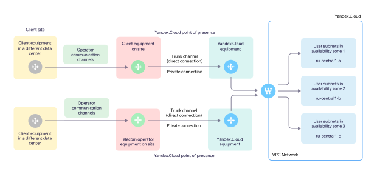

# Adding {{ interconnect-full-name }}

To use {{ interconnect-full-name }}, you need to configure a number of connection parameters, select a point of presence and request a cross connection (a communication line) for it:

1. [Specify the type of transceiver](#transceiver-type).
1. [Select a point of presence](#points-of-presence).
1. [Configure trunk connection settings](#trunk-connection-config).
1. [Configure private connection settings](#private-connection-config).
1. [Prepare private connection parameters](#interconnect-params).
1. [Prepare cloud network parameters](#vpc-networks) for a private connection.
1. [Select the connection speed and the desired traffic package](#bandwidth).
1. [Request a cross connection](#cross-connect) at the points of presence.

## Type of transceiver {#transceiver-type}

Select the [transceiver type](concepts/index.md#trunk-link) for linking with {{ yandex-cloud }} equipment. You'll need to specify it in the request for the service. Consider the capabilities of your equipment, as well as the distance between your equipment and the point of presence.

To set up a trunk link, your equipment is connected to that of {{ yandex-cloud }} with optical transceivers using the following standards:



## Points of presence {#points-of-presence}

Select one or more *points of presence* (POPs) where you want to organize a [trunk connection](concepts/index.md). We recommend choosing at least two POPs: this will ensure geographical fault tolerance and service redundancy. Each POP enables you to access your cloud resources in any of the {{ yandex-cloud }} [availability zones](../overview/concepts/geo-scope.md).



Points of presence (POPs) and their designations:



## Trunk connection settings {#trunk-connection-config}

Configure the following settings on your equipment:

* The port transmission rate of the client hardware must be set manually based on the transceiver type. Autonegotiation is not supported.
* The port must be in trunk mode according to the IEEE 802.1Q standard with a VLAN identifier (VID) from `2` to `4000`. Native VLAN is not supported.
* To transfer jumbo frames, you can set the MTU size to 8910 bytes.

Within a single POP, you can use:

* Channel aggregation methods using [LACP](https://en.wikipedia.org/wiki/Link_aggregation#Link_Aggregation_Control_Protocol) in `Active` mode.
* Switch stacking on the client side, provided that the switches are combined in a single logical unit (a stack).

## Private connection settings {#private-connection-config}

[Private connection](concepts/index.md#private-connection) is configured in two stages:

1. Configuring IP connectivity between the client device and the {{ yandex-cloud }} equipment.
1. Configuring BGP connectivity for the exchange of IPv4 prefixes (subnets), which are announced as part of a BGP session on the {{ yandex-cloud }} equipment side and on the client side.



Multiple cloud networks within a single private connection can be located in different clouds. This makes it possible to set up network interaction with several clouds and networks there ({{ vpc-short-name }} peering) within one private connection.



### Private connection parameters {#interconnect-params}

To set up a private connection, give your manager/architect the following information:

* `cloud_id`: ID of your cloud to connect {{ interconnect-name }} to.
* `folder_id`: ID of the folder to export {{ interconnect-name }} [metrics](concepts/user-metrics.md) to.
* `vlan_id`: VLAN ID for a private connection. Any values from `2` to `4000` are allowed. You can choose any number you like. The port must be configured in `802.1q trunk mode with VLAN tagging`. The VLAN tag is used to identify a logical private connection within a trunk connection.
* IPv4 subnet for BGP peering. Select an IPv4 subnet from the ranges defined in [RFC 1918](https://datatracker.ietf.org/doc/html/rfc1918) to set up BGP interaction between the client device and the {{ yandex-cloud }} edge router. The subnet size can be `/30` or `/31`. One of the addresses of this subnet will be configured on the {{ yandex-cloud }} equipment and the other address on the client device. These addresses will be used to establish a BGP session between the sides.
* IPv4 address on the {{ yandex-cloud }} side: IPv4 address from the subnet for BGP peering on the {{ yandex-cloud }} router side.
* The IPv4 address on the client side: IPv4 address from the subnet for BGP peering on the client side.
* BGP ASN: When setting up BGP communication on the client router, use the BGP ASN value `200350` as the {{ yandex-cloud }} BGP ASN. For a BGP ASN from the client equipment, you can use your public BGP ASN (if any) or any number you like from the range of private BGP ASNs (`64512–65534`) and configure it as your own on your router.
* (optional) BGP MD5 password: Used to increase the protection level of the BGP connection. You can configure MD5 authorization for a BGP session using a password. We recommend a strong random string of 20 or more characters in Latin letters, numbers, and special characters.

## Connecting cloud networks to a private connection {#vpc-networks}

To connect one or more networks to a private connection, specify the following information:

* `network_id`: ID of the virtual network to connect to {{ interconnect-name }}. You can find the network ID in the management console under **Networks** in {{ vpc-name }} or using the [yc vpc network list](../cli/cli-ref/managed-services/vpc/network/list.md) command in the {{ yandex-cloud }} CLI.
* A list of announced IPv4 prefixes with indication of the availability zone. Specify the prefixes that need to be announced from the indicated network to your infrastructure. Typically, prefixes correspond to subnets configured in your cloud. In this case, the announced IPv4 prefixes and the actual subnet address ranges match.

If you want to add a new subnet to a private connection, you will need to send support your request to add a new announcement in {{ interconnect-name }}. New subnets are not announced automatically.



The addresses of internal load balancers are announced as routes with a prefix length `/32`.



You can also announce *aggregated prefixes*. This will allow you to set up a private connection once and then add new subnets to an existing network automatically, without contacting support.

> For example, when organizing a private connection, you requested an announcement of the following aggregated IPv4 prefixes:
>
> ```
> {{ region-id }}-a [10.128.0.0/16]
> {{ region-id }}-b [10.130.0.0/16]
> {{ region-id }}-c [10.140.0.0/16]
> ```
>
> If you then create a subnet with the prefix `10.128.15.0/24` in this network in the `{{ region-id }}-a` zone, it will automatically be available via {{ interconnect-name }}, because the subnet `10.128.15.0/24` belongs to the already announced address space `10.128.0.0/16`.

## Connection speed and the necessary traffic package {#bandwidth}

The necessary traffic package is a unit of {{ interconnect-name }} billing, which is equal to the amount of traffic transmitted at the specified speed per month.

> For example, if you choose a speed of 100 Mbit/s, your traffic package will be 30 TB. This is the volume that can be transferred in a month with 100% utilization of a channel with a bandwidth of 100 Mbit/s.

## Cross connection at the point of presence {#cross-connect}

Each of the points of presence has an individual process for requesting optical cross connections:

### M9

1. Complete the [agreement letter](https://storage.yandexcloud.net/doc-files/interconnect-agreement-M9-example.docx) form. Specify details about your equipment rack and connection parameters. Notify [technical support]({{ link-console-support }}) or your manager that you wish to activate {{ interconnect-name }} on your own.
1. We will respond with a signed agreement letter with the port number allocated for your connection on the {{ yandex-cloud }} side.
1. Forward the signed letter to `sekretar@mmts9.ru` with the subject `Agreement letter from <your company name> — {{ yandex-cloud }}`.
1. Request a cross connection from your telecom operator or technical support by attaching the agreement letter.
1. The operator or site staff will then be able to start installing a cross connection and connecting it to a dedicated port in the {{ yandex-cloud }} equipment.

### OST

1. Complete the [agreement letter](https://storage.yandexcloud.net/doc-files/interconnect-agreement-Ost-example.docx) form. Specify details about your equipment rack and connection parameters. Notify [technical support](link-console-support) or your manager that you wish to activate {{ interconnect-name }} on your own.
1. We will respond with a signed agreement letter with the port number allocated for your connection on the {{ yandex-cloud }} side.
1. Request a cross connection from your telecom operator or technical support by attaching the agreement letter.
1. The operator or site staff will then be able to start installing a cross connection and connecting it to a dedicated port in the {{ yandex-cloud }} equipment.

### NORD

1. Complete the [agreement letter](https://storage.yandexcloud.net/doc-files/interconnect-agreement-Nord-example.docx) form. Specify details about your equipment rack and connection parameters. Notify [technical support](link-console-support) or your manager that you wish to activate {{ interconnect-name }} on your own.
1. We will respond with a signed agreement letter with the port number allocated for your connection on the {{ yandex-cloud }} side.
1. Request a cross connection from your telecom operator or technical support by attaching the agreement letter.
1. The operator or site staff will then be able to start installing a cross connection and connecting it to a dedicated port in the {{ yandex-cloud }} equipment.

### STD

1. Find out the port number and {{ yandex-cloud }} rack coordinates from your manager or architect.
1. Pass this information onto your operator or independently request support staff for a cross connection to a dedicated port on the {{ yandex-cloud }} equipment.
1. The operator or site staff will then be able to start installing a cross connection and connecting it to a dedicated port in the {{ yandex-cloud }} equipment.



The agreement letter for the `STD` site is not required. The operator installing a cross connection and {{ yandex-cloud }} interact directly.


