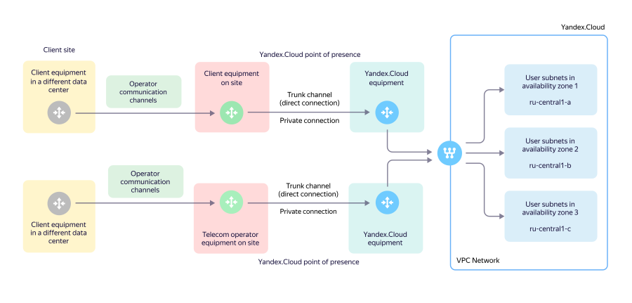

# Adding {{ interconnect-full-name }}

{{ interconnect-full-name }} lets you establish a private dedicated connection between your local network infrastructure and {{ yandex-cloud }}.

To connect {{ interconnect-full-name }}:
1. [Select the type of transceiver](#transceiver-type).
1. [Select a point of presence](#points-of-presence).
1. [Request a cross connection at the points of presence](#cross-connect).
1. [Select the connection speed and the desired traffic package](#bandwidth).
1. [Configure trunk connection](#trunk-connection-config).
1. [Configure private connection](#private-connection-config).
1. [Connect cloud networks via a private connection](#vpc-networks).

## Select the type of transceiver {#transceiver-type}

Select a transceiver type for a [trunk connection](concepts/index.md#trunk-link) to the {{ yandex-cloud }} equipment.

To set up a trunk link, your equipment is connected to that of {{ yandex-cloud }} with optical transceivers using the following parameters:



Specify the selected transceiver type in the service connection request. Consider the capabilities of your equipment, as well as the distance between your equipment and the [point of presence](concepts/points-of-presence.md).

## Select a point of presence {#points-of-presence}

Select one or more _points of presence_ (POPs) which you want to organize a trunk connection. We recommend choosing at least two POPs: this will ensure geographical fault tolerance and service redundancy. Each POP enables you to access your cloud resources in any of the {{ yandex-cloud }} [availability zones](../overview/concepts/geo-scope.md).



Points of presence and their designations:



## Request a cross connection at the points of presence {#cross-connect}

The process for requesting optical cross connections depends on a specific point of presence:



- M9

   1. Complete the [agreement letter for M9 form](https://storage.yandexcloud.net/doc-files/interconnect-agreement-M9-example.docx). Specify details about your equipment rack and connection parameters. Notify [technical support]({{ link-console-support }}) or your manager that you wish to activate {{ interconnect-name }} on your own.
   1. We will respond with a signed agreement letter with the port number allocated for your connection on the {{ yandex-cloud }} side.
   1. Forward the signed letter to [sekretar@mmts9.ru](mailto:sekretar@mmts9.ru) with the subject <q>Agreement letter from <your company name> — {{ yandex-cloud }}</q>.
   1. Request a cross connection from your telecom operator or technical support by attaching the agreement letter.
   1. The operator or site staff will then be able to start installing a cross connection and connecting it to a dedicated port in the {{ yandex-cloud }} equipment.

- OST

   1. Complete the [agreement letter for OST form](https://storage.yandexcloud.net/doc-files/interconnect-agreement-Ost-example.docx). Specify details about your equipment rack and connection parameters. Notify [technical support]({{ link-console-support }}) or your manager that you wish to activate {{ interconnect-name }} on your own.
   1. We will respond with a signed agreement letter with the port number allocated for your connection on the {{ yandex-cloud }} side.
   1. Request a cross connection from your telecom operator or technical support by attaching the agreement letter.
   1. The operator or site staff will then be able to start installing a cross connection and connecting it to a dedicated port in the {{ yandex-cloud }} equipment.

- NORD

   1. Complete the [agreement letter for Nord form](https://storage.yandexcloud.net/doc-files/interconnect-agreement-Nord-example.docx). Specify details about your equipment rack and connection parameters. Notify [technical support]({{ link-console-support }}) or your manager that you wish to activate {{ interconnect-name }} on your own.
   1. We will respond with a signed agreement letter with the port number allocated for your connection on the {{ yandex-cloud }} side.
   1. Request a cross connection from your telecom operator or technical support by attaching the agreement letter.
   1. The operator or site staff will then be able to start installing a cross connection and connecting it to a dedicated port in the {{ yandex-cloud }} equipment.

- STD

   1. Find out the port number and {{ yandex-cloud }} rack coordinates from your manager or architect.
   1. Pass this information onto your operator or independently request support staff for a cross connection to a dedicated port on the {{ yandex-cloud }} equipment.
   1. The operator or site staff will then be able to start installing a cross connection and connecting it to a dedicated port in the {{ yandex-cloud }} equipment.

   

   The agreement letter for the **STD** site is not required. The operator installing a cross connection and {{ yandex-cloud }} interact directly.

   



## Select the connection speed and the desired traffic package {#bandwidth}

The necessary traffic package is a unit of {{ interconnect-name }} billing, which is equal to the amount of traffic transmitted at the specified speed per month.

> For example, if you choose a speed of 100 Mbit/s, your traffic package will be 30 TB. This is the volume that can be transferred in a month with 100% utilization of a channel with a bandwidth of 100 Mbit/s.

## Configure trunk connection {#trunk-connection-config}

Set the trunk connection parameters on your equipment:
* The port transmission rate of the client hardware must be set manually based on the transceiver type. Autonegotiation is not supported.
* Port parameters:
   * Operation mode: trunk.
   * Standard: IEEE 802.1Q.
   * VLAN ID: from `2` to `4000` Native VLAN is not supported.
* (optional) The MTU size: 8910 bytes This size is selected to transfer jumbo frames.

Within a single POP, you can use the following features:
* Channel aggregation using [LACP](https://en.wikipedia.org/wiki/Link_aggregation#Link_Aggregation_Control_Protocol) in `Active` mode.
* Switch stacking on the client side, provided that the switches are combined in a single logical unit (a stack).

## Configure private connection {#private-connection-config}

To configure [private connection](concepts/index.md#private-connection):
1. Configure IP connectivity between the client device and the {{ yandex-cloud }} equipment.
1. Configure BGP connectivity for the exchange of IPv4 prefixes (subnets), which are announced as part of a BGP session on the {{ yandex-cloud }} equipment side and on the client side.



Multiple cloud networks within a single private connection can be located in different clouds. This makes it possible to set up network interaction with several clouds and networks there (VPC peering) within one private connection.



### Private connection parameters {#interconnect-params}

To set up a private connection, give your manager/architect the following information:
* `cloud_id`: [ID of the cloud](../resource-manager/operations/cloud/get-id.md) that the {{ interconnect-name }} service is connected to. To find out the cloud ID, select the desired cloud in the [management console]({{ link-console-main }}) from the list on the left. You can also find out the cloud ID using the {{ yandex-cloud }} CLI [command](../cli/cli-ref/managed-services/resource-manager/cloud/list.md) `yc resource-manager cloud list`.
* `folder_id`: ID of the folder to export {{ interconnect-name }} service [metrics](concepts/user-metrics.md) to. See section [{#T}](../resource-manager/operations/folder/get-id.md).
* `vlan_id`: VLAN ID for a private connection. Acceptable values: from `2` to `4000` The port must be configured in 802.1q trunk mode with VLAN tagging. The VLAN tag is used to identify a logical private connection within a trunk connection.
* IPv4 subnet from the ranges defined in [RFC 1918](https://datatracker.ietf.org/doc/html/rfc1918) specification to set up BGP interaction between the client device and the {{ yandex-cloud }} edge router. The subnet size can be `/30` or `/31`. In a subnet, two addresses should be allocated to establish a BGP session between the sides: one for the {{ yandex-cloud }} hardware and the other one for a client device (see the parameters below).
* IPv4 address on the {{ yandex-cloud }} side: IPv4 address from the subnet for BGP peering on the {{ yandex-cloud }} router side.
* The IPv4 address on the client side: IPv4 address from the subnet for BGP peering on the client side.
* BGP ASN is the autonomous system number of a remote neighbor. When setting up BGP communication on the client router, use the BGP ASN {{ yandex-cloud }} value `200350`. For a BGP ASN from the client equipment, you can use your public BGP ASN (if any) or any number you like from the range of private BGP ASNs (`64512`–`65534`) and configure it as your own on your router.
* (optional) BGP MD5 password is a BGP session's password used for MD5 authorization. Used to increase the protection level of the BGP connection. We recommend a strong random string of 20 or more characters in Latin letters, numbers, and special characters.

## Connect cloud networks via a private connection {#vpc-networks}

To connect one or more networks to a private connection, specify the following information:
* `network_id`: ID of the virtual network to connect to {{ interconnect-name }}.
   To find out the network ID, select **{{ vpc-name }}** in the [management console]({{ link-console-main }}) and go to the  **Cloud networks** tab. You can also find out the network ID using the {{ yandex-cloud }} CLI [command](../cli/cli-ref/managed-services/vpc/network/list.md) `yc vpc network list`.
* A list of announced IPv4 prefixes with indication of the availability zone. Specify the prefixes that need to be announced from the indicated network to your infrastructure. Typically, prefixes correspond to subnets configured in your cloud. In this case, the announced IPv4 prefixes and the actual subnet address ranges match.

New subnets are not announced automatically. If you want to add a new subnet to a private connection, contact [support]({{ link-console-support }}) to add a new announcement in {{ interconnect-name }}.



The addresses of internal load balancers are announced as routes with a prefix length `/32`.



You can also announce _aggregated_ prefixes. This will allow you to set up a private connection once and then add new subnets to an existing network automatically, without contacting support.

> For example, when organizing a private connection, you requested an announcement of the following aggregated IPv4 prefixes:
>
> ```
> {{ region-id }}-a [10.128.0.0/16]
> {{ region-id }}-b [10.130.0.0/16]
> {{ region-id }}-c [10.140.0.0/16]
> ```
>
> If you then create a subnet with the prefix `10.128.15.0/24` in this network in the `{{ region-id }}-a` zone, it will automatically be available via {{ interconnect-name }}, because the subnet `10.128.15.0/24` belongs to the already announced address space `10.128.0.0/16`.
