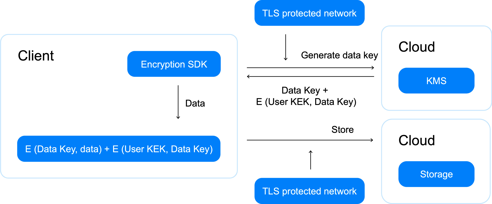

# Envelope encryption

Encryption employing the [encrypt](../api-ref/SymmetricCrypto/encrypt) method is limited by the maximum size of encryption data (32 KB). Larger data volumes cause a number of problems:
* Increased load on {{ kms-short-name }} caused by encryption and decryption operations.
* Reduced encryption and decryption performance if using the encrypt and decrypt methods with larger encryption data volumes.

   The encrypt and decrypt operation time includes transferring data from the client to {{ kms-short-name }} and back. As the amount of encrypted data increases, its transmission time and the load on the network increase, too.

Envelope encryption is mainly implemented on the client side and helps avoid the problems listed above.

## Description of the encryption process {#encrypt}

Unlike <q>direct</q> encryption, where a {{ kms-short-name }} key acts as a data encryption key, envelope encryption involves two types of keys:
* A data encryption key (DEK).
* A key encryption key (KEK).

Encryption is preformed as follows:
1. The client generates a DEK and locally encrypts data with it.

   To generate a high-entropy key, we recommend using the [generateDataKey](../api-ref/SymmetricCrypto/generateDataKey). It generates keys based on the Fortuna algorithm that collects entropy from various sources (RDSEED and RDRAND, /dev/urandom, host entropy).
1. The client sends an [encrypt](../api-ref/SymmetricCrypto/encrypt.md) request to {{ kms-short-name }} for DEK encryption.
1. In response, the client receives the encrypted DEK.

   In this scheme, the {{ kms-short-name }} key that the DEK is encrypted with acts as a KEK.
1. The unencrypted DEK is destroyed by the client.
1. The encrypted DEK is saved by the client along with the ciphertext.

When using envelope encryption, a wider set of algorithms is available for local encryption. You can also encrypt data with multiple DEKs, for example, to enable random access to ciphertext.

## Decryption process description {#decrypt}

Decryption is performed as follows:
1. The client reads the encrypted DEK stored along with the encrypted data.
1. The client sends a [decrypt](../api-ref/SymmetricCrypto/decrypt) request to {{ kms-short-name }} for DEK decryption.
1. In response, the client receives the decrypted DEK.
1. The encrypted data is locally decrypted using the DEK.
1. The DEK is destroyed.

## Implementation features of envelope encryption {#specify}

Envelope encryption shifts some of the responsibility for secure data encryption to the client. When implementing this scheme, it's important to:
* Use secure algorithms for local encryption.
* Make sure you don't save DEKs as plaintext.

   

   A plaintext DEK should only be decrypted for the duration of data encryption or decryption operations and destroyed immediately afterwards.

   

* Use different DEKs for different data.
* Generate new DEKs when data is re-encrypted.

To avoid errors, we recommend using the [AWS Encryption SDK](../tutorials/encrypt/aws-encryption-sdk.md) or [Google Tink](../tutorials/encrypt/google-tink.md) for client-side encryption.