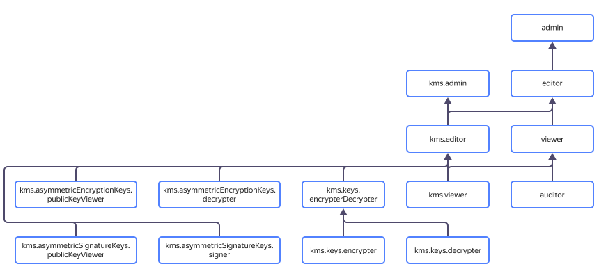

# Access management in {{ kms-name }}

In this section, you'll learn:
* [Which resources you can assign roles to](#resources).
* [Which roles exist in the service](#roles-list).
* [Which roles are required](#choosing-roles) for particular actions.



## What resources you can assign roles to {#resources}

Roles can be assigned for a [cloud](../../resource-manager/concepts/resources-hierarchy.md#cloud), [folder](../../resource-manager/concepts/resources-hierarchy.md#folder), or [key](../concepts/key). These roles also apply to nested resources. For example, the editor role includes all viewer role permissions. A description of each role is given under the diagram.

## What roles exist in the service {#roles-list}

You can manage access to {{ kms-short-name }} keys using both service and primitive roles. The diagram shows which roles are available in the service and how they inherit each other's permissions. For example, the `editor` role includes all `viewer` role permissions. A description of each role is given under the diagram.

### Service roles {#service}

Service roles provide more granular control over {{ kms-short-name }} keys, taking into account the service specifics: a strict division of subjects into key administrators (the `kms.admin` role) and users (the `kms.keys.encrypterDecrypter` role).

Users without the `resource-manager.clouds.owner` or `admin` role can't assign roles via the management console.

List of service roles:
* `kms.keys.encrypterDecrypter`: Enables you to [encrypt](../operations/encryption.md#encryption) and [decrypt](../operations/encryption.md#decryption) data and view information about keys.
* `kms.admin`: Enables you to assign random roles for keys using the CLI and API, delete keys and key versions, and update the primary version. Includes all access rights of the `kms.editor` role.
* `kms.editor`: Enables you to manage keys (view, create, update, rotate keys, and encrypt and decrypt data). Includes all access rights of the `kms.viewer` and `kms.keys.encrypterDecrypter` roles.
* `kms.viewer`: Enables you to read information about keys.

### Primitive roles {#primitive}

Primitive roles are common to all resources {{ yandex-cloud }}. Assigning any of them grants certain permissions in {{ kms-short-name }} and other cloud services. For example, the `admin` role assigned for a folder can enable you to remove any {{ kms-short-name }} keys in a folder and modify the folder itself or the resources it contains. You can manage primitive roles using the management console.

List of primitive roles:
* `viewer`: Provides viewing access only to resource information.
* `editor`: Lets you manage (create and edit) resources.
* `admin`: Lets you manage access to resources as well as the resources themselves (create, modify, and delete).

## What roles do I need {#choosing-roles}

**Example of key access control**

We recommend working with roles as follows:
1. The cloud owner (the `resource-manager.clouds.owner` role) or administrator (the `admin` role) assigns the `kms.admin` role to the {{ kms-short-name }} administrator.
1. The {{ kms-short-name }} administrator creates the required number of keys and assigns (through the CLI or API) roles to use them: subjects from different teams are granted the `kms.keys.encrypterDecrypter` and `kms.editor` roles for keys and folders.

It's good practice to store {{ kms-short-name }} keys in a dedicated folder apart from other {{ yandex-cloud }} resources.

| Action | Methods | Required roles |
----- | ----- | -----
| **{{ kms-short-name }}** | |
| Get information about keys and versions | `get`, `listVersions` | `kms.viewer` for a key and folder |
| [Encryption and decryption](../api-ref/SymmetricCrypto/) operations | `encrypt`, `decrypt`, `reEncrypt`, `generateDataKey` | `kms.keys.encrypterDecrypter` for a key |
| Get a list of keys in a folder | `list` | `kms.viewer` for a folder |
| [Create](../operations/key.md#create) and [update](../operations/key.md#update) a key | `create`, `update` | `kms.editor` for a folder |
| [Rotating keys](../operations/key.md#rotate) | `rotate` | `kms.editor` for a key |
| [Change the primary version](../operations/version.md#make-primary) | `setPrimaryVersion` | `kms.admin` for a key |
| [Destroy a key](../operations/key.md#delete) and [version](../operations/version.md#delete) | `delete`, `scheduleVersionDestruction`, `cancelVersionDestruction` | `kms.admin` for a key |
| [Grant a role](../../iam/operations/roles/grant.md), [revoke a role](../../iam/operations/roles/revoke.md) | `setAccessBindings`, `updateAccessBindings` | `kms.admin` for a key |
| View roles granted for a key | `listAccessBindings` | `kms.viewer` for a key |

#### What's next {#what-is-next}

* [How to use {{ yandex-cloud }} securely](../../iam/best-practices/using-iam-securely.md)
* [How to assign a role](../../iam/operations/roles/grant.md).
* [How to revoke a role](../../iam/operations/roles/revoke.md).
* [Learn more about access management in {{ yandex-cloud }}](../../iam/concepts/access-control/index.md).
* [More information on inheriting roles](../../resource-manager/concepts/resources-hierarchy.md#access-rights-inheritance).
