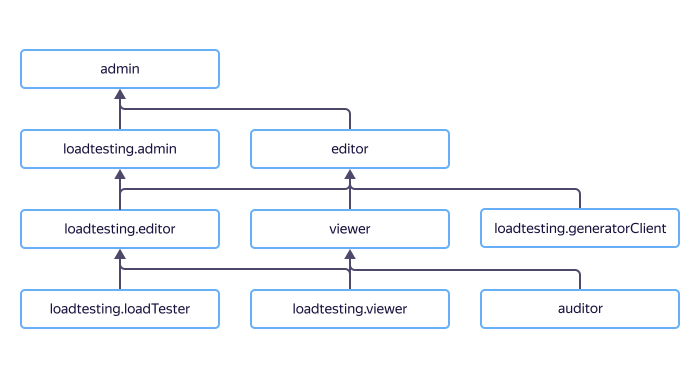

# Access management in {{ load-testing-name }}

{{ load-testing-name }} uses [roles](../../iam/concepts/access-control/roles.md) to manage access rights.

In this section, you will learn:
* [Which resources you can assign roles to](#resources).
* [Which roles exist in the service](#roles-list).
* [Which roles are required](#required-roles) for particular actions.



## Which resources you can assign roles to {#resources}



## Which roles exist in the service {#roles-list}



### Service roles {#service-roles}

* `loadtesting.viewer`: Allows viewing reports and created agents.
* `loadtesting.editor`: Allows viewing and deleting reports, creating, deleting, and editing VMs with agents, enables running and stopping load tests, and uploading test data and output to the repository.
* `loadtesting.admin`: At the moment, the service does not include an administrative function, so the role has the same permissions as `loadtesting.editor`.
* `loadtesting.loadTester`: Allows viewing and deleting reports, creating, deleting, and editing VMs with agents, enables running and stopping load tests, and loading test data.
* `loadtesting.generatorClient`: Allows starting VMs, running tests on agents, and uploading the output to the repository (assigned to a service account that is used to create VMs with agents).
* `loadtesting.externalAgent` allows registering agents created outside {{ load-testing-name }}, create, update, and run tests, as well as transfer their results to {{ load-testing-name }}.

### Primitive roles {#primitive-roles}



#### What's next {#next}

* [How to assign a role](../../iam/operations/roles/grant.md).
* [How to revoke a role](../../iam/operations/roles/revoke.md).
* [Learn more about access management in {{ yandex-cloud }}](../../iam/concepts/access-control/index.md).
* [Learn more about inheriting roles](../../resource-manager/concepts/resources-hierarchy.md#access-rights-inheritance).
