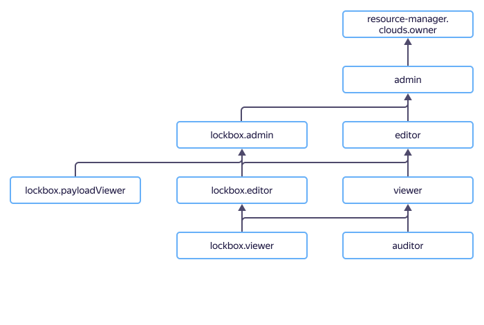

# Access management in {{ lockbox-name }}

In this section, you will learn:
* [Which resources you can assign a role for](#resources).
* [Which roles exist in the service](#roles-list).
* [Which roles are required](#choosing-roles) for particular actions.



## Which resources you can assign a role for {#resources}

Roles can be assigned for a [cloud](../../resource-manager/concepts/resources-hierarchy.md#cloud), [folder](../../resource-manager/concepts/resources-hierarchy.md#folder), or secret. These roles also apply to nested resources.



## Which roles exist in the service {#roles-list}

You can manage access to secrets using both service and primitive roles.

### Service roles {#service-roles}

Active roles in the service:

* 
* 
* 
* 
* 

### Primitive roles {#primitive-roles}



## What roles do I need {#choosing-roles}

The table below lists the roles needed to perform a particular action. You can always assign a role granting more permissions than the role specified. For example, you can assign the `editor` role instead of the `viewer` one.

| Action | `{{ roles-lockbox-admin }}` | `{{ roles-lockbox-editor }}` | `{{ roles-lockbox-viewer }}` | `{{ roles-lockbox-payloadviewer }}` | `kms.keys.encrypterDecrypter` |
----- | ----- | ----- | ----- | ----- | -----
| Create and delete secrets |  |  | - | - | - |
| Change the metadata of the secret |  |  | - | - | - |
| Read the metadata of the secret |  |  |  | - | - |
| Change the content of the secret version |  |  | - | - | - |
| Read the content of the secret version |  | - | - |  | - |
| Control access to the secret |  | - | - | - | - |
| Secret encryption and decryption operations | - | - | - | - |  |

#### What's next {#what-is-next}

* [How to use {{ yandex-cloud }} securely](../../iam/best-practices/using-iam-securely.md)
* [How to assign a role](../../iam/operations/roles/grant.md).
* [How to revoke a role](../../iam/operations/roles/revoke.md).
* [Learn more about access management in {{ yandex-cloud }}](../../iam/concepts/access-control/index.md).
* [Learn more about inheriting roles](../../resource-manager/concepts/resources-hierarchy.md#access-rights-inheritance).
* [Access management in {{ kms-full-name }}](../../kms/security/index.md)
