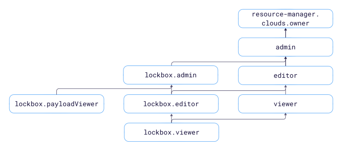

# Access management in {{ lockbox-name }}

In this section, you'll learn:
* [Which resources you can assign roles to](#resources).
* [Which roles exist in the service](#roles-list).
* [Which roles are required](#choosing-roles) for particular actions.



## What resources you can assign roles to {#resources}

Roles can be assigned for a [cloud](../../resource-manager/concepts/resources-hierarchy.md#cloud), [folder](../../resource-manager/concepts/resources-hierarchy.md#folder), or secret. These roles also apply to nested resources. The diagram shows which roles are available in the service and how they inherit each other's permissions. For example, the `editor` role includes all `viewer` role permissions. A description of each role is given under the diagram.

## What roles exist in the service {#roles-list}

You can manage access to secrets using both service and primitive roles.

Active roles in the service:
* Service roles:
   * 
   * 
   * 
   * 
   * 
   * 
* Primitive roles:
   * 
   * 
   * 

## What roles do I need {#choosing-roles}

The table below lists the roles needed to perform a given action. You can always assign a role granting more permissions than the role specified. For example, you can assign `editor` instead of `viewer`.

| Action | `{{ roles-lockbox-admin }}` | `{{ roles-lockbox-editor }}` | `{{ roles-lockbox-viewer }}` | `{{ roles-lockbox-payloadviewer }}` |
----- | ----- | ----- | ----- | -----
| Create and delete secrets | ✔ | ✔ | - | - |
| Change the metadata of the secret | ✔ | ✔ | - | - |
| Read the metadata of the secret | ✔ | ✔ | ✔ | - |
| Change the content of the secret version | ✔ | ✔ | - | - |
| Read the content of the secret version | ✔ | - | - | ✔ |
| Control access to the secret | ✔ | - | - | - |

#### What's next {#what-is-next}

* [How to use {{ yandex-cloud }} securely](../../iam/best-practices/using-iam-securely.md)
* [How to assign a role](../../iam/operations/roles/grant.md).
* [How to revoke a role](../../iam/operations/roles/revoke.md).
* [Learn more about access management in {{ yandex-cloud }}](../../iam/concepts/access-control/index.md).
* [More information on inheriting roles](../../resource-manager/concepts/resources-hierarchy.md#access-rights-inheritance).
