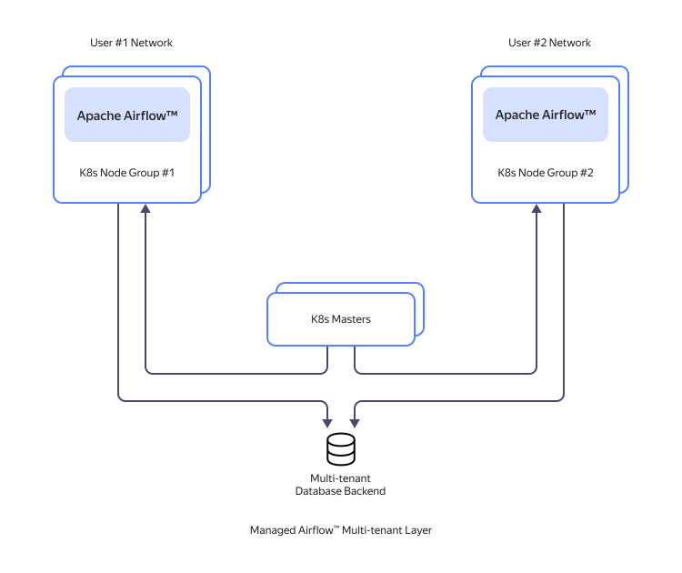
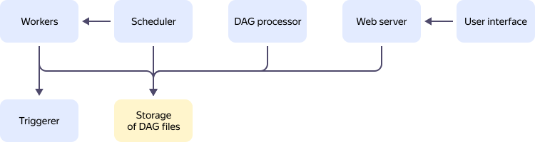
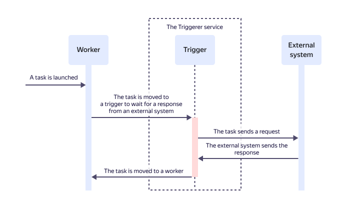

# Resource relationships in {{ maf-name }}

{{ maf-name }} helps you deploy and maintain clusters of [{{ AF }}](https://airflow.apache.org/) servers in the {{ yandex-cloud }} infrastructure.

## About {{ AF }} {#about-the-service}

{{ AF }} is an open-source platform that enables you to create, schedule, and monitor batch-oriented _workflows_. A workflow defines job relationships and their execution sequence. It is presented as a directed acyclic graph (DAG). DAGs in {{ AF }} can be used for automation and scheduled runs of any processes, e.g., [data processing in {{ SPRK }}](../tutorials/data-proc-automation.md).

{{ AF }} uses the _Workflows as code_ approach. It implies that each workflow is implemented using a Python 3.8 script. A file with this script is called a _DAG file_. It describes jobs, their run schedule, and dependencies between them. This approach allows storing workflows in a version control system, running tests, and enabling technology required for workflows.

{{ AF }} is not used for streaming and continuous data processing. If such processing is required, you can develop a solution based on [{{ mkf-full-name }}](../../managed-kafka/index.yaml).

For more information, see the [{{ AF }} documentation](https://airflow.apache.org/docs/apache-airflow/stable/#).

## {{ maf-name }} architecture {#architecture}

The {{ maf-name }} architecture is as follows:

Each [{{ AF }} cluster](#cluster) runs in a separate {{ k8s }} node group with the required network infrastructure. This infrastructure includes a virtual network, a security group, and a service account. Node groups are isolated from each other, both through virtual networks and through {{ k8s }} itself. Node groups are managed by a common {{ k8s }} master, and {{ AF }} clusters use a common {{ PG }} cluster for data storage.

To ensure isolated data storage, the service limits the use of the {{ PG }} cluster:

* A separate database is created for each {{ AF }} cluster in the {{ PG }} cluster. Clusters can connect only to their own database.
* {{ AF }} clusters can work only with tables created by {{ AF }}. You cannot create and modify schemas, tables, functions, procedures, and triggers yourself.
* Read and write speed, as well as the available database storage space, are limited.

   

   Any malicious attempt to bypass these restrictions will result in your cluster being locked under Clause 7 of the [Acceptable Use Policy]({{ link-cloud-aup }}).

   

## {{ AF }} cluster {#cluster}

The main entity {{ maf-name }} operates is a _cluster_. Inside a cluster, [{{ AF }} components](#components) are deployed. Cluster resources may reside in different availability zones. You can learn more about {{ yandex-cloud }} availability zones [here](../../overview/concepts/geo-scope.md).

A workflow running in a cluster may access any {{ yandex-cloud }} resource within the cloud network where the cluster is located. For example, a workflow can send requests to {{ yandex-cloud }} VMs or managed DB clusters. You can build a workflow using multiple resources, e.g., a workflow that collects data from one DB and sends it to another DB or [{{ dataproc-full-name }}](../../data-proc/index.yaml).

## {{ AF }} main components {#components}

The main {{ AF }} components are as follows:

{{ AF }} components:

* _Web server_: Server in {{ yandex-cloud }} hosting an {{ AF }} instance. The web server receives user commands sent through the {{ AF }} web interface and checks, runs, and debugs Python scripts in DAG files.

   To learn more about working with the web interface, see the [{{ AF }} documentation](https://airflow.apache.org/docs/apache-airflow/stable/ui.html).

* _Scheduler_: Server in {{ yandex-cloud }} that controls the job run schedule. The scheduler gets schedule information from DAG files. It uses this schedule to notify workers that it is time to run a DAG file.

* _Workers_: Executors of jobs specified in DAG files. The workers run jobs on the schedule received from the scheduler.

* [_Triggerer_](#triggerer): Service that releases a worker in the event of its downtime while executing a job with a long event timeout (optional component).

* _DAG file storage_: [{{ objstorage-full-name }} bucket](../../storage/concepts/bucket.md) that stores DAG files. This storage can be accessed by web servers, schedulers, workers, and Triggerer.

To ensure fault tolerance and enhance performance, web servers, schedulers, and Triggerer may exist in multiple instances. Their number is set when creating a cluster.

For workers, you can also set the minimum and maximum number of instances while creating a cluster. Their number will be scaled dynamically. This feature is provided by the [KEDA](https://airflow.apache.org/docs/helm-chart/stable/keda.html) controller.

## Triggerer {#triggerer}

The Triggerer service reduces the workers downtime.

DAGs may contain jobs that send requests to an external system (such as a {{ SPRK }} cluster) and wait for it to respond for a certain period of time. If [standard operators](https://airflow.apache.org/docs/apache-airflow/stable/core-concepts/operators.html) are used, such a job will keep a worker busy while it is waiting for the response. This results in the worker's downtime. If this happens to a large number of workers, job queues will form, reducing the job run speed and slowing down execution.

_Deferrable operators_ help avoid a situation like this. They allow pausing a job, releasing a worker, and isolating the external system request into a separate process called a _trigger_. All triggers are independent from each other and processed by Triggerer asynchronously, with separate resources allocated for it in the cluster. Once a response is received from the external system, a trigger fires, and the scheduler returns the job to the worker.

See how to work with Triggerer in the figure below:

For more information about deferrable operators, triggers, and the Triggerer service, see the [{{ AF }}](https://airflow.apache.org/docs/apache-airflow/stable/authoring-and-scheduling/deferring.html#deferrable-operators-triggers) documentation.
