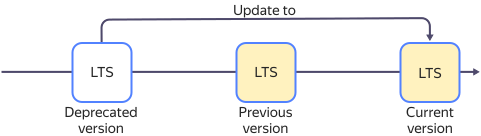
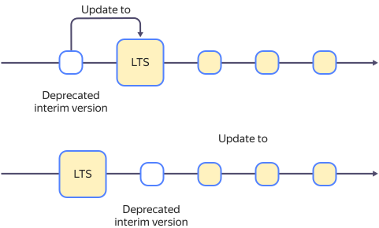

# {{ CH }} versioning policy

{{ CH }} uses the frequent release policy. In {{ mch-name }}, a limited set of {{ CH }} versions are available, which is continually updated. If the {{ CH }} version used in a {{ mch-name }} cluster becomes obsolete, it gets updated.

Updating to current versions allows you to get new features, patches, and security fixes, which improves the overall stability of the cluster.

Each {{ CH }} version supported by {{ mch-name }} undergoes comprehensive testing.

After updating to a new supported version of {{ CH }}, your data remains safe and accessible.

## Version support policy for {#versioning-policy}

{{ mch-name }} uses two types of {{ CH }} versions:
- **LTS** (Long-Term Support).

   The LTS version support period is 12 months, with new versions released every 6 months.

   Two LTS versions are supported: the current one and the previous one.

   When a new LTS version is released in {{ mch-name }}, the oldest available one stops being supported.

- **Interim**.

   The three latest {{ CH }} versions, including interim ones, are supported. If one of these versions is an LTS version, only two interim versions are supported.

   When a new interim {{ CH }} version is released in {{ mch-name }}, the oldest interim version stops being supported.

You can manually [change the cluster version](../operations/cluster-version-update.md) to one of the supported versions.



* You cannot create new hosts in clusters on a deprecated version of {{ CH }}.
* Clusters on a deprecated version of {{ CH }} are automatically updated according to the [update policy](#update-policy).



## Update policy for {#update-policy}



- LTS versions

   A {{ mch-name }} cluster on a deprecated version of {{ CH }} is updated to the next LTS version.

   

   

   Notifications about the scheduled update of clusters using a deprecated LTS version are sent to users **two months** and **one week** before the update.

   

- Interim versions

   A {{ mch-name }} cluster on a deprecated {{ CH }} version is updated to either an LTS version, if available, or the latest interim version.

   

   

   * Notifications about the scheduled update of clusters using a deprecated interim version are sent to users **one week** before the update.
   * If you upgrade to the LTS version, the appropriate update policy will apply to the cluster.

   

