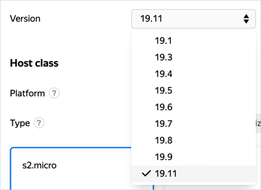

# Updating the {{ CH }} version

You can update the {{ CH }} version used by the cluster to any of the [supported {{ mch-name }} versions](../concepts/update-policy.md#versioning-policy), but you cannot switch:

* From version 22.0 and higher to a version lower than 22.0.
* To a version lower than {{ mch-ck-version }} if the cluster was created with {{ CK }} support.

To learn more about updates within a single version and host maintenance, see [Maintenance](../concepts/maintenance.md).

## List of available versions



- Management console

   You can view a list of available versions on the create and edit cluster screen in the [management console]({{ link-console-main }}):

   

- CLI

   

   

   To get a list of available versions, run the following command:

   ```bash
   yc managed-clickhouse version list
   ```

- API

   To view the list of available versions, use the [list](../api-ref/Versions/list.md) REST API method for the [Versions](../api-ref/Versions/index.md) resource or the [VersionsService/List](../api-ref/grpc/versions_service.md#List) gRPC API call.



## Before updating the version {#before-update}

Make sure this does not affect your applications:

1. See the {{ CH }} [changelog](https://clickhouse.com/docs/category/changelog) to check how updates might affect your applications.
1. Try updating the version on a test cluster. You can deploy it from a backup of the main cluster. In this case, you will only recover MergeTree tables.
1. [Create a backup](cluster-backups.md) of the main cluster before updating the version.

## Updating the version {#start-update}



- Management console

   1. In the [management console]({{ link-console-main }}), open the **{{ ui-key.yacloud.iam.folder.dashboard.label_managed-clickhouse }}** page in the folder where you want to update the {{ CH }} version.
   1. In the list of clusters, select the one to change.
   1. Click **{{ ui-key.yacloud.mdb.cluster.overview.button_action-edit }}**.
   1. Under **{{ ui-key.yacloud.mdb.forms.section_base }}**, select the appropriate version in the **{{ ui-key.yacloud.mdb.forms.base_field_version }}** field.
   1. Click **{{ ui-key.yacloud.mdb.forms.button_edit }}**.

   When the change starts, the cluster status switches to **UPDATING**. Wait for the operation to complete and then check the cluster version.

- CLI

   

   

   1. Get a list of your {{ CH }} clusters:

      ```bash
      {{ yc-mdb-ch }} cluster list

      +----------------------+---------------+---------------------+--------+---------+
      |          ID          |     NAME      |     CREATED AT      | HEALTH | STATUS  |
      +----------------------+---------------+---------------------+--------+---------+
      | c9q8p8j2gaih******** | clickhouse691 | 2019-04-23 12:44:17 | ALIVE  | RUNNING |
      +----------------------+---------------+---------------------+--------+---------+
      ```

   1. Get information about a cluster and check the {{ CH }} version in your cluster in the `config.version` parameter:

      ```bash
      {{ yc-mdb-ch }} cluster get c9q8p8j2gaih********
      id: c9q8p8j2gaih********
      folder_id: b1gqs1teo2q2********
      created_at: "2019-04-23T12:44:17.929853Z"
      name: clickhouse691
      environment: PRODUCTION
      monitoring:
      - name: Console
          description: Console charts
          link: {{ link-console-main }}/folders/b1gqs1teo2q2********/managed-clickhouse/cluster/c9q8p8j2gaih********?section=monitoring
      config:
          version: "19.1"
          ...
      ```

   1. Update the {{ CH }} version:

      ```bash
      {{ yc-mdb-ch }} cluster update --id c9q8p8j2gaih******** --version 19.4
      ```

   When the update starts, the cluster status will switch to **UPDATING**. Wait for the operation to complete and then check the cluster version.

- {{ TF }}

   1. Open the current {{ TF }} configuration file with an infrastructure plan.

      For more information about how to create this file, see [Creating clusters](cluster-create.md).

   1. To the {{ mch-name }} cluster description, add the `version` field or change its value if it is already there:

      ```hcl
      resource "yandex_mdb_clickhouse_cluster" "<cluster_name>" {
        ...
        version = "<{{ CH }}_version>"
      }
      ```

   1. Make sure the settings are correct.

      

   1. Confirm updating the resources.

      

   For more information, see the [{{ TF }} provider documentation]({{ tf-provider-resources-link }}/mdb_clickhouse_cluster).

   

- API

   To update a version, use the [update](../api-ref/Cluster/update.md) REST API method for the [Cluster](../api-ref/Cluster/index.md) resource or the [ClusterService/Update](../api-ref/grpc/cluster_service.md#Update) gRPC API call and provide the following in the request:

   * Cluster ID in the `clusterId` parameter. To find out the cluster ID, [get a list of clusters in the folder](./cluster-list.md#list-clusters).
   * Required value in the `configSpec.clickhouse.config.version` parameter.
   * List of settings to update (in this case, `configSpec.clickhouse.config.version`) in the `updateMask` parameter.

   




