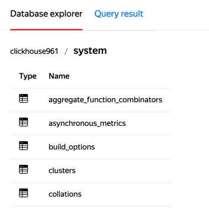
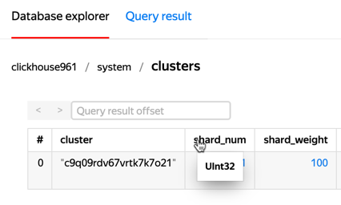
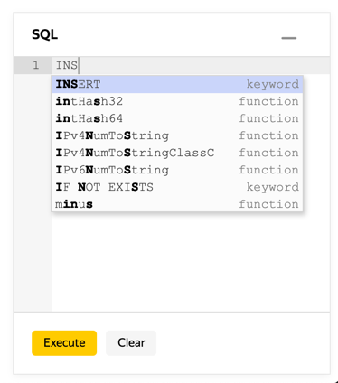
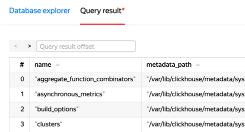

# SQL queries in Managed Service for ClickHouse

{{ mch-name }} allows you to visualize the data structure in your ClickHouse cluster and send SQL queries to databases from the {{ yandex-cloud }} management console. To do this, log in to the [management console]({{ link-console-main }}), open the cluster page you need, and go to the **SQL** tab.

See a reference list of supported queries in the [ClickHouse documentation]({{ ch.docs }}/sql-reference/statements/select/).

## Access to the cluster from the management console {#sql-cluster-access}

To connect to a {{ mch-name }} cluster from the management console and operate its data, activate the **Access from management console** option when [creating a cluster](cluster-create.md) or [changing its settings](update.md#change-additional-settings).



## Data structure visualization {#data-structure-visualization}

Once you have logged in, you can see the structure of the databases and tables in the cluster:

Click on the table to see the first 1000 rows of the `SELECT *` query result for this table (the console doesn't support full navigation through all the DB data). Hover over the column header to see the type of column data:

In the **Query result offset** field, you can set the offset for showing the results table. A maximum of 20 rows can be displayed on a single page. Use the **<** and **>** buttons to quickly increase and decrease the offset by 20.

## SQL queries {#sql-queries}

The query input window is open on the right. Start typing your query to see suggested keyword options:

Enter your query and click **Execute**. The results table or error message is shown in the results panel under the buttons.

## Query restrictions in the management console {#query-restrictions-in-the-management-console}

The main query restriction in the management console is that the text of queries and their results are available only until you close or reload the page in your browser. But if a query was run successfully, {{ mch-name }} processes it regardless of the state of the management console.

In addition, keep the following in mind:

* The management console will only display the first 1000 rows of results, even if there is actually more data.
* When a cluster query takes more than 10 minutes to complete, the management console will report an error as a result, even if the query was eventually processed successfully.
* If your cluster has multiple {{ CH }} hosts, queries from the management console are sent to a random one. Keep this in mind if you are going to modify data. For example, the `CREATE TABLE db1.newtable` query creates a table on one host only. To avoid this, use a [distributed query]({{ ch.docs }}/sql-reference/statements/create/table), putting your cluster name inside the curly brackets: `CREATE TABLE db1.newtable ON CLUSTER '{cluster}'`.
