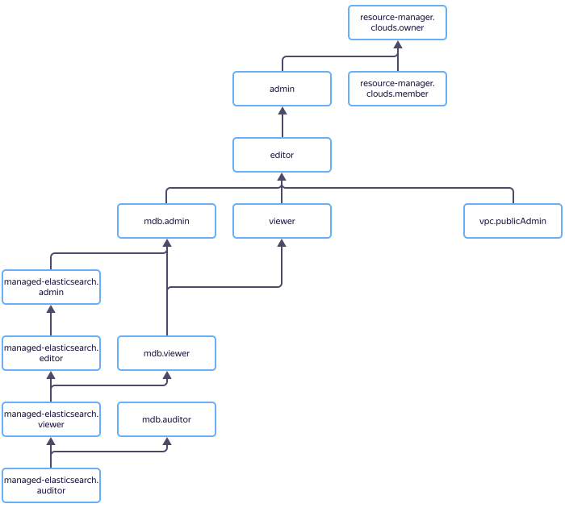

# Managing access to {{ mes-name }}



In this section, you will learn:

* [Which resources you can assign a role for](#resources).
* [Which roles exist in the service](#roles-list).
* [Which roles are required](#required-roles) for particular actions.

To use the service, log in to the management console with a [Yandex account](../../iam/concepts/users/accounts.md#passport) or [federated account](../../iam/concepts/users/accounts.md#saml-federation).





## Which resources you can assign a role for {#resources}



To allow access to {{ mes-name }} service resources (clusters and hosts, cluster backups, and accounts), assign the user the appropriate roles for a folder or cloud hosting the resources.

## Which roles exist in the service {#roles-list}

The chart below shows which roles are available in the service and how they inherit each other's permissions. For example, the `{{ roles-editor }}` role includes all the permissions of `{{ roles-viewer }}`. You can find the description of each role under the chart.

### Service roles {#service-roles}

#### managed-elasticsearch.viewer {#managed-elasticsearch-viewer}



#### managed-elasticsearch.editor {#managed-elasticsearch-editor}



#### managed-elasticsearch.admin {#managed-elasticsearch-admin}



#### mdb.auditor {#mdb-auditor}



#### mdb.viewer {#mdb-viewer}



#### mdb.admin {#mdb-admin}



#### vpc.publicAdmin {#vpc-public-admin}



### Primitive roles {#primitive-roles}



## Roles required {#required-roles}

To use the service, you need the `{{ roles.mes.editor }}` [role](../../iam/concepts/access-control/roles.md) or higher for the folder where the cluster is created. With the`{{ roles.mes.viewer }}` role, you can only view the list of clusters.

You can always assign a role with more permissions. For instance, you can assign `{{ roles.mes.admin }}` instead of `{{ roles.mes.editor }}`.

## What's next {#whats-next}

* [How to assign a role](../../iam/operations/roles/grant.md).
* [How to revoke a role](../../iam/operations/roles/revoke.md).
* [Learn more about access management in {{ yandex-cloud }}](../../iam/concepts/access-control/index.md).
* [Learn more about inheriting roles](../../resource-manager/concepts/resources-hierarchy.md#access-rights-inheritance).

