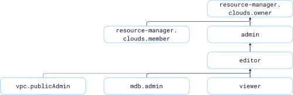

# Managing access to {{ mes-name }}



In this section, you'll learn:

* [What resources you can assign roles to](#resources).
* [What roles exist in the service](#roles-list).
* [What roles are required](#required-roles) for particular actions.



## What resources you can assign roles to {#resources}



To allow access to {{ mes-name }} service resources (clusters and hosts, cluster backups, and accounts), assign the user the appropriate roles for a folder or cloud hosting the resources.

## What roles exist in the service {#roles-list}

The diagram shows which roles are available in the service and how they inherit each other's permissions. For example, the `editor` role includes all `viewer` role permissions. A description of each role is given under the diagram.

Active roles in the service:

* Service roles:
    * 
    * 
    * 
    * 
* Primitive roles:
    * 
    * 
    * 

## What roles do I need {#required-roles}

The table below shows what you can do with cluster resources and the roles you need to perform them.

Action | Methods | Required roles
| ----- | ----- | ----- |
**View data** | |
View information about the cluster and related resources | `get`, `list` | `viewer` for the folder hosting the cluster
**Manage resources** | |
Create clusters in the folder | `create` | `mdb.admin` or `editor` for the folder
Creating clusters with hosts that have public access enabled | `create` | Or `vpc.publicAdmin` together with `mdb.admin`, or `editor` for the folder
Change and delete clusters and related resources | `update`, `delete` | `mdb.admin` or `editor` for the folder hosting the cluster
**Manage resource access** | |
[Create](../operations/cluster-users.md#adduser), [edit](../operations/cluster-users.md#updateuser), or [remove](../operations/cluster-users.md#removeuser) cluster accounts | `create`, `update`, `delete` | `editor` or `admin` for the folder hosting the cluster
[Assign](../../iam/operations/roles/grant.md), [revoke](../../iam/operations/roles/revoke.md), and view roles granted for the resource or cloud | `setAccessBindings`, `updateAccessBindings`, `listAccessBindings` | `admin` for the folder hosting the cluster or the cloud

## What's next {#whats-next}

* [How to assign a role](../../iam/operations/roles/grant.md).
* [How to revoke a role](../../iam/operations/roles/revoke.md).
* [Learn more about access management in {{ yandex-cloud }}](../../iam/concepts/access-control/index.md).
* [For more information about role inheritance, ](../../resource-manager/concepts/resources-hierarchy.md#access-rights-inheritance).






